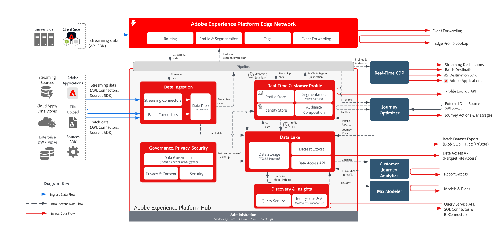

# Adobe Experience Platform数据流

## 数据流图

下图说明了向 Adobe Experience Platform 摄入和传出数据的各种路径。

{width="1000" zoomable="yes"}

## 数据进出口

有关所有数据摄取、收集、入口和出口模式的详细列表，请参阅[数据摄取文档](https://experienceleague.adobe.com/zh-hans/docs/experience-platform/collection/home)。