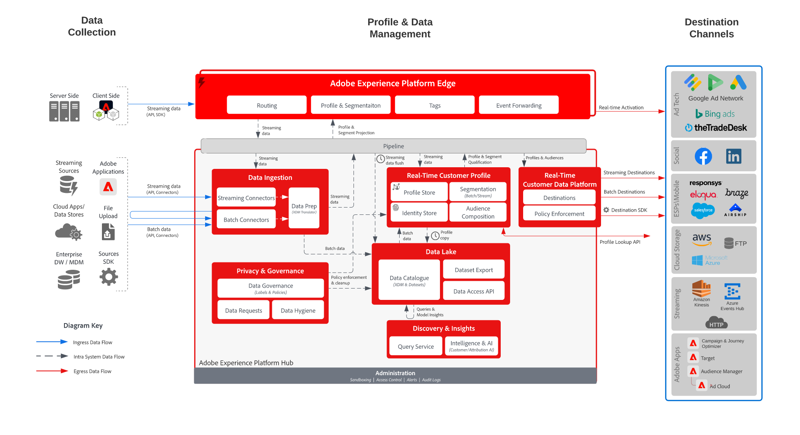

# Adobe Real-Time CDP激活

此架构显示Adobe [!DNL Real-Time Customer Data Platform] ([!DNL Real-Time CDP])如何通过流式和批量数据流将受众和配置文件数据激活到广告、社交、云存储和企业目标。

## Audience and profile activation

该架构说明了从[!DNL Real-Time CDP]受众和配置文件到目标应用程序的共享激活路径。 其中包括广告和社交平台的目标激活，以及用于存储、分析和下游应用程序工作流的企业目标。

{width="1000" zoomable="yes"}

## 支持的用例模式

上述架构支持以下用例模式：

- [目标受众激活](/help/blueprints/use-case-patterns/audience-building-activation/audience-activation-to-destinations.md) — 将评估的受众激活到广告、社交、云存储、CRM和其他企业目标。
- [匿名访客Web个性化](/help/blueprints/use-case-patterns/personalization/anonymous-visitor-web-personalization.md) — 支持跨数字渠道的受众激活和基于个人资料的个性化。

## 主要数据流和集成点

- 将客户数据从多个源摄取到[!DNL Real-Time CDP]。
- 在[!DNL Real-Time Customer Profile]中统一标识和配置文件属性。
- 评估配置文件以激活受众。
- 流式或批量处理对广告、社交、云存储和企业目标的受众和配置文件更改。
- 在下游营销、销售、支持、分析和个性化工作流中使用激活的个人资料和受众数据。

## 进一步阅读

- [Adobe Real-Time CDP目标](https://experienceleague.adobe.com/en/docs/experience-platform/destinations/home)
- [将受众激活到目标](https://experienceleague.adobe.com/en/docs/experience-platform/destinations/ui/activate/activate-batch-profile-destinations)
- [Adobe Real-Time CDP护栏](https://experienceleague.adobe.com/en/docs/experience-platform/rtcdp/guardrails/overview)
