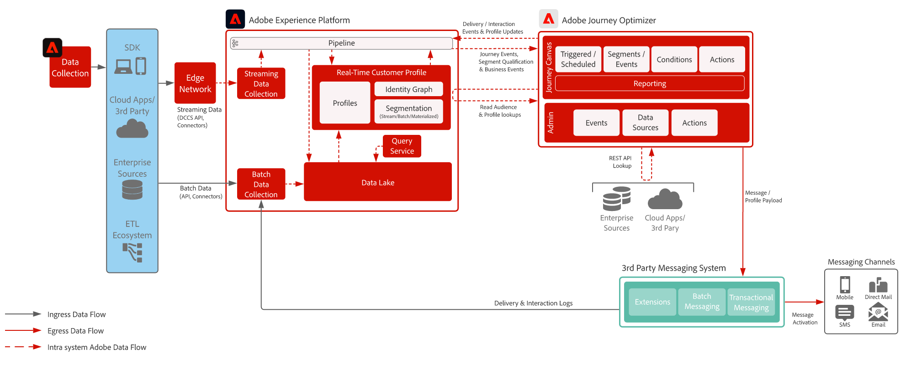

# 第三方报文传送

>[!TIP]
>此架构还被记录为Campaign Management &amp; Orchestration下的[用例模式](/help/blueprints/use-case-patterns/campaign-management-orchestration/third-party-messaging.md)。

演示如何将Adobe Journey Optimizer与第三方消息传递系统结合使用，以发送个性化通信。

 

## 架构

{width="1000" zoomable="yes"}

 

拓扑显示[!DNL Journey Optimizer]正在向第三方发送事务型负载
通过自定义操作或REST API集成发送消息应用程序。 使用[第三方消息传递用例模式](/help/blueprints/use-case-patterns/campaign-management-orchestration/third-party-messaging.md)
以了解先决条件、护栏和实施指南。

 

## 相关文档

* [Experience Platform文档](https://experienceleague.adobe.com/docs/experience-platform.html?lang=zh-Hans)
* [Experience Platform标记文档](https://experienceleague.adobe.com/docs/experience-platform/tags/home.html?lang=zh-Hans)
* [Experience Platform Mobile SDK文档](https://experienceleague.adobe.com/docs/mobile.html?lang=zh-Hans)
* [Journey Optimizer文档](https://experienceleague.adobe.com/docs/journey-optimizer/using/ajo-home.html?lang=zh-Hans)
* [Journey Optimizer产品描述](https://helpx.adobe.com/cn/legal/product-descriptions/adobe-journey-optimizer.html)
