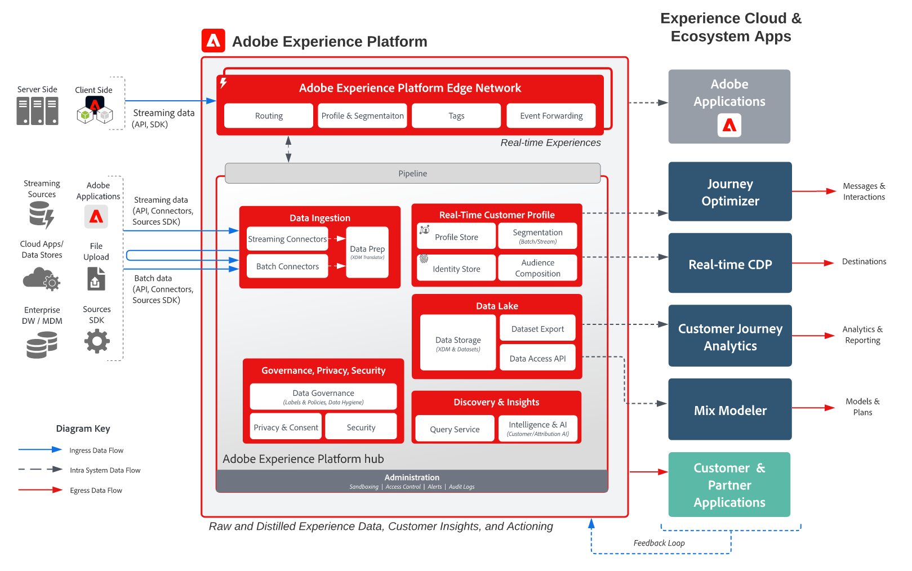
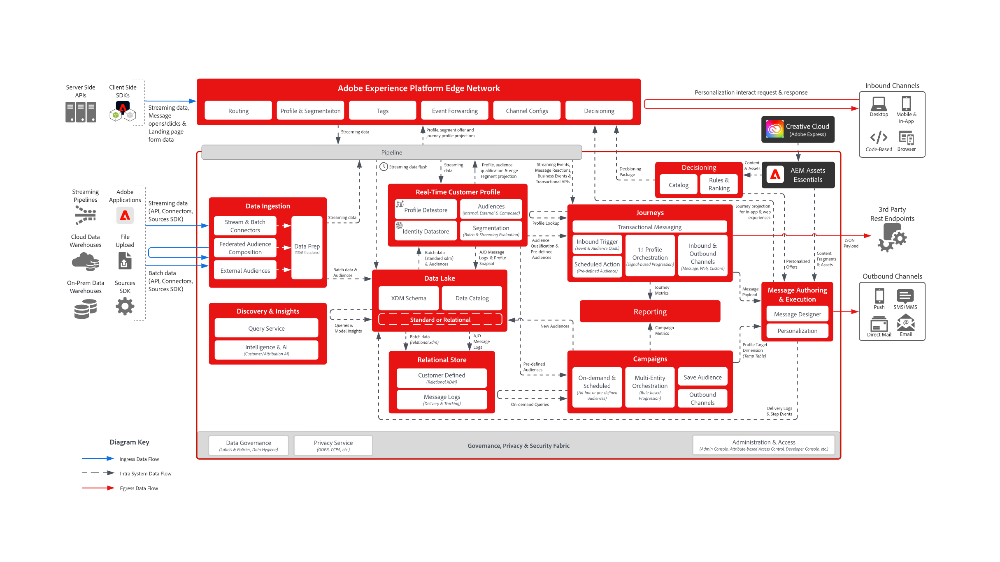

# 架构图

架构图是可视的技术参考，显示Adobe Experience Platform和应用程序如何组合 — 系统集成点、数据和内容流以及操作顺序。 在深入了解[用例模式](/help/blueprints/use-case-patterns/overview.md)中的分步指南之前，请使用它们来了解解决方案设计。

这些图表分为以下类别。 选择卡以跳转到该类别的登陆页面或潜在客户图表 — 使用左侧导航浏览类别中的每个图表。

<table style="table-layout:fixed; width:100%;">
<tr>
  <td style="width:33%; vertical-align:top; padding:10px; box-sizing:border-box;">
    
    

      <a href="architecture-overviews/overview.md">
        <strong>架构概述</strong>
      </a>
      
Experience Cloud应用程序、Experience Platform和部署SDK如何结合在一起，以及护栏和延迟。

    

  </td>
  <td style="width:33%; vertical-align:top; padding:10px; box-sizing:border-box;">
    
    

      <a href="audience-profile-activation/overview.md">
        <strong>受众和配置文件激活</strong>
      </a>
      
如何在Adobe Real-Time CDP中构建受众和配置文件，以及如何将其激活到目标和应用程序。

    

  </td>
  <td style="width:33%; vertical-align:top; padding:10px; box-sizing:border-box;">
    
    

      <a href="b2b-activation-marketing/overview.md">
        <strong>B2B激活和营销</strong>
      </a>
      
通过Real-Time Customer Data Platform B2B edition跨渠道和目标，实现基于帐户和基于人员的受众激活。

    

  </td>
</tr>
<tr>
  <td style="width:33%; vertical-align:top; padding:10px; box-sizing:border-box;">
    
    

      <a href="customer-insights/overview.md">
        <strong>客户分析</strong>
      </a>
      
Customer Journey Analytics如何统一和分析跨渠道行为数据，以及与Real-Time CDP和Journey Optimizer集成。

    

  </td>
  <td style="width:33%; vertical-align:top; padding:10px; box-sizing:border-box;">
    
    

      <a href="customer-journeys/journey-optimizer/journey-optimizer-overview.md">
        <strong>客户历程</strong>
      </a>
      
使用Journey Optimizer进行事件驱动型历程编排，在边缘和中心做出决策，并使用Adobe Campaign进行批量编排。

    

  </td>
  <td style="width:33%; vertical-align:top; padding:10px; box-sizing:border-box;"></td>
</tr>
</table>

## 相关内容

* [用例模式](/help/blueprints/use-case-patterns/overview.md) — 基于这些体系结构的可重复实施方法
* [关键业务目标](/help/blueprints/business-objectives/overview.md) — 这些体系结构帮助您实现的业务成果
* [行业用例](/help/blueprints/industry-use-cases/use-case-catalog.md) — 这些模式的垂直特定应用
