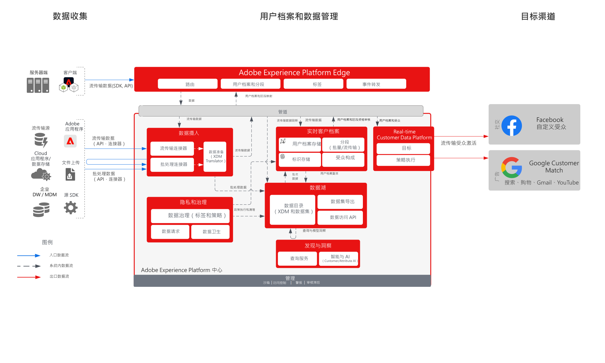

# 从 Real-time Customer data Platform 激活社交和广告目标

从多个来源摄入客户数据以构建客户的单个用户档案视图，将这些用户档案分段以构建用于营销和个性化的受众，将这些受众共享到 Facebook 和 Google 等广告网络，以针对这些受众定位和个性化营销活动。

## 用例

* 受众定位，针对社交和广告目的地上的已知受众。
* 具有线上和线下属性的线上个性化。

## 应用程序

* Real-time Customer Data Platform  

## 架构

## 实施步骤

1. 配置要在用户档案数据源中使用的身份命名空间。
   * 使用开箱即用的命名空间，如电子邮件、电子邮件 SHA256 哈希（如果可用）。
   * Facebook 具有受支持身份列表。要激活到 Facebook 自定义受众，待激活用户档案中必须存在受支持的身份。
   * Facebook 当前支持以下身份：GAID、IDFA、phone_sha256、email_lc_sha256、extern_id。
   * 有关更多详细信息，请参阅[《Facebook 目标指南》](https://experienceleague.adobe.com/docs/experience-platform/destinations/catalog/social/facebook.html?lang=zh-Hans)。
   * Google Customer Match 具有受支持身份的列表。要激活到 Google Customer Match，待激活用户档案中必须存在受支持的身份。
   * Google Customer Match 当前支持以下身份：GAID、IDFA、phone_sha256_e.164、email_lc_sha256、user_id。
   * 有关更多详细信息，请参阅[《Google Customer Match 目标指南》](https://experienceleague.adobe.com/docs/experience-platform/destinations/catalog/advertising/google-customer-match.html?lang=zh-Hans)。
   * 创建自定义命名空间，其中开箱即用的命名空间对适用的身份不可用。
1. 配置用户档案数据源架构和数据集。
   * 为所有用户档案记录源数据创建用户档案记录架构。
      * 为每个架构指定主身份和次身份。
      * 启用用于用户档案摄入的架构。
   * 为所有用户档案记录源数据创建用户档案记录数据集，并分配关联的架构。
      * 为用户档案摄入启用数据集。
   * 为所有基于用户档案时间序列的源数据创建用户档案体验事件架构。
      * 为架构指定主身份和次身份。
   * 启用用于用户档案摄入的架构。
   * 为所有用户档案体验事件源数据创建用户档案体验事件数据集，并分配关联的架构。
      * 为用户档案摄入启用数据集。
1. 使用源连接器将源数据摄入到上面配置的关联数据集。
   * 使用凭据配置源连接器帐户。
   * 配置数据流，从而按照指定的时间表将数据从源文件或文件夹位置摄入到指定数据集。
   * 将源数据中的任何字段映射到目标架构。
   * 将任何字段转换为正确的格式，以便将摄入转换为 Experience Platform。
      * 日期转换
      * 在适当时转换为小写 - 如电子邮件地址
      * 模式转换（例如电话号码）
      * 为体验事件记录添加唯一记录 ID（如果源数据中不存在）。
      * 转换数组和映射类型字段，以确保数组和映射的映射和建模正确，以便在 Experience Platform 中进行分段。
1. 配置用户档案合并策略，以确保正确配置身份图以及合并用户档案时应包含的数据集。
1. 执行数据流后，确保成功摄入用户档案数据，且无错误。
   * 检查多个用户档案的身份图，可确保正确处理身份关系。
   * 检查多个用户档案的属性和事件，以确保向用户档案正确摄入属性和事件。
1. 创作区段以创建用户档案受众
   * 在区段生成器中根据属性和事件使用规则生成区段。
   * 保存区段以进行评估。区段将每天评估一次指定的计划。
      * 如果区段规则符合流分段的条件，为用户档案摄入新的流数据时，将评估区段。在计划的批次分段期间，流传输区段也将被每天评估一次。
1. 确保区段结果符合预期。
   * 查看给定区段的区段结果计数。
   * 调查应包含在区段中的用户档案，以验证区段成员资格是否包含在用户档案的区段成员资格部分中。
1. 在目标配置中将受众传送配置到目标。
   * 有关配置 Facebook 目标的更多详细信息，请参阅[《Facebook 目标指南》](https://experienceleague.adobe.com/docs/experience-platform/destinations/catalog/social/facebook.html?lang=zh-Hans)。
   * 有关配置 Google 目标的更多详细信息，请参阅[《Google Customer Match 目标指南》](https://experienceleague.adobe.com/docs/experience-platform/destinations/catalog/advertising/google-customer-match.html?lang=zh-Hans)。
   * 配置目标时，选择要激活到目标的受众。
   * 确定您希望目标数据流开始向目标传送受众的计划开始日期。
   * 每个目标都具有将要发送的必要属性和可选属性。
      * 对于 Facebook，必须包含一个必需身份，并将其用于匹配 Experience Platform 中受众的用户档案与 Facebook 可定位的用户档案。
      * 对于 Google Customer Match，必须包含一个必需身份，并将其用于匹配 Experience Platform 中受众的用户档案与 Google Customer Match 可定位的用户档案。
   * 每个目标还具有指定的传送类型，无论是流传输还是批处理，还是基于文件或 JSON 有效负载。
      * 对于 Facebook，受众成员关系将以 JSON 格式流传输到 Facebook 端点。
      * 对于 Google Customer Match，受众成员身份将以 JSON 格式流传输到 Google Customer Match 端点。
      * 在 Experience Platform 中进行流传输或批次分段评估后，将以流传输方式传送受众成员资格。
1. 确保目标流程已按预期将受众传送到目标。
   * 检查监控界面，以确认已向受众发送预期数量的用户档案。受众规模应反映已激活的用户档案预期数量，并注意到特定目标（如 Facebook 和 Google）将需要特定字段（如电子邮件散列身份），如果受众成员的用户档案中不存在该字段，则不会将其激活到目标。
   * 检查跳过的用户档案，以查看是否缺失用户档案身份或缺少必要的属性。
   * 检查是否存在需要解决的任何其他错误。
1. 验证是否已按照预期数量的受众成员资格将受众激活到最终目标。
   * 登录 Facebook 自定义受众门户以验证是否已传送 Real-time Customer Data Platform 的受众，以及 Facebook 中受众的用户档案匹配率是否与 Real-time Customer Data Platform 中受众的用户档案数量合理匹配。
   * 完成激活流程后，切换到您的 Google Ads 帐户。已激活的区段以客户列表的形式显示在您的 Google 帐户中。请注意，根据区段大小，某些受众不会填充，除非要提供的活动用户超过 100 个。

## 护栏

[用户档案和分段护栏](https://experienceleague.adobe.com/docs/experience-platform/profile/guardrails.html?lang=zh-Hans)

## 相关文档

激活到 Facebook 自定义受众 - [目标配置](https://experienceleague.adobe.com/docs/experience-platform/destinations/catalog/social/facebook.html?lang=zh-Hans)

激活到 Google Customer Match - [目标配置](https://experienceleague.adobe.com/docs/experience-platform/destinations/catalog/advertising/google-customer-match.html?lang=zh-Hans)