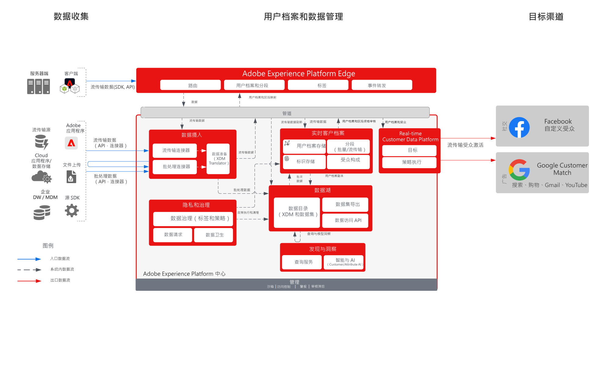

# Audience Activation到Social和Advertising目标

>[!TIP]
>此Blueprint还作为Audience Building &amp; Activation下的[用例模式](/help/blueprints/use-case-patterns/audience-building-activation/audience-activation-to-destinations.md)提供。

从多个来源摄取客户数据以构建客户的单个配置文件视图。 您可以按构建的受众细分这些配置文件以进行营销和个性化，并将这些受众共享到Facebook和Google等广告网络，以针对这些受众定位和个性化营销活动。

## 用例

* 受众定位，针对社交和广告目的地上的已知受众。
* 具有线上和线下属性的线上个性化。

## 应用程序

* Real-time Customer Data Platform

## 架构

## 护栏

[配置文件和分段护栏](https://experienceleague.adobe.com/docs/experience-platform/profile/guardrails.html?lang=zh-Hans)

## 相关文档

激活到 Facebook 自定义受众 - [目标配置](https://experienceleague.adobe.com/docs/experience-platform/destinations/catalog/social/facebook.html?lang=zh-Hans)

激活到 Google Customer Match - [目标配置](https://experienceleague.adobe.com/docs/experience-platform/destinations/catalog/advertising/google-customer-match.html?lang=zh-Hans)