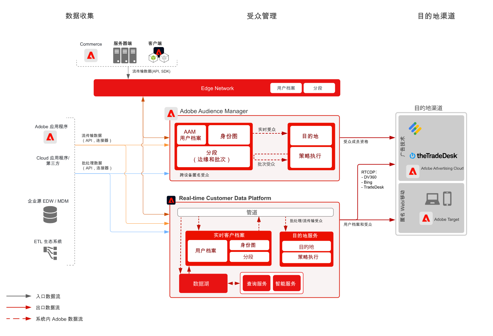

# 匿名受众激活 Blueprint

匿名受众激活是指根据匿名设备和行为数据，跨 Web、移动设备和广告渠道来定位和个性化受众的能力。

## 用例

* 在网站、移动设备应用程序或受支持的广告渠道上，进行匿名数字受众定位和个性化。
* 根据已知设备和行为特征优化登陆页面和身份验证前的体验。
* 利用 Audience Manager 第三方数据网络来进一步优化和扩展您的受众以进行定位。

## 应用程序

* Audience Manager
* Real-time Customer Data Platform  

Audience Manager 和 Real-time Customer Data Platform 均可用于提供现场和广告目标的匿名受众激活。请注意，Real-time Customer Data Platform 仅支持具有匿名设备标识符的一部分广告目标，如[目标文档](https://experienceleague.adobe.com/docs/experience-platform/destinations/catalog/advertising/overview.html?lang=zh-Hans)中所列。

对于基于匿名设备的定位，受支持 Real-time Customer Data Platform 广告目标主要有 Microsoft Bing、Google DV360 和 TradeDesk。除此之外，Real-time Customer Data Platform 还支持许多已知的基于客户的目标，如[目标文档](https://experienceleague.adobe.com/docs/experience-platform/destinations/catalog/advertising/overview.html?lang=zh-Hans)中所列和[已知客户激活 blueprint](https://experienceleague.adobe.com/docs/blueprints-learn/architecture/audience-activation/known-customer-audience-activation/known.html?lang=zh-Hans) 中所述。

## 架构

 

## Audience Manager 的实施步骤

* 有关实施 Audience Manager 的详细信息，请参阅以下[文档](https://experienceleague.adobe.com/docs/audience-manager/user-guide/implementation-integration-guides/implement-audience-manager.html?lang=zh-Hans)。

## Real-time Customer Data Platform 的实施步骤

* 有关 Real-time Customer Data Platform 的实施步骤，请参阅以下[文档](https://experienceleague.adobe.com/docs/blueprints-learn/architecture/audience-activation/known-customer-audience-activation/known.html?lang=zh-Hans)。

## 相关文档

* [Audience Manager](https://experienceleague.adobe.com/docs/audience-manager.html?lang=zh-Hans)
* [Experience Cloud[!UICONTROL  受众]](https://experienceleague.adobe.com/docs/core-services/interface/audiences/audience-library.html?lang=zh-Hans)
* [将 Audience Manager 与 Target 集成](https://experienceleague.adobe.com/docs/audience-manager/user-guide/implementation-integration-guides/integration-other-solutions/aam-target-integration.html?lang=zh-Hans)
* [通过 Audience Manager 分享 Adobe Analytics 区段](https://experienceleague.adobe.com/docs/analytics/components/segmentation/segmentation-workflow/seg-publish.html?lang=zh-Hans)
* [已知客户激活 Blueprint](https://experienceleague.adobe.com/docs/blueprints-learn/architecture/audience-activation/known-customer-audience-activation/known.html?lang=zh-Hans)。
* [Real-time Customer Data Platform](https://experienceleague.adobe.com/docs/experience-platform/rtcdp/overview.html?lang=zh-Hans)
