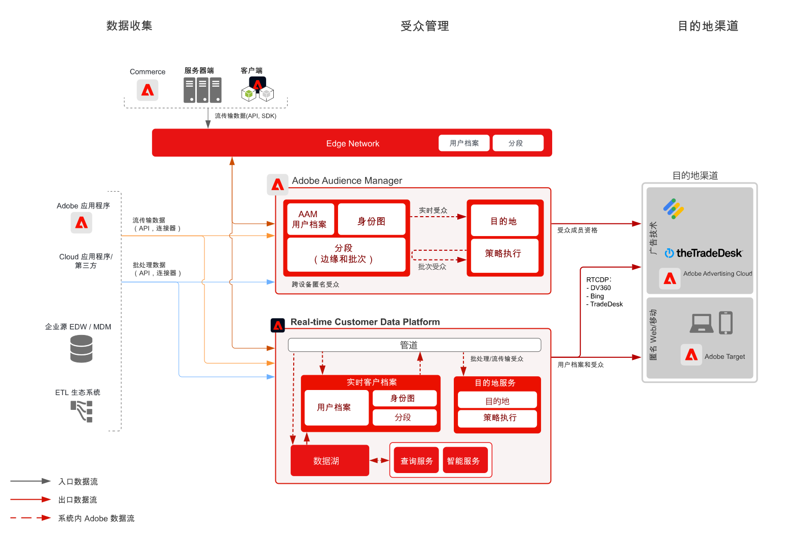

# Device Based — 使用Audience Manager进行匿名受众定位

>[!TIP]
>此Blueprint还作为Personalization下的[用例模式](/help/blueprints/use-case-patterns/personalization/anonymous-visitor-web-personalization.md)提供。

匿名受众激活是指根据匿名设备和行为数据，跨 Web、移动设备和广告渠道来定位和个性化受众的能力。

## 用例

* 在网站、移动设备应用程序或受支持的广告渠道上，进行匿名数字受众定位和个性化。
* 根据已知设备和行为特征优化登陆页面和身份验证前的体验。
* 利用 Audience Manager 第三方数据网络来进一步优化和扩展您的受众以进行定位。

## 应用程序

* Audience Manager
* Real-time Customer Data Platform

Audience Manager 和 Real-time Customer Data Platform 均可用于提供现场和广告目标的匿名受众激活。 请注意，Real-time Customer Data Platform 仅支持具有匿名设备标识符的一部分广告目标，如[目标文档](https://experienceleague.adobe.com/docs/experience-platform/destinations/catalog/advertising/overview.html?lang=zh-Hans)中所列。

## 架构

匿名Audience Activation Blueprint的

 

## Audience Manager 的实施步骤

* 有关实施 Audience Manager 的详细信息，请参阅以下[文档](https://experienceleague.adobe.com/docs/audience-manager/user-guide/implementation-integration-guides/implement-audience-manager.html?lang=zh-Hans)。