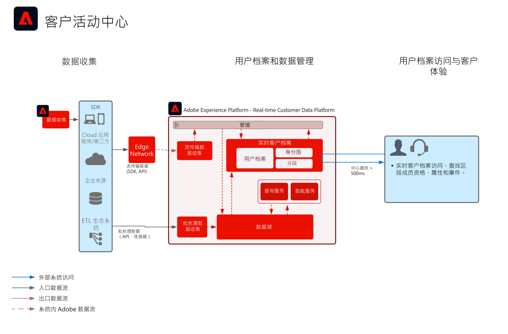

# 客户活动中心 Blueprint

客户活动中心 Blueprint 显示外部应用程序如何访问 Adobe Experience Platform 的[!UICONTROL 实时客户档案]。

外部应用程序可以使用 API GET 请求来访问用户档案。然后，存储在用户档案中的属性、事件、区段成员和模型驱动功能就可以用于这些外部非 Adobe 应用程序。

利用此功能，您可以在客户呼叫您的呼叫中心时显示丰富的背景信息。例如，支持座席可以了解客户的存留期值、客户流失倾向或营销活动接触情况。销售座席还可以受益于更多的背景信息和有关客户的洞察。

>[!NOTE]
>
>用户档案查找 API 支持的当前延迟约为 500 毫秒，因此该方法不适合将用户档案与实时决策引擎（如同页 Web 或移动个性化）集成。

## 用例

* 为座席支持的交互（如支持和销售体验）提供更深入的消费者背景信息。通过对 Experience Platform 用户档案的查找，座席可以接收更多有关消费者的背景信息，例如最近购买、活动交互、倾向、受众成员，以及存储在实时客户档案中的其他属性和洞察。

## 架构

## 护栏

* [[!UICONTROL 实时客户档案]数据的护栏](https://experienceleague.adobe.com/docs/experience-platform/profile/guardrails.html?lang=zh-Hans)

## 实施步骤

1. 为要摄入的数据[创建架构。](https://experienceleague.adobe.com/?recommended=ExperiencePlatform-D-1-2021.1.xdm)
1. 为要摄入的数据[创建数据集。](https://experienceleague.adobe.com/docs/platform-learn/tutorials/data-ingestion/create-datasets-and-ingest-data.html?lang=zh-Hans)
1. 在架构上[配置正确的身份和身份命名空间](https://experienceleague.adobe.com/docs/platform-learn/tutorials/identities/label-ingest-and-verify-identity-data.html?lang=zh-Hans)，以确保摄入的数据可以拼接到统一的用户档案中。
1. [为用户档案启用架构和数据集](https://experienceleague.adobe.com/docs/platform-learn/tutorials/profiles/bring-data-into-the-real-time-customer-profile.html?lang=zh-Hans)。
1. [将数据摄入](https://experienceleague.adobe.com/?recommended=ExperiencePlatform-D-1-2020.1.dataingestion&amp;lang=zh-Hans) Experience Platform。
1. [设置合并策略](https://experienceleague.adobe.com/docs/platform-learn/tutorials/profiles/create-merge-policies.html?lang=zh-Hans)。
1. 使用[实体 API ](https://experienceleague.adobe.com/docs/experience-platform/profile/api/entities.html?lang=zh-Hans)从记录实体或体验用户档案实体中查找事件属性。

## 相关文档

* [Adobe Experience Platform Activation 激活产品说明](https://helpx.adobe.com/cn/legal/product-descriptions/adobe-experience-platform0.html)
* [[!UICONTROL 实时客户档案]文档](https://experienceleague.adobe.com/docs/experience-platform/profile/home.html?lang=zh-Hans)
* [用户档案护栏](https://experienceleague.adobe.com/docs/experience-platform/profile/guardrails.html)
* [用户档案查找 API](https://www.adobe.io/apis/experienceplatform/home/api-reference.html)
