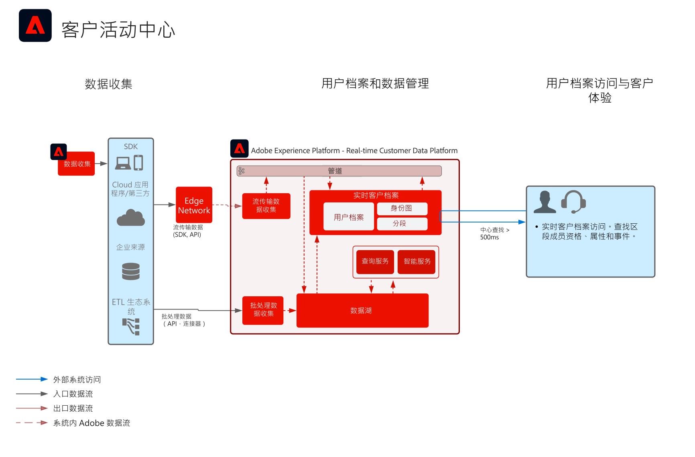

# 支持和销售方案的实时配置文件访问

>[!TIP]
>此Blueprint还作为Audience Building &amp; Activation下的[用例模式](/help/blueprints/use-case-patterns/audience-building-activation/real-time-profile-lookup.md)提供。

支持和销售方案的实时配置文件访问蓝图显示了外部应用程序如何访问Adobe Experience Platform的[!UICONTROL 实时客户配置文件]。

外部应用程序可以使用 API GET 请求来访问用户档案。 然后，存储在用户档案中的属性、事件、区段成员和模型驱动功能就可以用于这些外部非 Adobe 应用程序。

利用此功能，您可以在客户呼叫您的呼叫中心时显示丰富的背景信息。 例如，支持座席可以了解客户的存留期值、客户流失倾向或营销活动接触情况。 销售座席还可以受益于更多的背景信息和有关客户的洞察。

>[!NOTE]
>
>中心上的配置文件查找不适用于高吞吐量、低延迟的用例，如Web/移动入站个性化。 中心上的配置文件查找适用于延迟较低的情形，如代理辅助支持或销售互动。 对于低延迟、高吞吐量场景（如Web/移动个性化或实时优惠决策），应利用Edge用户档案。 Edge配置文件允许通过Real-time Customer Data Platform的[自定义Personalization连接](https://experienceleague.adobe.com/en/docs/experience-platform/destinations/catalog/personalization/custom-personalization)进行实时访问。

## 用例

* 为座席支持的交互（如支持和销售体验）提供更深入的消费者背景信息。 通过对 Experience Platform 用户档案的查找，座席可以接收更多有关消费者的背景信息，例如最近购买、活动交互、倾向、受众成员，以及存储在实时客户档案中的其他属性和洞察。

## 架构

## 护栏

* [[!UICONTROL 实时客户个人资料]数据的护栏](https://experienceleague.adobe.com/docs/experience-platform/profile/guardrails.html?lang=zh-Hans)

## 相关文档

* [Adobe Experience Platform Activation产品说明](https://helpx.adobe.com/cn/legal/product-descriptions/adobe-experience-platform0.html)
* [[!UICONTROL 实时客户个人资料]文档](https://experienceleague.adobe.com/docs/experience-platform/profile/home.html?lang=zh-Hans)
* [轮廓护栏](https://experienceleague.adobe.com/docs/experience-platform/profile/guardrails.html?lang=zh-Hans)
* [配置文件查找API](https://www.adobe.io/apis/experienceplatform/home/api-reference.html)
