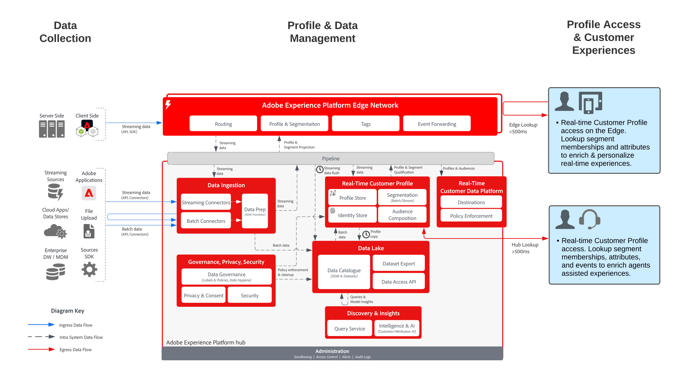

# 客户活动中心 Blueprint

客户活动中心 Blueprint 显示外部应用程序如何访问 Adobe Experience Platform 的[!UICONTROL 实时客户档案]。

外部应用程序可以通过API用户档案请求访问GET。 然后，存储在用户档案中的属性、事件、区段成员和模型驱动功能就可以用于这些外部非 Adobe 应用程序。

利用此功能，您可以在客户呼叫您的呼叫中心时显示丰富的背景信息。例如，支持座席可以了解客户的存留期值、客户流失倾向或营销活动接触情况。销售座席还可以受益于更多的背景信息和有关客户的洞察。

>[!NOTE]
>
>用户档案查找 API 支持的当前延迟约为 500 毫秒，因此该方法不适合将用户档案与实时决策引擎（如同页 Web 或移动个性化）集成。

## 用例

* 为座席支持的交互（如支持和销售体验）提供更深入的消费者背景信息。通过对 Experience Platform 用户档案的查找，座席可以接收更多有关消费者的背景信息，例如最近购买、活动交互、倾向、受众成员，以及存储在实时客户档案中的其他属性和洞察。

## 架构

## 护栏

* [实时客户档案数据的护栏](https://experienceleague.adobe.com/docs/experience-platform/profile/guardrails.html?lang=zh-Hans)

## 实施步骤

1. 配置数据集和架构
1. 配置[!UICONTROL 实时客户用户档案]:为[!UICONTROL 实时客户用户档案]配置模式和数据集，并设置合并策略和标识。
1. 将数据引入 Platform 并处理到[!UICONTROL 实时客户档案]。
1. 使用实体 API 从记录实体或体验用户档案实体中查找事件属性。

## 相关文档

* [Adobe Experience Platform Activation 激活产品说明](https://helpx.adobe.com/cn/legal/product-descriptions/adobe-experience-platform0.html)
* [实时客户档案文档](https://experienceleague.adobe.com/docs/experience-platform/profile/home.html?lang=zh-Hans)
* [用户档案护栏](https://experienceleague.adobe.com/docs/experience-platform/profile/guardrails.html)
* [用户档案查找 API](https://www.adobe.io/apis/experienceplatform/home/api-reference.html)
