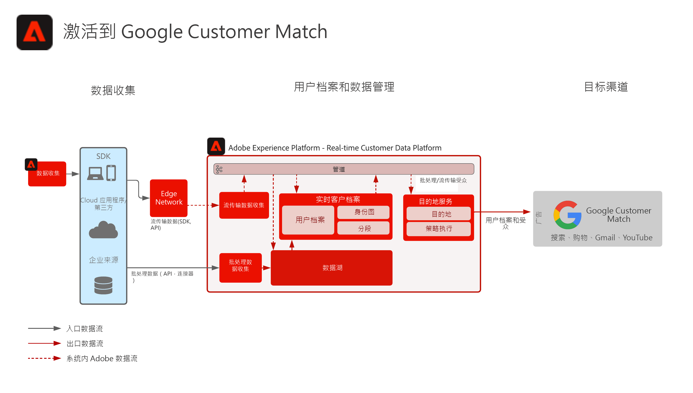

# 激活FGoogle客户匹配

从多个来源摄取客户数据以构建客户的单个配置文件视图，对这些配置文件进行分段以构建营销和个性化的受众，将这些受众共享到社交广告网络(如Google客户匹配)，以针对这些受众定位和个性化促销活动。 Google客户匹配允许您使用在线和离线数据，跨Google自有和运营的资产访问客户并与其重新互动，例如：搜索、购物、Gmail和YouTube。

## 用例

* 受众定位，针对社交和广告目的地上的已知受众。
* 具有线上和线下属性的线上个性化。

## 应用程序

* Real-time Customer Data Platform  

## 架构

## 实施步骤

1. 配置要在配置文件数据源中使用的身份命名空间。
   * 使用开箱即用的命名空间，如电子邮件、电子邮件SHA256哈希（如果可用）。
   * Google客户匹配包含一个受支持身份的列表。 要激活到Google客户匹配，要激活的配置文件中必须存在一个受支持的标识。
   * Google客户匹配当前支持以下身份：GAID、IDFA、phone_sha256_e.164、email_lc_sha256、user_id。
   * 有关更多详细信息，请参阅 [Google客户匹配目标指南](https://experienceleague.adobe.com/docs/experience-platform/destinations/catalog/advertising/google-customer-match.html).
   * 创建自定义命名空间，其中开箱即用的命名空间对适用的标识不可用。
1. 配置配置文件数据源架构和数据集。
   * 为所有用户档案记录源数据创建用户档案记录架构。
      * 为每个架构指定主标识和次标识。
      * 启用用于配置文件摄取的架构。
   * 为所有配置文件记录源数据创建配置文件记录数据集，并分配关联的架构。
      * 为配置文件摄取启用数据集。
   * 为所有基于配置文件时间序列的源数据创建配置文件体验事件架构。
      * 为架构指定主标识和次标识。
   * 启用用于配置文件摄取的架构。
   * 为所有配置文件体验事件源数据创建配置文件体验事件数据集，并分配关联的架构。
      * 为配置文件摄取启用数据集。
1. 使用源连接器将源数据摄取到上面配置的关联数据集。
   * 使用凭据配置源连接器帐户。
   * 配置数据流，以按照指定的时间表将数据从源文件或文件夹位置摄取到指定数据集。
   * 将源数据中的任何字段映射到目标架构。
   * 将任何字段转换为正确的格式，以便将摄取转换为Experience Platform。
      * 日期转换
      * 在适当时转换为小写 — 如电子邮件地址
      * 模式转换（例如电话号码）
      * 为体验事件记录添加唯一记录ID（如果源数据中不存在）。
      * 转换数组和映射类型字段，以确保数组和映射的映射和建模正确，以便在Experience Platform中进行分段。
1. 配置配置文件合并策略，以确保身份图的正确配置以及合并配置文件时应包含哪些数据集。
1. 执行数据流后，确保成功摄取配置文件数据，且未出现错误。
   * Inspect是多个用户档案的身份图，可确保正确处理身份关系。
   * Inspect多个配置文件的属性和事件，以确保向配置文件正确摄取属性和事件。
1. 创作区段以创建用户档案受众
   * 在区段生成器中根据属性和事件使用规则生成区段。
   * 保存区段以进行评估。 区段将按指定的计划每天评估一次。
      * 如果区段规则符合流分段的条件，则在为用户档案摄取新的流数据时，将评估区段。 在计划的批量分段期间，流区段也将每天评估一次。
1. 确保区段结果符合预期。
   * 查看给定区段的区段结果计数。
   * 调查应包含在区段中的配置文件，以验证区段成员资格是否包含在配置文件的区段成员资格部分中。
1. 在目标配置中配置将受众交付到目标。
   * 请参阅 [Google客户匹配目标指南](https://experienceleague.adobe.com/docs/experience-platform/destinations/catalog/advertising/google-customer-match.html) 有关配置Facebook目标的更多详细信息。
   * 配置目标时，选择要激活到目标的受众。
   * 确定您希望目标数据流开始向目标传送受众的计划开始日期。
   * 每个目标都具有将要发送的必需属性和可选属性。
      * 对于Google客户匹配，必须包含其中一个必需的标识，该标识用于将Experience Platform中受众的用户档案与Google客户匹配可定位的用户档案进行匹配。
   * 每个目标还具有指定的提交类型，无论是流传送还是批处理传送，还是基于文件或JSON有效负载。
      * 对于Google客户匹配，受众成员身份将以流式方式以JSON格式交付到Google客户匹配端点。
      * 在Experience Platform中进行流式或批量分段评估后，将以流式方式提供受众成员资格。
1. 确保目标流程已按预期将受众交付到目标。
   * 检查监控界面以确认已向受众发送预期用户档案数。 受众大小应反映激活的用户档案预期数量，并注意到特定目标(如Google客户匹配)将需要特定字段（如电子邮件哈希标识），如果受众成员的用户档案中不存在，则不会将其激活到目标。
   * 检查是否存在跳过的配置文件标识缺失或缺少必需的属性。
   * 检查是否存在需要解决的任何其他错误。
1. 验证是否已使用预期受众成员资格数将受众激活到最终目标。
   * 完成激活流程后，切换到您的Google Ads帐户。 激活的区段以客户列表的形式显示在您的Google帐户中。 请注意，根据区段大小，某些受众不会填充，除非要提供的活动用户超过100个。

## 护栏

[配置文件和分段护栏](https://experienceleague.adobe.com/docs/experience-platform/profile/guardrails.html?lang=zh-Hans)

## 相关文档

激活Google客户匹配 —  [目标配置](https://experienceleague.adobe.com/docs/experience-platform/destinations/catalog/advertising/google-customer-match.html)