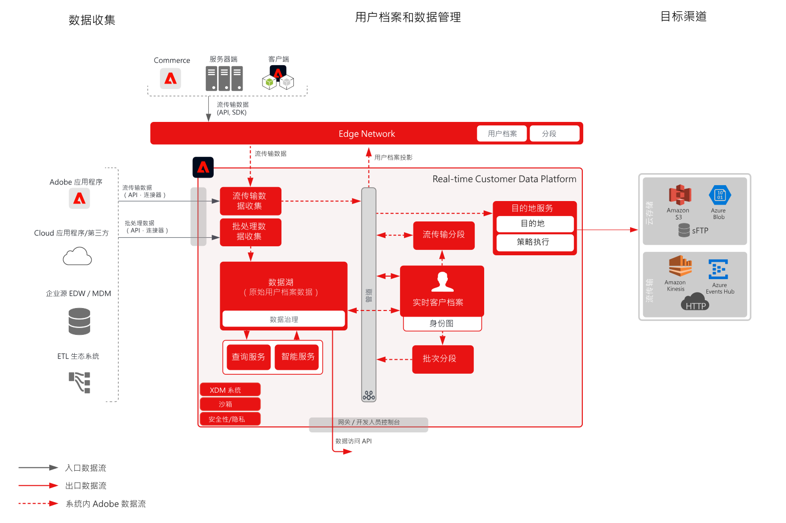

# 受众和用户档案激活到文件和企业流传输目标 Blueprint

以流式处理或批量处理方式共享配置文件和受众更改及事件 [!UICONTROL Real-time Customer Data Platform] 到企业数据存储和应用程序。 这些用户档案和受众事件可用于向客户发起销售或支持行动，例如跟踪放弃的应用程序流程或网络研讨会注册，或使用最新的客户属性和信息更新企业应用程序 [!UICONTROL Real-time Customer Data Platform].

## 用例

* 用户档案和受众激活到云存储目的地，或用于企业跟踪、存储、分析和激活客户数据和洞察的流式目的地。

## 应用程序

* Adobe Experience Platform   Activation

## 架构

## 护栏

[请参阅“受众和用户档案激活概述”页上的护栏概述。](overview.md)

## 实施步骤

1. 为要摄入的数据[创建架构。](https://experienceleague.adobe.com/?recommended=ExperiencePlatform-D-1-2021.1.xdm&amp;lang=zh-Hans)
1. 为要摄入的数据[创建数据集。](https://experienceleague.adobe.com/docs/platform-learn/tutorials/data-ingestion/create-datasets-and-ingest-data.html?lang=zh-Hans)
1. 在架构上[配置正确的身份和身份命名空间](https://experienceleague.adobe.com/docs/platform-learn/tutorials/identities/label-ingest-and-verify-identity-data.html?lang=zh-Hans)，以确保摄入的数据可以拼接到统一的用户档案中。
1. [为用户档案启用架构和数据集](https://experienceleague.adobe.com/docs/platform-learn/tutorials/profiles/bring-data-into-the-real-time-customer-profile.html?lang=zh-Hans)。
1. [将数据摄入](https://experienceleague.adobe.com/?recommended=ExperiencePlatform-D-1-2020.1.dataingestion&amp;lang=zh-Hans) Experience Platform。
1. [提供 [!UICONTROL Real-time Customer Data Platform] 区段共享](https://www.adobe.com/go/audiences) 在Experience Platform和Audience Manager之间共享Experience Platform中定义的受众，以Audience Manager。
1. 在 Experience Platform 中[创建区段](https://experienceleague.adobe.com/docs/platform-learn/tutorials/segments/create-segments.html?lang=zh-Hans)。系统自动确定以批次还是流式评估区段。
1. [配置目的地](https://experienceleague.adobe.com/docs/platform-learn/tutorials/destinations/create-destinations-and-activate-data.html?lang=zh-Hans)，以共享用户档案属性和受众成员资格到所需目的地。

## 相关文档

* [目的地文档](https://experienceleague.adobe.com/docs/experience-platform/destinations/catalog/overview.html?lang=zh-Hans)
* [云存储目的地概述](https://experienceleague.adobe.com/docs/experience-platform/destinations/catalog/cloud-storage/overview.html?lang=zh-Hans#catalog)
* [HTTP 目的地](https://experienceleague.adobe.com/docs/experience-platform/destinations/catalog/http-destination.html?lang=zh-Hans#overview)
* [[!UICONTROL Real-time Customer Data Platform] 产品描述](https://helpx.adobe.com/cn/legal/product-descriptions/real-time-customer-data-platform.html)
* [用户档案和分段指南](https://experienceleague.adobe.com/docs/experience-platform/profile/guardrails.html?lang=zh-Hans)
* [分段文档](https://experienceleague.adobe.com/docs/experience-platform/segmentation/api/streaming-segmentation.html?lang=zh-Hans)

## 相关视频和教程

* [[!UICONTROL Real-time Customer Data Platform] 概述](https://experienceleague.adobe.com/docs/platform-learn/tutorials/application-services/rtcdp/understanding-the-real-time-customer-data-platform.html?lang=zh-Hans)
* [演示 [!UICONTROL Real-time Customer Data Platform]](https://experienceleague.adobe.com/docs/platform-learn/tutorials/application-services/rtcdp/demo.html?lang=zh-Hans)
* [创建区段](https://experienceleague.adobe.com/docs/platform-learn/tutorials/segments/create-segments.html?lang=zh-Hans)
