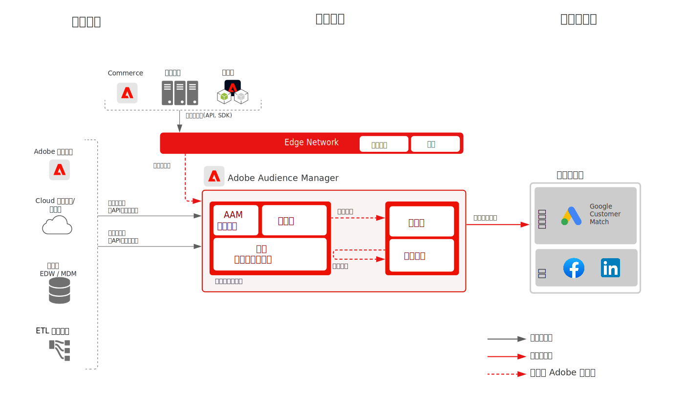

# 已知客户激活 Blueprint

将线下属性和事件（如线下订单、交易、CRM 或忠诚度数据）与线上行为结合使用，实现线上定位和个性化。

通过内置管理控制扩展的标识符为与已知客户沟通提供了更多机会。将受众激活到基于用户档案的已知目的地（如电子邮件提供商、社交网络和广告目的地）。

[使用 Experience Cloud 应用程序的受众和用户档案激活 Blueprint](platform-and-applications.md) 中提供了更多详细信息，该 Blueprint 特定于 Experience Platform 和 Experience Cloud 应用程序之间的集成。

## 用例

* 受众定位，针对社交和广告目的地上的已知受众。
* 具有线上和线下属性的线上个性化。
* 激活已知渠道（如电子邮件和短信）的受众。

## 应用程序

* [!UICONTROL Real-time Customer Data Platform]
* Audience Manager 基于人员的目标还可用于对 Facebook、LinkedIn 和 Google Customer Match 进行基于人员的激活。

## 架构

### 通过 Real-time Customer Data Platform 的已知客户激活

 

### 通过 Audience Manager 基于人员的目标的已知客户激活

 

## 护栏

[请参阅“受众和用户档案激活概述”页上的护栏概述](overview.md)。

## Real-time Customer Data Platform 的实施步骤

1. 为要摄入的数据[创建架构。](https://experienceleague.adobe.com/?recommended=ExperiencePlatform-D-1-2021.1.xdm)
1. 为要摄入的数据[创建数据集。](https://experienceleague.adobe.com/docs/platform-learn/tutorials/data-ingestion/create-datasets-and-ingest-data.html?lang=zh-Hans)
1. 在架构上[配置正确的身份和身份命名空间](https://experienceleague.adobe.com/docs/platform-learn/tutorials/identities/label-ingest-and-verify-identity-data.html?lang=zh-Hans)，以确保摄入的数据可以拼接到统一的用户档案中。
1. [为用户档案启用架构和数据集](https://experienceleague.adobe.com/docs/platform-learn/tutorials/profiles/bring-data-into-the-real-time-customer-profile.html?lang=zh-Hans)。
1. [将数据摄入](https://experienceleague.adobe.com/?recommended=ExperiencePlatform-D-1-2020.1.dataingestion&amp;lang=zh-Hans) Experience Platform。
1. 在 Experience Platform 和 Audience Manager 之间[设置 [!UICONTROL Real-time Customer Data Platform] 区段共享](https://www.adobe.com/go/audiences)，以便将 Experience Platform 中定义的受众共享给 Audience Manager。
1. 在 Experience Platform 中[创建区段](https://experienceleague.adobe.com/docs/platform-learn/tutorials/segments/create-segments.html?lang=zh-Hans)。系统自动确定以批次还是流式评估区段。
1. [配置目的地](https://experienceleague.adobe.com/docs/platform-learn/tutorials/destinations/create-destinations-and-activate-data.html?lang=zh-Hans)，以共享用户档案属性和受众成员资格到所需目的地。

## 实施注意事项

* 要将用户档案数据共享到目的地，您需要在目的地有效负荷中包含目的地使用的特定身份值。任何目标目的地必需的身份都必须被摄入 Platform，并配置为[!UICONTROL 实时客户档案]的身份。

* 请参阅[使用 Experience Cloud 应用程序的受众和用户档案激活 Blueprint](platform-and-applications.md)，以了解有关将受众从 Real-time Customer Data Platform 共享到 Audience Manager、Analytics、Target、Campaign 和 Journey Optimizer 的更多详细信息。

## Audience Manager 基于人员的目标的实施步骤

* 有关实施 Audience Manager 的详细信息，请参阅以下[文档](https://experienceleague.adobe.com/docs/audience-manager/user-guide/implementation-integration-guides/implement-audience-manager.html?lang=zh-Hans)。

* 有关实施 Audience Manager 基于人员的目标的详细信息，请参阅以下[文档](https://experienceleague.adobe.com/docs/audience-manager/user-guide/faqs/faq-people-based-destinations.html?lang=zh-Hans)。

## 相关文档

* [[!UICONTROL Real-time Customer Data Platform] 产品说明](https://helpx.adobe.com/cn/legal/product-descriptions/real-time-customer-data-platform.html)
* [用户档案和分段指南](https://experienceleague.adobe.com/docs/experience-platform/profile/guardrails.html?lang=zh-Hans)
* [分段文档](https://experienceleague.adobe.com/docs/experience-platform/segmentation/api/streaming-segmentation.html?lang=zh-Hans)
* [目的地文档](https://experienceleague.adobe.com/docs/experience-platform/destinations/catalog/overview.html?lang=zh-Hans)

## 相关视频和教程

* [[!UICONTROL Real-time Customer Data Platform] 概述](https://experienceleague.adobe.com/docs/platform-learn/tutorials/application-services/rtcdp/understanding-the-real-time-customer-data-platform.html?lang=zh-Hans)
* [[!UICONTROL Real-time Customer Data Platform] 演示](https://experienceleague.adobe.com/docs/platform-learn/tutorials/application-services/rtcdp/demo.html?lang=zh-Hans)
* [创建区段](https://experienceleague.adobe.com/docs/platform-learn/tutorials/segments/create-segments.html?lang=zh-Hans)
