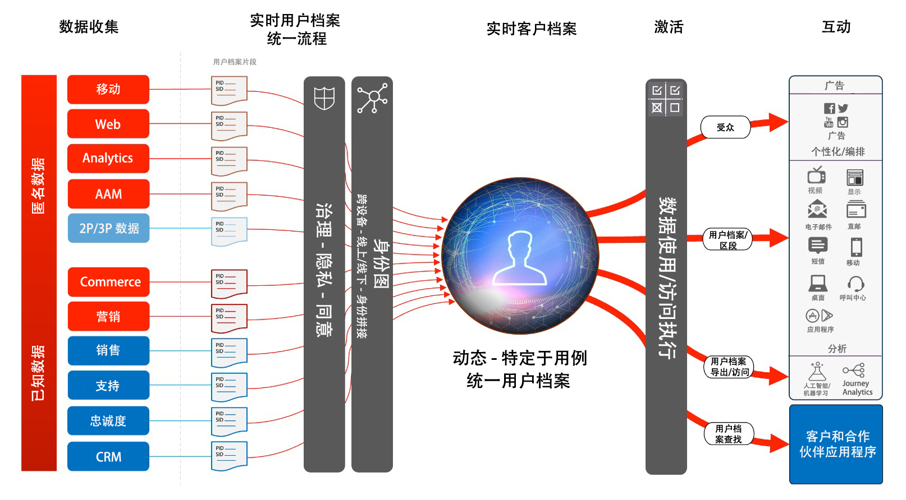

# 受众和用户档案激活

受众和用户档案激活是在数据驱动营销世界中取得成功的关键。但是，许多品牌仍然将精力集中在渠道优先激活上，这往往会带来不一致的覆盖范围和个性化。

通过渠道优先的方法，每个渠道都充当一个筒仓，个性化努力仅以该渠道上与品牌互动的客户为目标。此方法并不反映客户与跨多个不同接触点的品牌互动的现实。受众和用户档案激活使品牌能够将多个渠道的客户互动关联起来，从而提供集中的用户档案和受众，可将其激活到所有渠道。

| Blueprint | 描述 | Experience Cloud 应用程序 |
|---|---|---|
| **[匿名受众激活](anonymous.md)** | <ul><li>跨 Web 和广告渠道定位目标受众，以获取匿名和行为客户数据。</li><li>与第三方受众数据集成以提高个性化。</li></ul> | <ul><li>Adobe Audience Manager</li></ul> |
| **[线上/线下受众激活](online-offline.md)** | <ul><li>激活到基于用户档案的已知目的地（如电子邮件提供商、社交网络和广告目的地）。 </li><li>将线下属性和事件（如线下订单、交易、CRM 或忠诚度数据）与线上行为结合使用，实现线上定位和个性化。</li></ul> | <ul><li>Adobe Experience Platform</li><li> [!UICONTROL 实时客户数据平台]</li><li>Adobe Audience Manager（可选）</li></ul> |
| **[将受众和用户档案激活到企业目的地](enterprise-destinations.md)** | <ul><li>将用户档案和受众的更改复制和更新到企业存储，以用于激活和用例报告。 </li></ul><ul><li>通过从[!UICONTROL 实时客户数据平台]向企业系统和应用程序发出客户操作通知，向客户发起销售或支持行动。</li></ul> | <ul><li>Adobe Experience Platform</li><li>[!UICONTROL 实时客户数据平台]</li><li>Experience Platform 激活</li><li>Adobe Audience Manager（可选）</li></ul> |
| **[使用 Experience Cloud 应用程序的受众和用户档案激活](platform-and-applications.md)** | <ul><li>在 Experience Platform 中管理用户档案和受众，并将其与 Experience Cloud 应用程序共享</li><li>在 Experience Platform 中建立并共享丰富的客户区段和洞察，将其与 Experience Cloud 应用程序共享</li></ul> | <ul><li>Adobe Experience Platform</li><li>[!UICONTROL 实时客户数据平台]</li><li>Experience Platform 激活</li><li>Experience Cloud 应用程序</li></ul> |
| **[客户活动中心](customer-activity.md)** | <ul><li>为座席支持的交互（如支持和销售体验）提供更深入的消费者背景信息。通过对 Experience Platform 用户档案的查找，座席可以接收更多有关消费者的背景信息，例如最近购买、活动交互、倾向、受众成员，以及存储在实时客户档案中的其他属性和洞察。</li></ul> | <ul><li>Adobe Experience Platform</li></ul> |

## 实时客户用户档案架构

下图概述了Experience Platform实时客户用户档案的核心组件。

第一个数据源被引入Experience Platform。 如果用户档案源配置为进行用户档案处理，它将馈送到实时客户。 为每个用户档案源和为每个数据源配置的每个主ID记录创建单个文档片段或。 另外，当数据被摄入到用户档案时，也由标识服务处理。 模式中标记了多个标识并且记录中填充了相应值的来自数据源的任何记录将作为标识服务中的标识关系进行处理。

请注意，只有一个标识的记录不会被标识服务处理，因为此类记录没有用于进一步填充图形的标识链接。 另外，标识服务不区分主标识和次标识。 它只是处理不同身份的身份关系。

合并用户档案片段时，标识图会跨已相关的各种源用户档案片段提供关系。 合并策略确定哪些源片段以及哪些标识图将用作合并片段。 无论何时用户档案访问用户档案片段，都会进行合并，以确保用户档案的最新组合视图。 治理和政策规则确保只能将授权的细分和属性激活到指定目标。

## 受众和用户档案激活 Blueprint 护栏

* [用户档案和分段指南](https://experienceleague.adobe.com/docs/experience-platform/profile/guardrails.html?lang=zh-Hans)

### 激活属性和身份

* [!UICONTROL 实时受众数据平台]可以激活受众成员资格以及属性和身份更改，这些更改是针对被选择激活的区段内成员的用户档案而进行的。如果您的目标是激活属性或身份，则必须定义一个全局区段，其中包含将属性和身份更新发送到的所有用户档案。此时，您可以选择要激活的区段和所需属性，将其作为目的地配置的一部分。
* 请注意，批次目的地不支持激活仅限属性的更改事件。可以随选定的属性一起发送所有或增量的受众成员资格以进行激活，但您无法通过批次目的地激活仅限属性的更改事件。

### 将批次区段激活到流式目的地

* 支持将批次区段激活到流式目的地。在区段作业完成后，批次区段作业会将消息放在管道上以进行流式激活

### 将流式区段激活到批次目的地

* 支持流式区段激活到批次目的地。批次目的地计划根据批次目的地计划导出用户档案区段成员资格。这包括通过流式和批次方式确定的区段成员资格。

### 激活体验事件

* 不支持激活原始体验事件。要根据体验事件进行激活，必须使用包含或排除体验事件逻辑的必要规则创建区段。这会创建一个根据体验事件定义的区段，并且区段成员资格可以作为激活原始体验事件的代理被激活。还可考虑使用 [!UICONTROL Launch 服务器端]激活通过 SDK 收集的原始体验事件。

## 相关博客帖子

* [[!DNL Blueprints for Audience Activation in Adobe Experience Platform]](https://medium.com/adobetech/a-blueprint-for-audience-activation-in-adobe-experience-platform-b2b30fae90fd)
* [[!DNL How Adobe Experience Platform Predictive Audiences improves Personalized Experiences]](https://medium.com/adobetech/how-adobe-experience-platform-predictive-audiences-improves-personalized-experiences-1f75a60cb7a3)
* [[!DNL Adobe Experience Platform Web SDK for Audience Management]](https://medium.com/adobetech/adobe-experience-platform-web-sdk-for-audience-management-751fa6d063bc)
