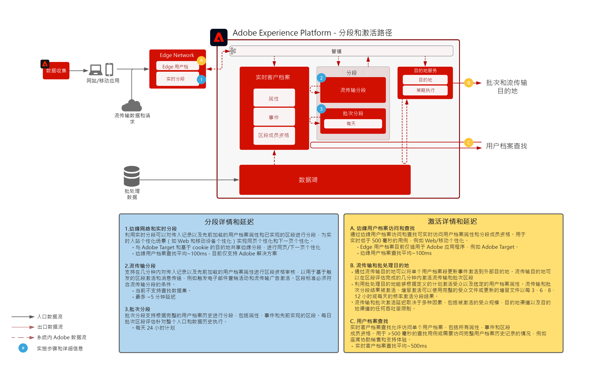

# 受众和用户档案激活

受众和用户档案激活是在数据驱动营销世界中取得成功的关键。但是，许多品牌仍然将精力集中在渠道优先激活上，这往往会带来不一致的覆盖范围和个性化。

通过渠道优先的方法，每个渠道都充当一个筒仓，个性化努力仅以该渠道上与品牌互动的客户为目标。此方法并不反映客户与跨多个不同接触点的品牌互动的现实。受众和用户档案激活使品牌能够将多个渠道的客户互动关联起来，从而提供集中的用户档案和受众，可将其激活到所有渠道。

| Blueprint | 描述 | Experience Cloud 应用程序 |
|---|---|---|
| **[匿名受众激活](anonymous.md)** | <ul><li>跨 Web 和广告渠道定位目标受众，以获取匿名和行为客户数据。</li><li>与第三方受众数据集成以提高个性化。</li></ul> | <ul><li>Adobe Audience Manager</li></ul> |
| **[已知客户激活](known.md)** | <ul><li>激活到基于用户档案的已知目的地（如电子邮件提供商、社交网络和广告目的地）。 </li><li>将线下属性和事件（如线下订单、交易、CRM 或忠诚度数据）与线上行为结合使用，实现线上定位和个性化。</li></ul> | <ul><li>Adobe Experience Platform</li><li> [!UICONTROL Real-time Customer Data Platform]</li><li>Adobe Audience Manager（可选）</li></ul> |
| **[使用 Experience Cloud 应用程序的受众和用户档案激活](platform-and-applications.md)** | <ul><li>在 Experience Platform 中管理用户档案和受众，并将其与 Experience Cloud 应用程序共享</li><li>在 Experience Platform 中建立并共享丰富的客户区段和洞察，将其与 Experience Cloud 应用程序共享</li></ul> | <ul><li>Adobe Experience Platform</li><li>[!UICONTROL Real-time Customer Data Platform]</li><li>Experience Platform Activation</li><li>Experience Cloud 应用程序</li></ul> |

## 实时客户档案架构

下图概述了 Experience Platform 实时客户档案的核心组件。

首先，数据源被摄入 Experience Platform。如果已为数据源配置用户档案处理，则它将被馈送到实时客户档案中。会为每个数据源和为其配置的每个主 ID 记录创建一个单独的用户档案片段或文档。另外，当数据被摄入到用户档案时，身份服务也会对其进行处理。在身份服务中，如果来自数据源的任何记录在架构中标记了一个以上的身份，并在记录中填充了相应的值，则记录将被作为身份关系来处理。

请注意，身份服务不会处理仅具有一个身份的记录，因为此类记录没有身份链接可用于进一步填充身份图。另外，身份服务不区分主身份和次身份。它只处理不同身份之间的身份关系。

在身份图提供相关联的各种源用户档案片段之间的关系时，会发生用户档案合并。合并策略决定在合并片段时将使用哪些源片段和哪个身份图。每当访问用户档案时，都会发生用户档案合并，以确保用户档案的组合视图最新。治理和策略规则确保只能将授权的区段和属性激活到指定目的地。

## 分段和目的地概述

下图概述了各种分段方法以及各种用户档案和受众激活模式。

## 受众和用户档案激活 Blueprint 护栏

* [用户档案和分段指南](https://experienceleague.adobe.com/docs/experience-platform/profile/guardrails.html?lang=zh-Hans)

### 激活属性和身份

* [!UICONTROL Real-time Customer Data Platform] 可以激活受众成员资格以及属性和身份更改，这些更改是针对被选择激活的区段内成员的用户档案而进行的。如果您的目标是激活属性或身份，则必须定义一个全局区段，其中包含将属性和身份更新发送到的所有用户档案。此时，您可以选择要激活的区段和所需属性，将其作为目的地配置的一部分。
* 请注意，批次目的地不支持激活仅限属性的更改事件。完整或增量受众成员资格可选定的属性一起发送以用于激活。

### 将批次区段激活到流式目的地

* 支持将批次区段激活到流式目的地。在判断批次区段作业的用户档案是否符合受众成员资格条件时，这些实施可通过流式激活来激活。

### 将流式区段激活到批次目的地

* 支持流式区段激活到批次目的地。批次目的地计划根据批次目的地计划导出用户档案区段成员资格。这包括通过流式和批次方式确定的区段成员资格。

### 激活体验事件

* 不支持激活原始体验事件。要根据体验事件进行激活，必须使用包含或排除体验事件逻辑的必要规则创建区段。这会创建一个根据体验事件定义的区段，并且区段成员资格可以作为激活原始体验事件的代理被激活。还可考虑使用 [!UICONTROL Launch 服务器端]激活通过 SDK 收集的原始体验事件。

## 相关博客帖子

* [[!DNL Blueprints for Audience Activation in Adobe Experience Platform]](https://medium.com/adobetech/a-blueprint-for-audience-activation-in-adobe-experience-platform-b2b30fae90fd)
* [[!DNL How Adobe Experience Platform Predictive Audiences improves Personalized Experiences]](https://medium.com/adobetech/how-adobe-experience-platform-predictive-audiences-improves-personalized-experiences-1f75a60cb7a3)
* [[!DNL Adobe Experience Platform Web SDK for Audience Management]](https://medium.com/adobetech/adobe-experience-platform-web-sdk-for-audience-management-751fa6d063bc)
