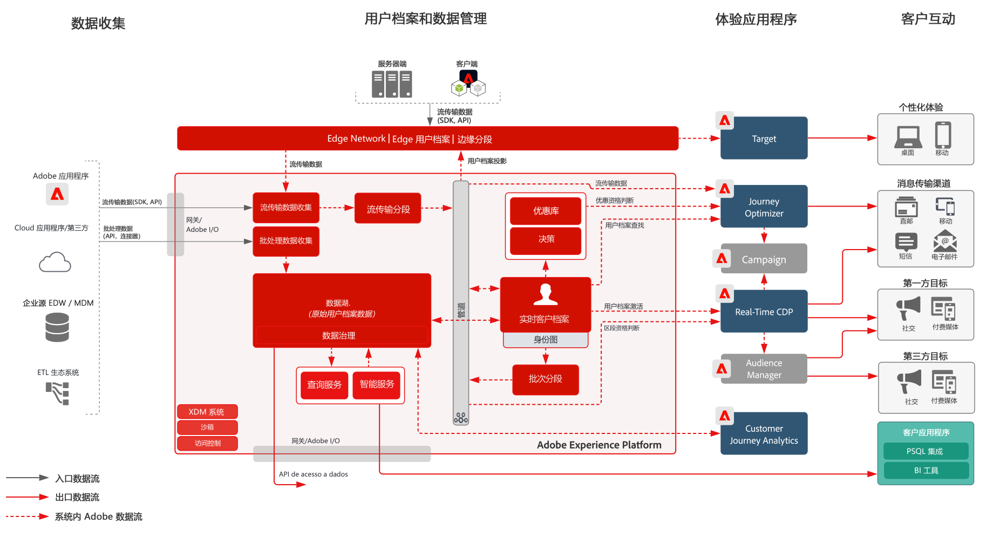

# 使用 Experience Cloud 应用程序的受众和用户档案激活 Blueprint

在 Experience Platform 中管理用户档案和受众，并将其与 Experience Cloud 应用程序共享。在 Experience Platform 中建立并共享丰富的客户区段和洞察，将其与 Experience Cloud 应用程序共享。

使用 Experience Cloud 应用程序的激活与[线上/线下受众激活 Blueprint](online-offline.md) 联系紧密。

## 用例

* 基于 Experience Cloud 跨客户交互渠道进行个性化和定位。
* 在 Experience Platform 和 Experience Cloud 应用程序之间共享受众和用户档案数据。

## 应用程序

* Adobe Experience Platform  
* [!UICONTROL 实时客户数据平台]
* Experience Platform 激活
* Experience Cloud 应用程序
   * Adobe Audience Manager
   * Adobe Target
   * Adobe Campaign
   * Journey Optimizer

## 架构

[请参阅 Experience Platform 和应用程序架构的相关章节，以了解有关 Experience Platform 与 Experience Cloud 应用程序集成的其他架构图。](https://experienceleague.adobe.com/docs/blueprints-learn/architecture/architecture-overview/platform-applications.html?lang=zh-Hans)

### 使用 Experience Cloud 应用程序的受众和用户档案激活

 

## 护栏

请参阅[“受众和用户档案激活概述”页上的护栏](overview.md)

## 相关文档

* [[!UICONTROL 实时客户数据平台]产品说明](https://helpx.adobe.com/cn/legal/product-descriptions/real-time-customer-data-platform.html)
* [用户档案和分段指南](https://experienceleague.adobe.com/docs/experience-platform/profile/guardrails.html?lang=zh-Hans)
* [分段文档](https://experienceleague.adobe.com/docs/experience-platform/segmentation/api/streaming-segmentation.html?lang=zh-Hans)
* [目的地文档](https://experienceleague.adobe.com/docs/experience-platform/destinations/catalog/overview.html?lang=zh-Hans)

## 相关视频和教程

* [[!UICONTROL 实时客户数据平台]概述](https://experienceleague.adobe.com/docs/platform-learn/tutorials/application-services/rtcdp/understanding-the-real-time-customer-data-platform.html?lang=zh-Hans)
* [[!UICONTROL 实时客户数据平台]演示](https://experienceleague.adobe.com/docs/platform-learn/tutorials/application-services/rtcdp/demo.html?lang=zh-Hans)
* [创建区段](https://experienceleague.adobe.com/docs/platform-learn/tutorials/segments/create-segments.html?lang=zh-Hans)
