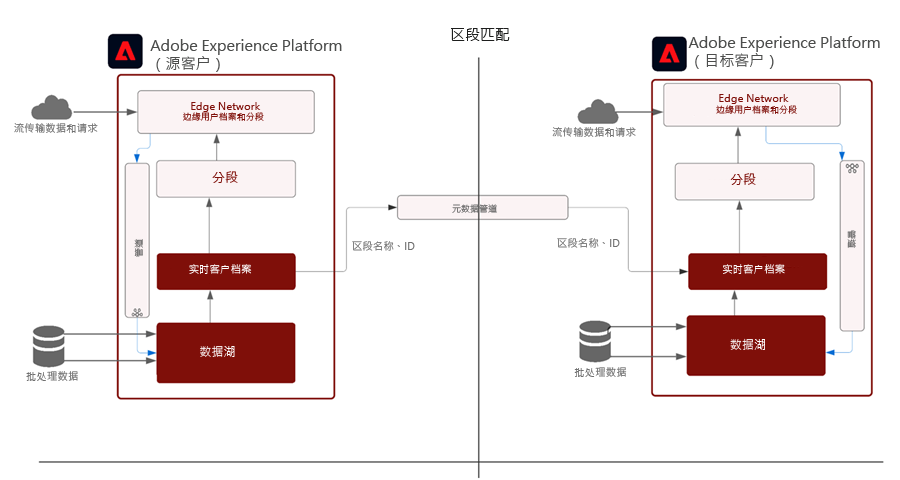
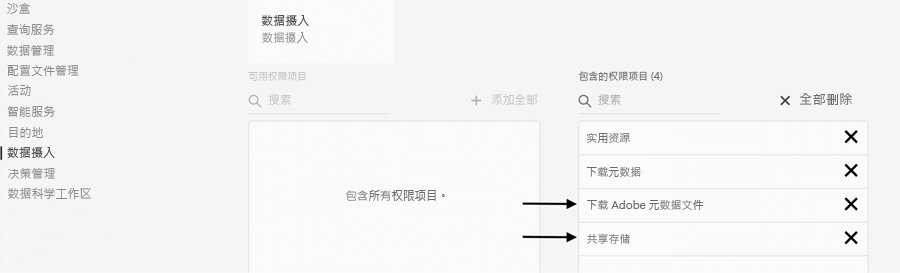
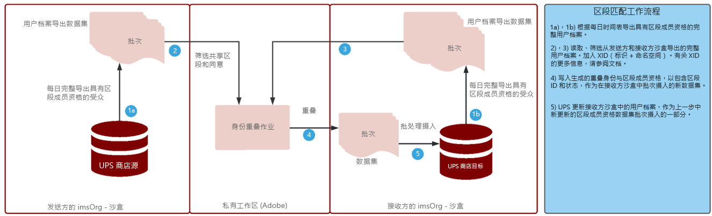

# 区段匹配Blueprint

区段匹配允许合作伙伴品牌在其各自的 Experience Platform 环境中共享受众。品牌的关键在于根据从与消费者的直接关系中收集的数据，与客户建立联系。通过更好的治理、权限和首选项管理系统，营销人员可以通过关键合作伙伴进一步增强其经过身份验证的第一方受众。

[!UICONTROL 区段匹配]是一项数据协作服务，允许 Experience Platform (AEP) 客户（称为 _合作伙伴_）以安全、受管理且对隐私友好的方式，基于通用行业标识符交换区段数据。

该服务使客户能够以安全、中立的方式安全地识别匹配的 ID，而无需披露其整个数据库。对于重叠的 ID，合作伙伴仅会收到指定的属性（区段名称），从而能够以符合同意管理的可控方式更快、更轻松地共享。

[!UICONTROL 区段匹配]使用 AEP 数据管理和同意框架作为其支柱。它可供所有 B2C 和 B2P Real-time Customer Data Platform 客户使用。[!UICONTROL [!UICONTROL 区段匹配]]的主要功能包括：

* 重叠同意客户的区段共享
* 预共享重叠报告以获取有关预计匹配量的洞察
* 完全集成的 DULE 策略和权限执行
* 数据共享同意框架支柱
* 用于组织区段和合作伙伴的数据馈送

## 应用程序

品牌到发布者：

弃用第三方 Cookie 和移动设备广告 ID 数据对“发布者用例”的影响最大。此用例对专注于以业务模式销售广告的媒体和娱乐行业有重大影响。对于拥有大量第一方受众且希望直接与其广告商协作的发布者，[!UICONTROL 区段匹配]是一条适合的途径。广告商可以直接与发布者合作，针对发布者属性的匹配受众发布广告，以开展精细的定位或潜在客户营销活动。

### 品牌到品牌

消费者历程从来不是线性的。例如，客户可能忠于航空公司及其信用卡公司。使用[!UICONTROL 区段匹配]，航空公司和信用卡公司可以创建数据合作伙伴关系以了解重叠的受众，然后量身定制优惠，为每家公司的忠实消费者提供个性化体验。

### 业务部门到业务部门

全球跨国公司面临着在独立运营的业务部门之间开展数据协作的挑战。由于各个业务部门的隐私政策各异，获取或管理权限不同，可能无法将数据合并到单个沙盒中。

[!UICONTROL 区段匹配]可帮助大型组织中分散的营销团队更高效地协作，同时继续保持独立运营

## 架构

{zoomable="yes"}

[!UICONTROL 区段匹配]不是可以购买数据的数据市场。它其实是一项 AEP 功能，可与选定的合作伙伴一起处理第一方数据，使用隐私和同意控制来帮助进行协作。[!UICONTROL 区段匹配]有助于集中精力改善客户关系和提升品牌。如果存在既有的品牌或合作伙伴关系，则此功能将非常有用。[!UICONTROL 区段匹配]体验易于管理、可扩展，并且允许管理员以支持选择加入且可控的方式共享区段。

[!UICONTROL 区段匹配]支持：

* 使用标准的人员级别标识符（如散列电子邮件或电话号码）在组织之间安全地传送区段成员身份数据
* 受众共享 UI 和工作流以及通知
* 预共享重叠估计数
* 自助式合作伙伴设置
* 在选择标准化的命名空间（散列电子邮件、散列电话、ECID、IDFA、GAID）上重叠
* 数据共享同意强制实施
* 共享受众生命周期管理
* 共享工作流中的 DULE 实施
* 每日批量更新

[!UICONTROL 区段匹配]支持创建互联的客户体验。支持的持久标识符包括散列电子邮件、散列电话号码以及 ECID、IDFA 和 GAID 等标识符。客户可以生成馈送，以在品牌沙盒之间匹配和移动受众数据，并具有强大的治理能力、透明度和撤销用于广告和营销激活的功能

## 先决条件

[!UICONTROL 区段匹配]的先决条件为：

* RT-CDP 活动已授予许可
* 支持的标准散列标识符有 SHA256 散列电子邮件、散列电话、ECID、Apple IDFA 和 GAID
* 隐私框架和同意策略
* 客户之间已签订数据共享协议

## 安全性

### RBAC

管理合作伙伴的[!UICONTROL 区段匹配]流由 RBAC 保护。只有拥有适当权限的个人才能启动、接受或管理合作伙伴。这可以在产品配置文件的“数据摄入”部分中完成。需要以下权限：

{zoomable="yes"}

| 权限 | 描述 |
|---|---|
| **管理受众共享连接** | 此权限允许您完成合作伙伴握手过程，从而连接两个 IMS 组织以启用[!UICONTROL 区段匹配]流。 |
| **管理受众共享** | 此权限允许您与活动合作伙伴（管理员用户已通过&#x200B;**受众共享连接**&#x200B;访问连接的合作伙伴）创建、编辑和发布馈送（用于[!UICONTROL 区段匹配]的数据包）。 |

有关权限的更多信息，请参阅[官方文档](https://experienceleague.adobe.com/docs/experience-platform/segmentation/ui/segment-match/overview.html?lang=zh-Hans#understanding-segment-match-permissions)。

### 连接 ID

合作伙伴连接过程通过&#x200B;**[!UICONTROL 连接 ID]** 管理，这是随机生成并可映射到特定 AEP 沙盒的标识符。启动和管理合作伙伴沙盒需要此连接 ID。此外，还可以根据需要重新生成连接 ID 以重新配置合作伙伴连接。

### 治理

对于[!UICONTROL 区段匹配]服务，具有 *C11* 合同标签的任何数据集或数据属性都受限制。使用这些属性的区段不能用于[!UICONTROL 区段匹配]。这样可以控制哪些区段可用于或不可用于的[!UICONTROL 区段匹配]。此外，还会执行创建的自定义策略和营销操作。默认情况下，策略处于禁用状态，需要启用才能执行。在共享区段时选择的电子邮件营销和现场广告等限制也会传播并与合作伙伴共享。

### 同意

[!UICONTROL 区段匹配]的同意设置可通过以下方式进行管理：

* 在组织级别，在载入过程中使用同意检查的选择退出或选择加入设置。

  此设置决定能否共享用户数据。默认设置为选择退出，这表示在 AEP 客户已拥有数据共享用途所需的同意协议的情况下，可以共享用户数据。可以联系 Adobe 客户经理，并加入额外检查以强制 AEP 客户明确跟踪同意，将此设置更改为选择加入。

* 使用[同意和首选项字段组](https://experienceleague.adobe.com/docs/experience-platform/xdm/field-groups/profile/consents.html?lang=zh-Hans)设置特定于身份 (idSpecific) 的共享属性。

  此字段组提供单个对象类型字段“同意”以捕获同意和首选项信息。[!UICONTROL 区段匹配]默认将包含所有尚未明确选择退出的身份，例如：

  ```
  "share": {
  `                `"val": "n"
  `     `}
  ```

  通过联系 Adobe 客户经理，可以更改此设置，以仅包含明确选择加入的身份，例如：

  ```
  "share": {
  `                `"val": "y"
  `     `}
  ```

### 警报

在启动合作伙伴连接或与合作伙伴共享区段馈送时会生成警报。

## 设置工作流

如上所述，用于设置合作伙伴连接的工作流是使用 RBAC 管理的。如果拥有适当的权限，则与合作伙伴沙盒的连接需要共享合作伙伴组织内该沙盒/实例的连接 ID。

在发送合作伙伴请求连接后，必须在接收方批准该连接，以确保合作伙伴设置安全。合作伙伴连接握手可确保两个组织之间存在协议，并允许 Adobe 代表组织促进[!UICONTROL 区段匹配]过程。如果连接已批准且处于活动状态，则可从任一方启动区段共享过程。

### 区段共享

仅当选定的标识符存在匹配项时，才会与合作伙伴共享区段。可能存在一对多的合作伙伴关系，这意味着可以与多个合作伙伴共享区段。

要在设置合作伙伴连接后启动区段共享，发送合作伙伴应创建一个馈送。然后，选择应从中排除区段数据的营销用例或操作以及持久标识符。然后，即可将相关区段添加到馈送中进行共享。

作为此区段共享工作流程的一部分，发送合作伙伴可以在移动任何数据之前通过估计的重叠数来发现潜在的高价值区段。

整个处理流程是：

{zoomable="yes"}

这些重叠估计数可提供关键的洞察、合作伙伴发现和数据来推动数据协作协议。在获取这些重叠估计数量度时，不会跨沙盒移动客户或区段数据。任何给定沙盒中由客户选择且经过预散列处理的适用身份将添加到可能性数据结构中，该数据结构允许 Adobe 在身份之间执行并集和交集操作。这些操作有助于[!UICONTROL 区段匹配]获取由来自两个不同沙盒的身份构成的两种数据结构的交集估计，而无需比较实际值

身份重叠流程取决于发送方和接收方沙盒中的&#x200B;**每日完整用户档案导出**&#x200B;数据集，以识别属于共享区段的公共用户档案。重叠流程的详细处理流程如下所示：

{zoomable="yes"}

在从发送合作伙伴完成区段共享后，接收方会收到已共享区段馈送的通知。必须在接收方为用户档案启用此区段馈送，以便启动区段成员资格数据流。只有区段成员资格会被摄入到接收方 IMS 组织的重叠用户档案片段中，并且不会从发送方向接收方传输任何其他身份。

共享区段位于&#x200B;**[!UICONTROL 区段生成器]**&#x200B;中&#x200B;**[!UICONTROL 受众]**&#x200B;选项卡的 `AEPSegmentMatch` 部分，并可用于在接收方沙盒中构建区段时包含或抑制受众。

每日重叠流程可在发送方和接收方之间保持区段成员资格同步。接收方可以为收到的区段馈送禁用用户档案，以暂停区段共享过程。

#### 区段出口/入口

在完整用户档案导出过程中，用户档案区段成员资格下共享区段 ID 的状态具有一个相应的值，即&#x200B;_已实现_、_已退出_&#x200B;或&#x200B;_现有_，以反映当前状态。

在每日身份重叠流程中，如果接收方沙盒中存在相应的身份，则共享区段的这些区段成员资格状态将会发送到接收方以用于摄入。

#### 区段撤销

从发送方撤销/删除区段是一个按需流程，期间会从接收方获取具有已撤销区段 ID 的所有用户档案的列表。区段 ID 将从这些身份的区段成员资格中移除，并在接收方重新摄入。此操作将覆盖现有区段成员资格片段，会删除该区段的成员资格。

## 在程序化交易中使用区段匹配

随着围绕第三方Cookie和设备标识符的限制日益严格，程序化广告正在寻找新的方法来构建和目标受众。 已提出了越来越多的“通用ID”解决方案，但行业仍在不断变化，尚未就实现相同级别的目标达成一致的、可扩展的方式，同时还要平衡适用的隐私问题。

您可以在以隐私为中心的受众协作中使用Adobe Experience Platform区段匹配，并增强广告商和出版商之间的编程式私人交易。 通过区段匹配，您可以：

* 拆分&#x200B;**广告跟踪**&#x200B;和&#x200B;**受众**&#x200B;工作流。
* 允许合作伙伴品牌共享受众元数据，以便在征得同意的流程中使用持久标识符（例如哈希电子邮件和哈希电话号码）进行相互共享和同意身份标识。

### 用例

* 通过计划性私人交易定位第一方受众。
* 通过计划性私人交易抑制第一方受众。
* 定位通过程序化私人交易植入的第一方受众中的相似受众。

>[!BEGINSHADEBOX]

**请考虑以下品牌(Luma)和媒体网络(ACME)之间的示例工作流：**

1. 品牌(Luma)通过区段匹配与媒体网络(ACME)进行受众匹配。
2. ACME通过Adobe Real-Time CDP目标将受众推送到广告服务器或程序化SSP。
3. ACME使用适用的定位标准（包括上一步中建立的受众）设置私有库存交易(ID)。 随后，私有库存交易ID将被推送到Luma的DSP。
4. Luma开展私有库存交易和流量营销活动/广告创意。
5. 然后，该营销活动会通过程序化的“私有库存交易”进行交付。
6. 接下来，广告服务器或SSP提供符合既定定位标准的广告展示次数。 (其他定位标准，如频度上限，可通过广告服务器和/或DSP使用，具体取决于协议中是建立了保证交易还是首选交易)。
7. 流量来自Luma的品牌资产。
8. 然后，ACME通过“区段匹配”分享营销活动后的见解或受众，以便重新定位。

>[!ENDSHADEBOX]


>[!IMPORTANT]
>
> 虽然上述解决方案提供了一种通过编程性私人交易定位第一方数据的简单方法，但执行之前可能会有一些注意事项，包括但不限于以下示例：
>
>* 同意：品牌、出版商或零售媒体网络通过此方式利用数据的适用同意收集。
>
>* 策略和许可协议：品牌、出版商或零售媒体网络遵守任何适用的策略（包括隐私策略、第三方供应商协议），以这种方式利用和激活数据。


## 更多信息

* [区段匹配](https://experienceleague.adobe.com/docs/experience-platform/segmentation/ui/segment-match/overview.html?lang=zh-Hans#)
* [权限](https://experienceleague.adobe.com/docs/experience-platform/access-control/home.html?lang=zh-Hans)
* [故障排除](https://experienceleague.adobe.com/docs/experience-platform/segmentation/ui/segment-match/troubleshooting.html?lang=zh-Hans)
* [XID](https://experienceleague.adobe.com/docs/experience-platform/identity/api/list-native-id.html?lang=zh-Hans)
