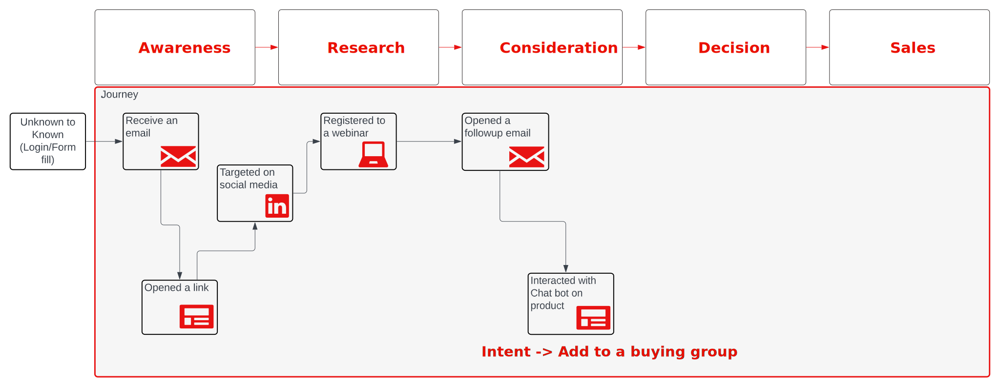

# 购买基于群组的营销和历程管理蓝图

在为销售人员提供合格的潜在客户方面，营销团队目前面临着许多挑战。 这些挑战之一是与组织中的适当人员合作，这通常在努力和准确性方面显而易见。 以&#x200B;_潜在客户得分_&#x200B;计，组太窄，团队可能缺少合适的人员。 对于&#x200B;_帐户得分_，需要花费更大的精力才能通过如此广泛的帐户视图来识别正确的人员。

此挑战是引入&#x200B;**_购买组_**&#x200B;概念的地方。 购买组让营销人员能够找到帐户中的合适人员组，并通过确定潜在客户资格并确定他们在组中的角色来与这些人员合作。

## 如何使用购买组确定潜在客户和客户

创建并努力完成购买组可以提高营销活动在确认潜在客户销售机会方面的有效性。 购买组取决于匹配与解决方案意图关联的潜在客户角色模板。

例如，_Acme Corp Seeds Buying Group_&#x200B;是购买组，其解决方案利益为&#x200B;_AI驱动种子_。

购买团体代表公司中对解决方案意图感兴趣的一群人员。 此外，还可以为多个解决方案兴趣识别购买团体，并且个人出现在多个购买团体中。

由于Journey Optimizer B2B edition提供的B2B增强功能，您现在可以解决以下挑战：

* 缺少&#x200B;_客户优先_&#x200B;的营销活动。
* Marketing Qualified Lead (MQL)向Sales Qualified Lead (SQL)的转化不一致，需要让计划与销售保持一致，以培养MQL
* 缺少可销售的机制来识别和定位&#x200B;_竞争_&#x200B;帐户。
* 收入及管道集中风险。

以下KPI与衡量用例的成功非常吻合：

* **感知**：目标客户是否看到您的广告，并将其驱赶到您网站的速度是否比以前更快？
* **参与**：目标客户访问您的网站并参与内容吗？
* **时间**：销售团队需要多长时间才能从各种工具中查找联系人并将其添加到商机中？
* **成本**：每个潜在客户在每个平台上要花费多少钱？

## 基于帐户的营销

一个常见用例，也是此Blueprint中的重点，是基于帐户的营销计划。 本使用案例探讨了当创建的购买组与角色和解决方案兴趣相关联时，使用潜在客户填充该购买组的程度。

当您引导个人完成整个历程时，通过表单、CRM同步和LinkedIn激活，收集有关潜在客户（购买组工作流程）的更多信息。

当潜在客户清楚地表明其对该解决方案的兴趣时，它表示由业务镜头定义的业务事件。 此时，公司确信此潜在客户确实对产品感兴趣。 在Journey Optimizer B2B edition中，潜在客户与角色模板中该解决方案的购买群体（如影响者、决策者、拥护者和赞助者）相关联。

下图说明了如何收集表单中的详细信息或通过LinkedIn激活收集详细信息，以及在发生与聊天机器人交互时确认解决方案意图。

{zoomable="yes"}

当购买组完成百分比足够高时，您可以通过SQL或SOL将该组共享给Sales团队，以将帐户中的潜在客户转换为已完成销售。

## 以客户为中心的解决方案

B2B商机管理的重点是客户及其商机。 技术层旨在支持代表这些特征的数据，这是成功客户细分和历程管理的要求。

### 要求

以客户为中心的解决方案需要以下应用程序和服务：

* Adobe Journey Optimizer B2B edition
* Adobe Real-time Customer Data Platform (RTCDP) B2B edition
* Adobe Marketo Engage

>[!NOTE]
>
>Journey Optimizer B2B edition的许可应包括以下项目：
><ul><li>连接到Experience PlatformB2B的Journey Optimizer B2B edition实例</li><li>同步到RTCDP的Marketo Engage实例</li></ul>
>&gt; 
>&gt;对于现有Marketo Engage客户，建议连接到现有实例。
>&gt;  
>&gt;为增强用户档案丰富度，解决方案提供了其他扩展：
>&gt;<ul><li>RTCDP的其他来源以丰富用户档案</li><li>RTCDP目标到Marketo Engage</li></ul>

实施此解决方案还需要清楚地了解&#x200B;_帐户_&#x200B;和&#x200B;_购买群组_&#x200B;的概念，以及它们如何扩大和加快销售线索资格鉴定。 有了这种了解，您还必须确定所需的购买群组完整性分数。

### 架构

{zoomable="yes"}

### 数据架构

对于任何数据驱动营销自动化的实施，架构设计都是成功实施的关键所在。 在设计架构之前，请查看[B2B命名空间和架构](https://experienceleague.adobe.com/zh-hans/docs/experience-platform/sources/connectors/adobe-applications/marketo/marketo-namespaces)，并确保您了解可用于在新的实施方案中生成新架构的自动生成实用程序。

架构中特别丰富了B2B数据元素，以支持用户档案中的丰富关系，并通过`sourceKey`包含帐户透视，以将事件和用户档案关联到帐户架构。 架构代表了您的组织要求以及收集和分析的数据。 为了满足这些需求，B2B架构非常灵活，是所需B2B元素的扩展。

在为贵组织设计数据架构时，最佳做法是使用高级实体来表示和标记ERD中的主要实体。 （请参阅[RTCDP B2B架构文档](https://experienceleague.adobe.com/zh-hans/docs/experience-platform/xdm/tutorials/relationship-b2b)中的第一个图表）。 此过程对于了解您需要在每个架构中定义的数据元素非常有用。

在此阶段，体验事件尚无法影响历程。 除了体验事件架构之外，还建议您将属性添加到帐户，这些属性代表基于用户活动的主要决策。 这些属性用于历程设计器中的拆分路径元素。

>[!NOTE]
>
>目前，Journey Optimizer B2B edition支持的唯一关系是通过`Person`实体上的`personComponents[0].sourceAccountKey.sourceKey`属性建立的直接关系。 计划将来扩展以适应B2b架构中的帐户 — 人员关系对象。

### Marketo Engage源连接器

要扩充帐户数据元素，您可以使用Marketo Engage及其B2B数据扩充RTCDP和Journey Optimizer B2B edition帐户视图。 设置Marketo EngageSource Connector并将Marketo Engage数据映射到RTCDP架构属性允许数据从Marketo Engage流到RTCDP，如果指定，则流到用户档案。

有关连接器配置和到架构的所需字段映射的详细信息，请参阅[Marketo Engage连接器文档](https://experienceleague.adobe.com/zh-hans/docs/experience-platform/sources/connectors/adobe-applications/marketo/marketo)。

### 护栏

[产品描述页面](https://helpx.adobe.com/cn/legal/product-descriptions/adobe-journey-optimizer-b2b.html)中详细介绍了Journey Optimizer B2B edition护栏。

与实施相关的护栏

* 在[B2B Audience和Profile Activation Blueprint](https://experienceleague.adobe.com/zh-hans/docs/blueprints-learn/architecture/architecture-overview/deployment/guardrails)中描述了所有B2B Audience护栏，这些护栏可直接转置为Journey Optimizer B2B edition的成功护栏。
* 如果需要在帐户历程中通过Marketo Engage渠道进行激活或使用CRM Sync扩充帐户，则相关[Marketo Engage相关护栏](https://helpx.adobe.com/cn/legal/product-descriptions/adobe-marketo-engage---product-description.html#performance-guardrails)。

有关RTCDP护栏的其他详细信息，请参阅[Real-Time CDP护栏文档](https://experienceleague.adobe.com/zh-hans/docs/experience-platform/rtcdp/guardrails/overview)。

### 配置

* 所有实例都必须位于同一IMS组织中。
* 只有一个Journey Optimizer B2B edition实例可以链接到一个Experience Platform沙盒。
* 强烈建议向Real-time Customer Data Platform实施[Marketo Source Connector](https://experienceleague.adobe.com/zh-hans/docs/experience-platform/sources/connectors/adobe-applications/marketo/marketo)。

## 实施

以下步骤为在Journey Optimizer B2B edition实例中启用购买群组提供了指南，包括受众激活，以支持扩展您的帐户群，并重点关注缺失的购买群组角色模板。

### 必备步骤

1. 定义将代表您帐户和潜在客户业务视图的XDM架构。

   第一步，您定义并创建一个体验架构，该架构旨在满足B2B用例需求并涵盖数据源（批量处理和实时处理）。 此设计应呈现企业思考客户实体和人员实体以及您希望支持的用例的方式。 要使架构成为B2B架构，该架构应遵循[RTCDP B2B架构文档](https://experienceleague.adobe.com/zh-hans/docs/experience-platform/xdm/tutorials/relationship-b2b)中提供的结构。

   一个有用的做法是从图表中获取实体名称，并通过以相同的方式标记这些实体来识别架构中的这些实体。 请注意，某些架构需要特定键（如`sourceKey`）才能在RTCDP B2B中运行。 短期而言，Journey Optimizer B2B不支持通过帐户人员关系在帐户和人员之间建立&#x200B;_多对多_&#x200B;关系。 请使用加速器脚本以获得最佳起点：

   * 使用[RTCDP B2B架构创建脚本](https://github.com/adobe/experience-platform-postman-samples/tree/master/Postman%20Collections/CDP%20Namespaces%20and%20Schemas%20Utility)生成初始架构
   * 将用例特定字段添加到生成的架构中，以完成架构以适合组织需求。

   在此阶段，您已在Marketo Engage和RTCDP之间建立连接，并且模式结构接受帐户和人员数据以填充Account Segments的数据集。 下一步是将RTCDP与Marketo Engage和Journey Optimizer B2B edition连接。

1. 配置Marketo Engage连接器，包括Marketo Engage到XDM结构的映射。

   准备好XDM结构和字段后，继续使用连接器将Marketo Engage连接到RTCDP，连接器会向Marketo Engage和Journey Optimizer B2B提供数据。 首先，组织从Marketo Engage到RTCDP类的字段映射。 使用[连接器文档](https://experienceleague.adobe.com/zh-hans/docs/experience-platform/sources/connectors/adobe-applications/marketo/marketo#field-mapping-from-marketo-engage-to-xdm)中的信息来标识要包含在Marketo Engage实现中的字段。

### 购买组配置

1. 在Journey Optimizer B2B edition或RTCDP中创建客户受众。

   启用“客户→受众→浏览”页面中的“计划所有受众”选项，以启用“帐户受众”。 （如果此方法不起作用，则必须创建一个客户配置文件区段，以便能够创建客户受众。）

   要创建区段，请按照[帐户受众文档](https://experienceleague.adobe.com/zh-hans/docs/journey-optimizer-b2b/user/account-audiences/account-audience-overview)中的步骤操作。 在定义受众时，关键活动是将区段生成器与您标识为帐户受众关键的数据字段结合使用。

   在此阶段，您知道客户通过RTCDP将重点关注，并用于购买组的构建块。

1. 定义角色模板。

   在每个购买组中，确定代表个人在要处理的组中担任的角色的角色。 例如，您可以使用&#x200B;_决策者_、_影响者_&#x200B;和&#x200B;_冠军_。 还定义此角色在购买组中的权重和条件。

   [角色模板文档](https://experienceleague.adobe.com/zh-hans/docs/journey-optimizer-b2b/user/buying-groups/buying-groups-role-templates)介绍了此过程以及如何定义特殊条件。

1. 定义解决方案兴趣。

   对解决方案感兴趣是一种指示购买组关注您的营销活动和策略的方式。

   要定义解决方案兴趣，请按照[解决方案兴趣文档](https://experienceleague.adobe.com/zh-hans/docs/journey-optimizer-b2b/user/buying-groups/solution-interests)中的步骤操作。 请记住，您使用它来将购买组与组织中的销售计划相匹配。

1. 配置购买组。

   准备好购买组的构建块后，为解决方案兴趣和帐户受众配置购买组，使其具有包含正确帐户成员的角色模板。 使用此配置，将解决方案兴趣分配给您标识的角色模板，并在特定产品的销售成功中为每个角色分配权重。

   要构建购买群，请按照[购买群文档](https://experienceleague.adobe.com/zh-hans/docs/journey-optimizer-b2b/user/buying-groups/buying-groups-create)中的步骤操作。

   在此阶段，您已准备好[创建一个历程](https://experienceleague.adobe.com/zh-hans/docs/journey-optimizer-b2b/user/account-journeys/journey-overview#get-started-with-a-journey)并开始与客户受众合作，以建立购买群体，并让他们符合解决方案兴趣的条件。

### Audience Activation

通过受众激活提高购买群体的完整性。

1. 定义LinkedIn广告匹配的帐户受众。

   除了电子邮件和表单填写活动之外，Journey Optimizer B2B edition还提供LinkedIn广告功能，以增加您帐户的广度，并通过扩展帐户潜在客户范围和增加营销活动的影响力来支持完成购买组的工作。

   要使用LinkedIn付费媒体与未完成购买群组或未充分参与的帐户通信，请展开或与帐户受众互动，使用[LinkedIn帐户匹配受众功能](https://experienceleague.adobe.com/zh-hans/docs/journey-optimizer-b2b/user/account-audiences/linkedin-account-matched-audiences)通过帐户匹配受众生成LinkedIn广告受众。

1. 激活购买群组的受众。

>[!TIP]
>
>成功营销活动的几个提示：
>
>* 营销活动应具有角色过滤器，以适合缺少角色的购买群体，从而提高ROI。
>* 要捕获潜在客户，请直接潜在客户填写表单(LinkedIn或Marketo Engage表单)并重新定位表单未命中。
