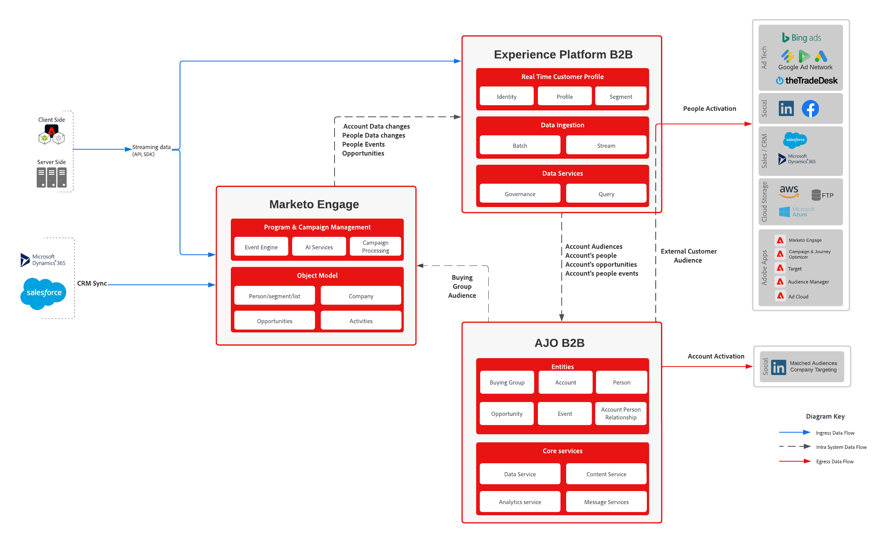

# 使用Marketo Data Blueprint的B2B历程

本综合指南概述将Marketo Engage与Adobe Journey Optimizer B2B edition集成的过程。 它涵盖了自定义模式的配置、用户档案和帐户的摄取，以及编排购买群组的个性化历程。 通过使用Marketo Engage数据，此Blueprint确保跨多个渠道进行准确定位和参与，从而推动更多符合条件的需求并增强客户体验。

## 用例

* **创建和管理购买群组**：使用创新型人工智能在目标帐户中组合和管理购买群组，确保全面覆盖关键利益相关者
* **自动分配成员**：根据定义的条件（如内容使用情况和CRM数据），自动为购买群组角色分配成员
* **个性化历程**：根据每个购买群组和成员的角色、帐户、产品兴趣和生命周期阶段，设计并可视化针对这些购买群组和成员的多步历程
* **实时自动化**：通过实时参与触发器和资格计分，通过历程自动完成帐户和购买组的过程
* **Cross-Channel Engagement**：与跨多个渠道（包括电子邮件、短信、广告、聊天、活动和网络研讨会）的购买团体互动以简化需求生成和资格鉴定
* **AI驱动的分析**：使用AI驱动的分析优化单个购买者和整个购买组的内容交付和参与策略
* **统一数据激活**：激活Adobe Real-Time Customer Data Platform中的统一帐户列表，为购买群组的创建和管理提供最新和完整的数据
* **增强型Collaboration**：协调营销和销售工作，以创造更准确的销售机会并加快创建管道

## 应用程序

* Journey Optimizer B2B Edition
* Real-time Customer Data Platform B2B 版
* Marketo Engage

## 集成模式

| 集成 | 描述 |
| :-- | :--- |
| [Marketo Engage连接器](https://experienceleague.adobe.com/zh-hans/docs/experience-platform/sources/connectors/adobe-applications/marketo/marketo) | Adobe Experience Platform方便了从Marketo中摄取数据，提供了用于构建、标记和使用其服务增强数据的功能。 |
| [Journey Optimizer B2B edition - Marketo Engage操作](https://experienceleague.adobe.com/zh-hans/docs/journey-optimizer-b2b/user/account-journeys/journey-nodes/action-nodes#marketo-engage-actions) | 将Journey Optimizer B2B edition中的Account-Based Marketing与Marketo Engage中基于商机的工作同步，使用基于人员的操作管理列表成员资格、人员分区和请求营销活动。 |
| [Journey Optimizer B2B edition - Marketo Engage资源](https://experienceleague.adobe.com/zh-hans/docs/journey-optimizer-b2b/user/content-management/assets/marketo-engage-dam/marketo-engage-design-studio) | Marketo Engage Design Studio是Journey Optimizer B2B edition的默认资源源，支持帐户历程的轻松资源管理。 |

## 架构

{zoomable="yes"}

## 护栏

* 每个沙盒最多有50个帐户区段。
* 批次分段评估。
   * 在批量受众运行和配置文件导出作业完成后，每24小时自动评估一次。
   * 不支持边缘、流或临时评估。
* 帐户属性可用于导出。
* 人们的事件。
   * 事件回顾时间最长为30天，不为事件谓词排序。
   * AND/OR受支持(因此您可以说“A和B必须发生”，  但是你不能说“A必须在B之前3天发生”)。
* 所有帐户历程中的最多500万个帐户
* 所有帐户历程中最多有4000万人
* 购买团体和历程中每个帐户最多1,000人
* [用户档案和分段护栏](https://experienceleague.adobe.com/zh-hans/docs/experience-platform/profile/guardrails)

## 实施步骤

* 使用以下任一选项安装B2B架构和命名空间
   * 使用[Postman收藏集](https://github.com/adobe/experience-platform-postman-samples/tree/master/Postman%20Collections/CDP%20Namespaces%20and%20Schemas%20Utility)
   * 在Platform UI中使用[模板](https://experienceleague.adobe.com/zh-hans/docs/experience-platform/sources/ui-tutorials/templates)
* 构建数据字典，定义Marketo字段和Experience Platform XDM架构之间的映射
   * 使用[Marketo对象元数据](https://experienceleague.adobe.com/zh-hans/docs/marketo/using/product-docs/administration/field-management/export-all-object-metadata)作为起点
   * [自定义XDM架构](https://experienceleague.adobe.com/zh-hans/docs/experience-platform/xdm/ui/fields/overview)以包含您的自定义字段
   * 查看Journey Optimizer B2B edition支持的标准[XDM字段](https://experienceleague.adobe.com/zh-hans/docs/journey-optimizer-b2b/user/accounts/field-mapping)。 如果您需要其他字段，请打开支持票证以配置它们
      * 人员数据集上需要&#x200B;**workEmail.address**
      * 帐户数据集中需要&#x200B;**accountName**
   * 将新的XDM字段列添加到导出的Marketo元数据电子表格中，以记录预期的映射
* 配置[Marketo Engage源连接器](https://experienceleague.adobe.com/zh-hans/docs/experience-platform/sources/connectors/adobe-applications/marketo/marketo)
   * 使用上面定义的数据字典为源连接器定义[导入映射](https://experienceleague.adobe.com/zh-hans/docs/experience-platform/data-prep/ui/mapping#import-mapping)
   * 建议不要在考虑[实现注意事项](#implementation-considerations)之前启用配置文件
   * 建议至少摄取人员、公司、机会和活动，因为这些对象在创建客户受众时最有用
* 为人员实施[身份图链接规则](https://experienceleague.adobe.com/zh-hans/docs/experience-platform/identity/features/identity-graph-linking-rules/overview)：
   * 定义如何使用身份命名空间（例如，email、b2b_person）链接人员记录。
   * 在AEP中配置身份命名空间和身份拼接规则。
   * 使用示例“人员”数据和预览工具验证链接。
* 为[个人资料](https://experienceleague.adobe.com/zh-hans/docs/experience-platform/catalog/datasets/user-guide#enable-profile)启用人员、公司、机会和活动数据集
* 定义您的前[帐户受众](https://experienceleague.adobe.com/zh-hans/docs/journey-optimizer-b2b/user/accounts/account-audience-overview)
* 使用帐户受众定义[购买组](https://experienceleague.adobe.com/zh-hans/docs/journey-optimizer-b2b/user/accounts/buying-groups/buying-groups-overview)或[帐户历程](https://experienceleague.adobe.com/zh-hans/docs/journey-optimizer-b2b/user/account-journeys/journey-overview)
   * 购买组作业每天运行，处理符合帐户受众或新关联人员资格的新帐户
   * 购买团体维护服务在每周五CT午夜运行，因此仅在周五才删除成员或添加新合格成员

## 建议的设置

为了简化实施并确保与Adobe Journey Optimizer B2B edition的兼容性，建议执行以下设置：

* **使用默认标识字段：**
   * _email_&#x200B;和&#x200B;_b2b_person_&#x200B;应保留为人员架构中的身份字段，以支持身份拼接和受众激活。
* **为Marketo Source Connector使用默认映射：**
   * 利用Adobe提供的现成字段映射来简化数据摄取并减少配置开销。
* **为AJO B2B使用默认映射：**
   * 对Journey Optimizer B2B edition采用[标准字段映射](https://experienceleague.adobe.com/zh-hans/docs/journey-optimizer-b2b/user/accounts/field-mapping)，以确保与购买组逻辑和Journey Orchestration兼容。
* **阻止除电子邮件以外的所有字段的字段更新：**
   * 在Marketo Engage中，为[电子邮件](https://experienceleague.adobe.com/zh-hans/docs/marketo/using/product-docs/administration/field-management/block-updates-to-a-field)以外的所有字段配置字段管理，以阻止从Adobe Experience Platform进行更新&#x200B;__。 这有助于保持数据完整性，同时仍支持身份解析。
* **使用电子邮件作为唯一的身份命名空间来实施身份链接规则**
   * 将Adobe Experience Platform中的[身份图形链接规则](https://experienceleague.adobe.com/zh-hans/docs/experience-platform/identity/features/identity-graph-linking-rules/overview)配置为将&#x200B;_电子邮件_&#x200B;显式用作唯一的身份命名空间。 这些规则可确保跨存在&#x200B;_电子邮件_的数据源精确拼合用户档案，从而实现可靠的身份解析。 遵循Adobe的最佳实践，定义将电子邮件优先作为稳定且全球唯一的标识符的关联规则，以维护一致且符合隐私要求的身份图。
这种设置可以在轻松部署和数据治理之间取得平衡，从而确保为编排B2B历程奠定可靠的基础。

## 实施注意事项

在实施Adobe Journey Optimizer B2B edition时，了解实时客户数据平台提供的身份拼接功能至关重要。 此平台在人员和帐户级别执行身份拼接，确保客户数据的统一视图。

### 要点

* **身份拼接**：平台使用默认标识符(如Marketo ID、CRM ID和电子邮件)来拼接身份。 这有助于通过合并来自不同来源的数据来创建全面的配置文件。
* **潜在风险**：使用电子邮件作为标识符进行拼合可能会导致无意中的身份崩溃。 这意味着共享同一电子邮件地址的不同个人可能会错误地合并到单个配置文件中。 此身份折叠可能会对CRM数据的准确性产生负面影响，并损害其完整性。
* **合并策略**： B2B CDP采用基于时间的合并策略，其中使用特定配置文件属性的最新lastUpdatedDate。 此策略可确保最新数据反映在配置文件中。
* **电子邮件注意事项**：必须全面评估电子邮件作为合并配置文件片段的标识符的使用情况。 尽管这可能有好处，但必须仔细考虑身份崩溃的风险，而不是好处。 缺点之一是，如果没有电子邮件作为标识符，AJO B2B创建的外部受众会员资格不会集成到现有配置文件中。
* **Marketo人员集成**：在多个AJO记录合并到单个配置文件时，Marketo B2B使用潜在客户ID最低的Marketo人员。

通过牢记这些要点，您可以就如何在Adobe Journey Optimizer B2B edition中配置身份拼接做出明智的决策，从而确保准确可靠的客户档案。

### 评估身份拼接结果

查询服务可用于在未启用配置文件的数据集中查看身份拼接的影响。 以下查询可用于进行评估

#### 已摄取的记录数

此查询返回已摄取到人员配置文件数据集中的记录总数

```sql
select
    count(distinct b2b.personKey.sourceKey)
from
    marketo_person_ajo_b2b
```

#### 复制电子邮件

此查询返回将作为平台身份拼接的一部分合并的人员记录数

```sql
select
    SUM(personCount)
from
    (
        select
            emailAddress,
            count(*) as personCount
        from
            (
                select
                    MAX(workemail.address) as emailAddress
                from
                    marketo_person_ajo_b2b
                where
                    workemail.address IS NOT NULL
                group by
                    b2b.personKey.sourceKey
            )
        group by
            emailAddress
        having
            count(*) > 1
    )
```

#### 包含重复记录的电子邮件地址

此查询返回数据集重复记录最多的电子邮件。  此列表可用于检查其中一些记录，以更好地了解关联身份可能对Marketo和CRM有何影响。  有关标识链接工作方式的更多详细信息，请参阅[标识服务概述](https://experienceleague.adobe.com/zh-hans/docs/experience-platform/identity/home)。

```sql
select
    *
from
    (
        select
            emailAddress,
            MAX(personId) as personId,
            count(*) as personCount
        from
            (
                select
                    b2b.personKey.sourceKey,
                    MAX(workemail.address) as emailAddress,
                    MAX(b2b.personKey.sourceId) as personId
                from
                    marketo_person_ajo_b2b
                where
                    workemail.address IS NOT NULL
                group by
                    b2b.personKey.sourceKey
            )
        group by
            emailAddress
        having
            count(*) > 1
    )
order by
    personCount desc
```

### 选项

#### 删除电子邮件作为标识

在分析之后，如果您确定电子邮件不是用作标识字段的有效字段，则可以修改人员架构以[删除作为标识字段的电子邮件](https://experienceleague.adobe.com/zh-hans/docs/experience-platform/xdm/ui/fields/identity)

#### 阻止来自Adobe Experience Platform的更新

如果将电子邮件保留为标识字段最适合您的用例，则可以选择[阻止来自AJO B2B的字段更新](https://experienceleague.adobe.com/zh-hans/docs/marketo/using/product-docs/administration/field-management/block-updates-to-a-field)，并允许AJO B2B主要在Marketo数据上运行。

## 相关文档

* [Real-time Customer Data Platform B2B 版](https://experienceleague.adobe.com/zh-hans/docs/experience-platform/rtcdp/intro/rtcdpb2b-intro/b2b-overview)
* [Real-time Customer Data Platform B2B edition入门](https://experienceleague.adobe.com/zh-hans/docs/experience-platform/rtcdp/intro/rtcdpb2b-intro/b2b-tutorial)
* Real-time Customer Data Platform B2B edition的[护栏](https://experienceleague.adobe.com/zh-hans/docs/experience-platform/rtcdp/intro/rtcdpb2b-intro/b2b-guardrails)
* [Adobe Experience Platform](https://experienceleague.adobe.com/zh-hans/docs/experience-platform)
* [Adobe Experience Platform Identity服务](https://experienceleague.adobe.com/zh-hans/docs/experience-platform/identity/home)
* [Marketo Engage](https://experienceleague.adobe.com/zh-hans/docs/marketo/using/home)
* [Adobe Experience Platform - Marketo 源连接器](https://experienceleague.adobe.com/zh-hans/docs/experience-platform/sources/connectors/adobe-applications/marketo/marketo)
* [Adobe Journey Optimizer B2B edition文档](https://experienceleague.adobe.com/zh-hans/docs/journey-optimizer-b2b/user/guide-overview)
