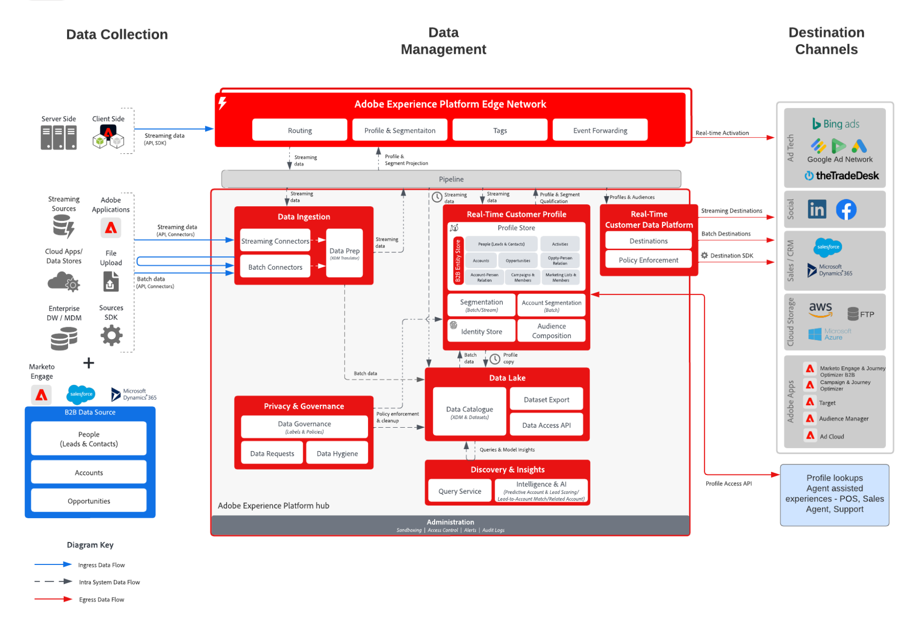

# B2B 受众和用户档案激活 Blueprint

使用与单个客户绑定的帐户、机会和商机信息，创建可操作的 B2B 用户档案，以改进跨渠道的个性化和定位。

## 用例

* 创建人员受众，以便针对 B2B 数据（包括帐户、机会和商机）进行跨渠道定位和个性化。
* 将受众激活到任何 Experience Platform 目标，以便进行定位和个性化。
* 创建客户受众（例如公司列表）并通过LinkedIn之类的目的地定位这些公司，这些目的地接受公司列表作为输入或导出到云存储目的地以进行定位和销售推广。

## 应用程序

* Real-time Customer Data Platform B2B 版

## 集成模式

* B2B 数据源（Marketo、Salesforce 等）-> Real-time Customer Data Platform B2B版本 — >目标
* 各种B2B数据源可用于将客户、商机、机会和人员数据映射到Real-time Customer Data Platform的B2B版本。

## 架构

## 护栏

* 请注意，仅当将 Marketo Engage 用作源和/或目标时，与 Marketo Engage 相关的护栏和实施步骤才相关。

* 有关数据模型、大小和分段的其他详细信息和防护，请参阅[部署防护文档](../experience-platform/deployment/guardrails.md)

### 多实例和 IMS 组织支持：

以下概述了对于映射 Experience Platform 和 Marketo Engage 实例所支持的模式。

#### Marketo 作为数据源到 Experience Platform：

* 支持多个 Marketo Engage 实例到一个 Experience Platform 实例。
* 不支持一个 Marketo Engage 实例到多个 Experience Platform 实例。
* 支持一个 Marketo Engage 实例到一个 Experience Platform 实例和多个沙箱。

#### Marketo 作为目标到 Experience Platform：

* 支持 Experience Platform 到多个 Marketo Engage 实例
* 支持多个 Experience Platform 实例到一个 Marketo Engage 实例

#### Experience Platform 用户档案和分段护栏：

* 有关 Experience Platform - [用户档案和分段护栏](https://experienceleague.adobe.com/docs/experience-platform/profile/guardrails.html?lang=zh-Hans)，请参阅用户档案和分段护栏
* B2B 区段包括帐户、商机、机会，使用多实体关系，这会导致区段评估成为批处理。对于仅限于人员和事件的区段，支持流传输分段。
* 包括批量B2B区段作为流区段或边缘区段的输入，以支持流B2B区段用例。 批处理客户细分会员资格基于最新的每日批处理客户细分评估结果。

#### Experience Platform - Marketo Engage 源连接器：

* 历史回填可能需要最多 7 天才能完成，具体取决于数据量。
* 来自Marketo的持续数据更新和更改通过流API发送到Experience Platform，其对于用户档案的延迟时间最长约为10分钟，对于数据湖，根据流量不同，延迟时间最长约为60分钟。

#### Experience Platform - Marketo 目标连接器：

* 从Real-time Customer Data Platform到Marketo Engage的流区段共享最多可能需要花费15分钟。 首次激活前已在区段中存在的回填配置文件最长可能需要24小时。
* 根据 Experience Platform 分段计划，每天会共享一次批次分段。使用多实体关系的B2B区段（例如，在帐户和机会对象中使用数据的区段）始终以批处理模式执行。

#### Marketo Engage 护栏：

* 联系人和潜在客户必须直接在 Marketo Engage 中摄入和定义，Real-time Customer Data Platform 受众才能与 Marketo Engage 联系人和潜在客户进行匹配。
* RTCDP Marketo目标可以选择在Marketo中为处于区段但不存在于Marketo中的客户创建新潜在客户。

#### 目标护栏

* 有关目标的具体指导，请参阅目标文档。[目标护栏](https://experienceleague.adobe.com/docs/experience-platform/destinations/guardrails.html?lang=zh-Hans)

## 实施步骤

有关如何实施和配置 Real-time Customer Data Platform B2B 版的指导，请参阅 Real-time Customer Data Platform B2B 版的文档。[Real-time Customer Data Platform B2B 版](https://experienceleague.adobe.com/docs/experience-platform/rtcdp/b2b-overview.html?lang=zh-Hans)

存在两种可能的实施模式。能够从 Marketo Engage 中摄入 B2B 数据和用户档案，或者能从其他 CRM 数据源中摄入 B2B 数据。

## 实施注意事项

关于 Blueprint 的主要注意事项和配置的指导。

* CRM与Marketo的集成，以及不与的集成：
如果实施使用Marketo Engage作为源，并且Marketo Engage已连接到CRM，则CRM数据将自动通过同一连接流动，无需将CRM直接连接到Platform，除非存在未通过Marketo传递的其他CRM数据对象。 如果需要摄入其他表格，请使用 Experience Platform 源连接器。如果实施不将Marketo Engage用作源，请使用CRM源Experience Platform连接器直接将CRM源连接到Platform。
* Platform的Marketo Engage目标连接器将受众推送到Marketo Engage以进行激活，并根据匹配的电子邮件地址和ECID共享受众成员。 如果联系人不存在，则可以选择创建新潜在客户。 创建新潜在客户时，Real-time Customer Data Platform中最多可以将50个配置文件属性（非数组或映射属性）映射到Marketo中的人员字段。

## 相关文档

* [Real-time Customer Data Platform B2B 版](https://experienceleague.adobe.com/docs/experience-platform/rtcdp/b2b-overview.html?lang=zh-Hans)
* [Real-time Customer Data Platform B2B版本入门](https://experienceleague.adobe.com/zh-hans/docs/experience-platform/rtcdp/intro/rtcdpb2b-intro/b2b-tutorial)
* Real-time Customer Data Platform B2B版本的[护栏](https://experienceleague.adobe.com/zh-hans/docs/experience-platform/rtcdp/intro/rtcdpb2b-intro/b2b-guardrails)
* [Adobe Experience Platform](https://experienceleague.adobe.com/docs/experience-platform.html?lang=zh-Hans)
* [Marketo Engage](https://experienceleague.adobe.com/docs/marketo/using/home.html?lang=zh-Hans)
* [Adobe Experience Platform - Marketo 源连接器](https://experienceleague.adobe.com/docs/experience-platform/sources/connectors/adobe-applications/marketo/marketo.html?lang=zh-Hans)
* [Adobe Experience Platform - Marketo 目标连接器](https://experienceleague.adobe.com/docs/marketo/using/product-docs/core-marketo-concepts/smart-lists-and-static-lists/static-lists/push-an-adobe-experience-cloud-segment-to-a-marketo-static-list.html?lang=zh-Hans)
