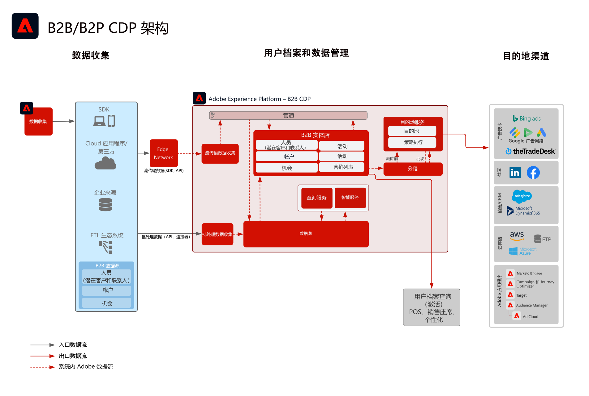

# B2B 受众和用户档案激活 Blueprint

使用与单个客户绑定的帐户、机会和商机信息，创建可操作的 B2B 用户档案，以改进跨渠道的个性化和定位。

## 用例

* 创建人员受众，以便针对 B2B 数据（包括帐户、机会和商机）进行跨渠道定位和个性化。
* 将受众激活到任何 Experience Platform 目标，以便进行定位和个性化。

## 应用程序

* Real-time Customer Data Platform B2B版

## 集成模式

* B2B 数据源（Marketo、Salesforce 等） -> Real-time Customer Data Platform B2B Edition ->目标各种B2B数据源可用于将帐户、商机、商机和人员数据映射到Real-time Customer Data Platform B2B Edition。

## 架构

 

## 护栏

* 请注意，仅当将 Marketo Engage 用作源和/或目标时，与 Marketo Engage 相关的护栏和实施步骤才相关。

* 有关端到端延迟护栏的更多详细信息，请参阅 [部署护栏文档](../experience-platform/deployment/guardrails.md)

### 多实例和 IMS 组织支持：

以下概述了对于映射 Experience Platform 和 Marketo Engage 实例所支持的模式。

#### Marketo 作为数据源到 Experience Platform：

* 支持多个 Marketo Engage 实例到一个 Experience Platform 实例。
* 不支持多个 Marketo Engage 实例到多个 Experience Platform 实例。
* 不支持一个 Marketo Engage 实例到多个 Experience Platform 实例。
* 支持一个 Marketo Engage 实例到一个 Experience Platform 实例和多个沙箱。

#### Marketo 作为目标到 Experience Platform：

* 支持 Experience Platform 到多个 Marketo Engage 实例
* 支持多个 Experience Platform 实例到一个 Marketo Engage 实例

#### Experience Platform 用户档案和分段护栏：

* 有关 Experience Platform - [用户档案和分段护栏](https://experienceleague.adobe.com/docs/experience-platform/profile/guardrails.html?lang=zh-Hans)，请参阅用户档案和分段护栏
* B2B 区段包括帐户、商机、机会，使用多实体关系，这会导致区段评估成为批处理。对于仅限于人员和事件的区段，支持流传输分段。

#### Experience Platform - Marketo Engage 源连接器：

* 历史回填可能需要最多 7 天才能完成，具体取决于数据量。
* 持续的数据更新和来自 Marketo 的更改将通过流传输 API 发送到 Experience Platform，流传输 API 至用户档案的延迟最长约为 5 分钟，到数据湖的延迟约为 15 分钟，具体取决于数据量。

#### Experience Platform - Marketo 目标连接器：

* 从Real-time Customer Data Platform到Marketo Engage的流区段共享最多可能需要5分钟。
* 根据 Experience Platform 分段计划，每天会共享一次批次分段。B2B 区段包括帐户、商机、机会，使用多实体关系，这会导致区段成为批处理。

#### Marketo Engage 护栏：

* 联系人和潜在客户必须直接在Marketo Engage中摄取和定义，以便Real-time Customer Data Platform受众与Marketo Engage联系人和潜在客户进行匹配。

#### 目标护栏

* 有关目标的具体指导，请参阅目标文档。[目标护栏](https://experienceleague.adobe.com/docs/experience-platform/destinations/guardrails.html?lang=zh-Hans)

## 实施步骤

有关如何实施和配置Real-time Customer Data Platform B2B版的指导，请参阅Real-time Customer Data Platform文档的B2B版。 [B2B版Real-time Customer Data Platform](https://experienceleague.adobe.com/docs/experience-platform/rtcdp/b2b-overview.html?lang=zh-Hans)

存在两种可能的实施模式。能够从 Marketo Engage 中摄入 B2B 数据和用户档案，或者能从其他 CRM 数据源中摄入 B2B 数据。

## 实施注意事项

关于 Blueprint 的主要注意事项和配置的指导。

* 包含与不含 Marketo 的 CRM 集成：
如果实施将使用 Marketo Engage 作为源，并且 Marketo Engage 已连接到 CRM，则使用 Experience Platform 中的 Marketo 源连接器将 CRM 数据摄入 Experience Platform 中。如果需要摄入其他表格，请使用 Experience Platform 源连接器。如果实施不使用 Marketo Engage 作为源，请使用 CRM 源 Experience Platform 连接器将 CRM 源直接连接到 AEP。
* 仅Real-time Customer Data PlatformB2B版不建议引入和培养铅。 在此用例中，建议使用潜在客户培养工具(如 Marketo Engage)。
* AEP 的 Marketo Engage 目标连接器可将受众推送到 Marketo Engage 进行激活，它仅推送电子邮件地址和 ECID。如果联系人不存在，它不会创建新潜在客户，因此需要将用户档案和潜在客户数据摄入 Marketo Engage 中。

## 相关文档

* [B2B版Real-time Customer Data Platform](https://experienceleague.adobe.com/docs/experience-platform/rtcdp/b2b-overview.html?lang=zh-Hans)
* [Adobe Experience Platform](https://experienceleague.adobe.com/docs/experience-platform.html?lang=zh-Hans)
* [Marketo Engage](https://experienceleague.adobe.com/docs/marketo/using/home.html?lang=zh-Hans)
* [Adobe Experience Platform - Marketo 源连接器](https://experienceleague.adobe.com/docs/experience-platform/sources/connectors/adobe-applications/marketo/marketo.html?lang=zh-Hans)
* [Adobe Experience Platform - Marketo 目标连接器](https://experienceleague.adobe.com/docs/marketo/using/product-docs/core-marketo-concepts/smart-lists-and-static-lists/static-lists/push-an-adobe-experience-cloud-segment-to-a-marketo-static-list.html?lang=zh-Hans)
