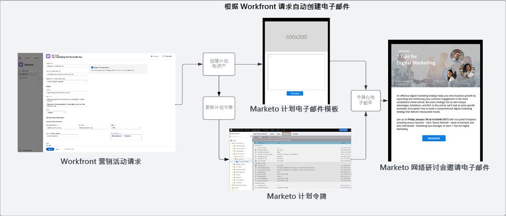
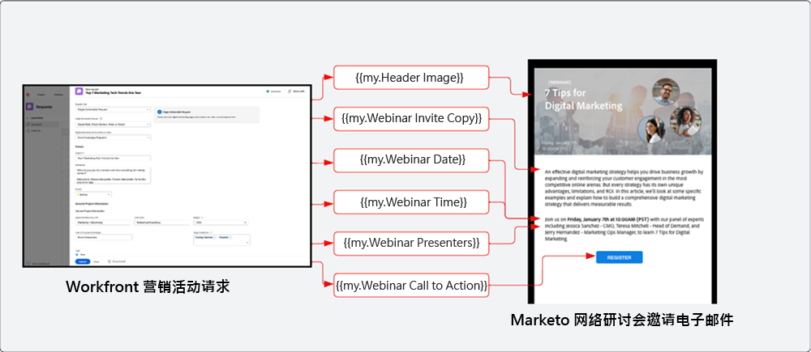
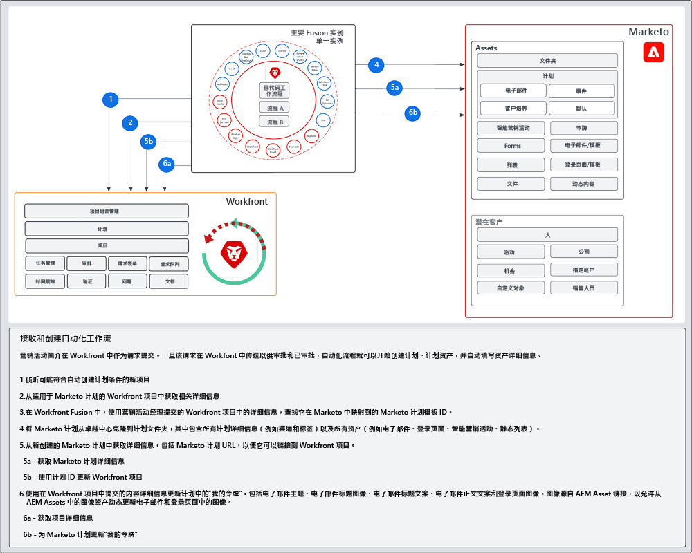

# 引入和创建 {#intake-and-create}

进入营销运营团队发起新营销活动的营销请求数量，可以将运转良好的团队转变为重复性任务的旋转门，导致倦怠和创新停滞。

通过建立提交营销活动请求的流程并自动创建常见请求的营销活动，您可以：提高营销活动的速度、减少错误、将请求路由到营销操作的正确成员、平衡和提高资源利用率，以及将更多营销操作集中在更具战略性的任务上。

通过Workfront和Marketo Engage，系统到系统连接允许 [Workfront请求表](https://experienceleague.adobe.com/docs/workfront/using/administration-and-setup/customize/custom-forms/create-or-edit-a-custom-form.html){target=&quot;_blank&quot;}创建Marketo Engage程序，然后填写关键变量，例如：主题行、电子邮件副本、图像、日期、时间、事件信息等。

要实现此集成，您将使用Workfront Fusion ，它是一个工作自动化层，允许您自动执行Workfront与其他系统之间的工作流。

以下工作流展示了营销活动管理器使用Workfront请求表单发起的网络研讨会请求。 在请求中提交的详细信息会触发要在网络研讨会Marketo Engage中创建的项目和电子邮件。 此外，还从请求表单中获取用于填充电子邮件内容的详细信息。

>[!TIP]
>
>要进一步了解Workfront中用于组织营销活动工作的不同类型对象以及它如何映射到Marketo Engage项目，请查看 [Marketo和Workfront概述](/help/blueprints/b2b/campaign-supply-chain/overview.md){target=&quot;_blank&quot;}。

## 准备Campaign开发流程以实现自动化 {#prepare-your-campaign-development-process-for-automation}

在每一个伟大的工作流自动化背后，都有一个明确的流程，可确保团队和利益相关方从自动化中获得最大价值。

**您将收到哪些类型的营销请求？**

请考虑您将采用的营销策略类型，如电子邮件、培养、第一方网络研讨会和活动。 您还运行第三方网络研讨会或展示广告吗？ 应考虑这些请求中的每个请求，因为它们可能需要请求表单中的特定输入字段，并且将映射到将克隆的Marketo Engage中的不同程序模板。

您还希望了解您是否正在多个区域运行营销活动。 如果是这种情况，您将需要考虑Workfront中的一个项目，该项目在Marketo Engage中创建多个项目，每个项目代表不同的语言支持。

请务必提前了解您预计会收到的营销请求类型，以确保能够以自动方式为请求提供便利。

**营销活动请求中应捕获哪些信息？**

请考虑您在请求表单中需要捕获的关键信息片段，以了解您运行的每种不同策略。 以下是一些可在Workfront表单中捕获的信息示例，可帮助您自动开发促销活动。

<table> 
  <tr> 
   <td><b>营销策略</b></td>
   <td><b>要捕获的信息</b></td>
  </tr>
  <tr> 
   <td>电子邮件爆炸</td>
   <td>·电子邮件主题 
·计划日期 
·电子邮件副本 
·行动要求 
·图像 — 可以直接引用AEM Assets URL以在Marketo中使用 
·受众资格标准</td>
  </tr>
  <tr>
   <td>网络研讨会/活动</td>
   <td>·事件名称 
·事件日期 
·事件时间 
·活动城市 
·事件描述 
·网络研讨会记录页面 — PageURL OnDemand 
·演讲人姓名 
·演讲人头衔 
·扬声器图像 
·所需电子邮件（邀请、确认、提醒、跟进） 
·电子邮件标题图像 
·受众资格标准</td>
  </tr>
  <tr>
   <td>培养</td>
   <td>·电子邮件数量 
·电子邮件副本 
·电子邮件标题 
·行动要求 
·受众资格标准</td>
  </tr>
  </tbody>
</table>

>[!NOTE]
>
>如今，通过自动化以编程方式构建受众的Marketo Engage受到限制，因为智能列表中不支持令牌。 这意味着受众将需要由用户在Marketo Engage中创建，或者如果您有一个预定义的受众，并且您可以与其持续通信，则可以在自动化过程中克隆的程序模板中包含已配置的智能列表。

### 建立您的卓越中心 {#establish-your-center-of-excellence}

如果要自动创建项目，您需要一个卓越的Marketo Engage中心。 英才中心包括模板化的方案和资产，以帮助加快和标准化活动开发过程。 例如，您可能有一个项目模板来满足您的不同营销活动需求：电子邮件、培养、现场活动和网络研讨会。 此外，您可能有多个电子邮件项目模板，这些模板可用于不同地区或不同类型的电子邮件公告。

在Marketo Engage中利用计划模板构建您的卓越中心，是采取更符合程序化的方法执行促销活动的第一步，并将作为自动化促销活动请求的基础。

拥有一组可重复使用的计划模板后，您可以使用此蓝图中概述的自动化来进一步扩展您的工作范围，以加快营销活动开发的速度。

要进一步了解如何创建您自己的卓越中心，请查看 [Marketo社区](https://nation.marketo.com/t5/product-blogs/marketo-master-class-center-of-excellence-with-chelsea-kiko/ba-p/243221){target=&quot;_blank&quot;}以了解最佳实践。

### 使用令牌填充内容 {#use-tokens-to-populate-content}

通过Marketo Engage，可使用令牌向促销活动资产中填充内容。 例如，在从您的卓越中心克隆电子邮件模板后，Workfront Fusion可以从Workfront中的促销活动请求中获取详细信息，并将其传递到Marketo Engage计划中的“我的令牌”。 然后，可以直接将令牌值继承到电子邮件中，以构建电子邮件。

### 从AEM Assets填充图像 {#populate-images-from-aem-assets}

您可以利用Marketo Engage令牌和指向AEM Assets中资产的链接，进一步自动化电子邮件和登陆页面开发。 Campaign请求者可以在请求过程中提交来自AEM Assets的已发布图像链接。 然后，Workfront Fusion可以获取这些链接，并使用Marketo Engage令牌将其嵌入到电子邮件的HTML中。

请记住，您需要在Marketo Engage中构建程序和程序模板以利用我的令牌，以便Fusion能够使用Workfront中提交的信息更新令牌值。

>[!NOTE]
>
>AEM Assets不需要支持此工作流，但可以允许更简化的流程来管理整个促销活动开发供应链中的促销活动资产。

### 为所有程序请求类型组合查找库 {#assemble-a-lookup-library-for-all-program-request-types}

在从Workfront请求自动创建新Marketo Engage程序时，务必在Workfront Fusion自动化中包含一个步骤，该步骤可以从Workfront请求中获取信息，并查找应在Marketo Engage中克隆的正确程序模板。

为此，您可以在Workfront Fusion中导入一个数据集，该数据集包含您的卓越Marketo Engage中心所有不同项目模板的列表。

要包含在程序模板查找库中的一些基本信息包括：

<table> 
  <tr> 
   <td><b>列</b></td>
   <td><b>描述</b></td>
  </tr>
  <tr> 
   <td>促销活动类型</td>
   <td>这可以是电子邮件、网络研讨会、培养、事件、第三方网络研讨会、列表导入等。“促销活动类型”将用作所请求内容的可读描述。</td>
  </tr>
  <tr> 
   <td>Workfront请求类型</td>
   <td>这是在Workfront表单中选择的请求类型，它可能与促销活动类型相同，如电子邮件、网络研讨会、培养或事件。 用于将Workfront表单中选择的输入映射到Marketo中的项目模板。</td>
  </tr>
  <tr> 
   <td>Workfront表单ID</td>
   <td>用于验证写请求的Workfront请求表单的唯一ID正被映射到Marketo Engage程序模板。</td>
  </tr>
  <tr> 
   <td>Marketo计划ID</td>
   <td>这是Marketo Engage中映射到所发出请求的程序模板的ID。 在Workfront Fusion中随时提供此信息将使Fusion能够向Marketo Engage发出请求，并准确了解要克隆的程序。</td>
  </tr>
  </tbody>
</table>

## 进气和创建自动化流 {#intake-and-create-automation-flow}

以下示例说明了如何使用预建的在Fusion中组装工作流逻辑 [Workfront](https://experienceleague.adobe.com/docs/workfront/using/adobe-workfront-fusion/fusion-apps-and-modules/workfront-modules.html){target=&quot;_blank&quot;}和 [Marketo Engage](https://experienceleague.adobe.com/docs/workfront/using/adobe-workfront-fusion/fusion-apps-and-modules/marketo-modules.html){target=&quot;_blank&quot;}个模块，使您能够更快地交付自动化。

## 资源 {#resources}

* [Adobe Marketo Engage模块](https://experienceleague.adobe.com/docs/workfront/using/adobe-workfront-fusion/fusion-apps-and-modules/marketo-modules.html){target=&quot;_blank&quot;}

* [Adobe Workfront模块](https://experienceleague.adobe.com/docs/workfront/using/adobe-workfront-fusion/fusion-apps-and-modules/workfront-modules.html){target=&quot;_blank&quot;}

* [Marketo和Workfront概述](/help/blueprints/b2b/campaign-supply-chain/overview.md){target=&quot;_blank&quot;}
