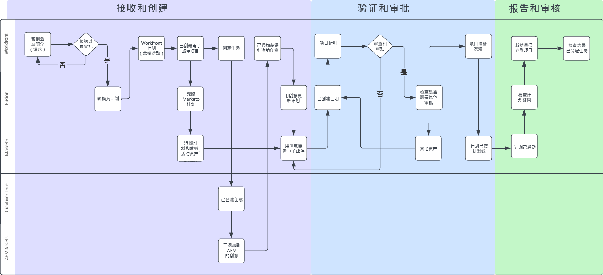
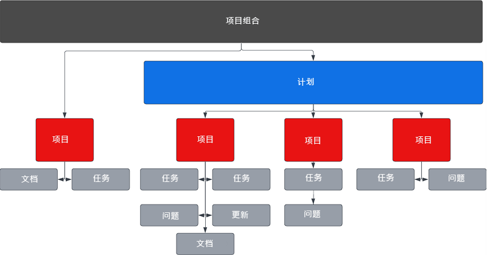
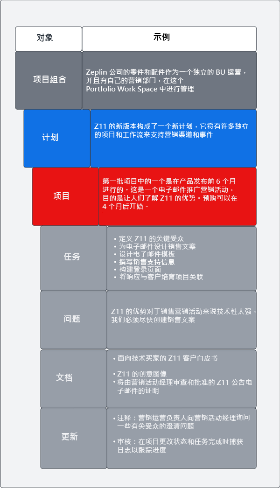
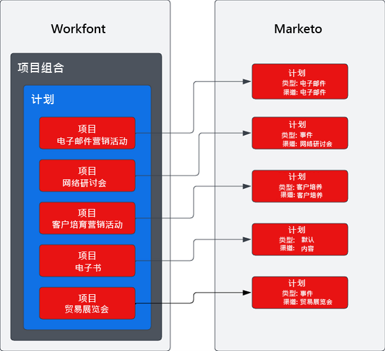

# 概述 {#overview}

## 利用优化的营销活动供应链实现更快的上市时间 {#achieving-faster-time-to-market-with-optimized-campaign-supply-chain}

营销工作不断增长，新渠道和更多方式每天个性化通信。 营销团队需要各种方法来继续自动化和改进，以支持世界各地不断变化的营销需求。

**“投资回报率一直是真正的目标。 收入很高，但不会以任何成本收入 — 尤其是在今天。” - CMO，商业服务行业**

在增加收入的同时实现更高ROI的组织正通过简化其促销活动开发流程、优化其促销活动执行速度并改进对整个营销功能的监督来实现这一目标。

如果贵组织希望实现下面概述的类似目标，本文档将对您有所帮助：

* 扩展营销活动操作以支持跨职能营销团队
* 通过简化促销活动请求流程缩短上市时间
* 建立记录系统，以提高活动利益相关方的可见度
* 审核和批准营销活动资产（图像、电子邮件副本）

营销活动操作团队需要能够让他们高效地规划和执行营销活动的系统。 无论是电子邮件、网络研讨会、活动、付费媒体、培养还是内容整合，营销团队都需要一个中央解决方案来组织活动参与者、交付内容和执行。

通过将多渠道营销激活系统(Marketo Engage)与营销规划和记录系统(Workfront)集成，您可以提高促销活动速度并更好地向利益相关方显示。

借助Workfront Fusion，营销运营团队可以在很大程度上消除将营销摘要转换为营销活动时涉及的手动和容易出错的步骤。 Workfront Fusion在Workfront和Marketo Engage之间提供了一个开箱即用的集成层，它允许在系统之间开发工作流方面具有灵活性和效率。 您可以进一步了解如何设置集成以及可以采取哪些操作来自动化工作流 [此处](https://experienceleague.adobe.com/docs/workfront/using/adobe-workfront-fusion/fusion-apps-and-modules/marketo-modules.html){target=&quot;_blank&quot;}。

## 从营销活动计划到执行 — 自动化用例 {#campaign-planning-to-execution-automation-use-cases}

* 通过在Workfront中通过引入请求自动在Marketo Engage中创建促销活动，从而支持营销运营团队
* 将在Marketo Engage中创建的电子邮件和登陆页面的草稿共享到Workfront，以便获得跨职能利益相关方的最终审阅和批准
* 将来自Marketo Engage的促销活动结果共享到Workfront，以实现对促销活动量度的访问大众化

在下方，您可以看到营销活动开发流程的工作流图（如果是电子邮件爆炸请求）。 此外，您还可以看到Workfront Fusion如何在Workfront和Marketo Engage之间发挥作用，在整个营销活动开发周期中推动工作流和流程自动化。

注意营销活动开发过程中的不同阶段。

1. 引入并创建：营销活动请求以编程方式组合营销活动资产。

1. 验证和批准：组织营销活动后，利益相关方便审查和注销电子邮件和登陆页面等营销活动资产。

1. 报告和审计：将促销活动结果共享到Workfront，以便更好地向跨职能的利益相关者展示。

>[!NOTE]
>
>在以上示例中，Workfront在Marketo Engage计划的整个生命周期中管理和规划工作。 尽管如此，Workfront的灵活性也可以扩展到管理您营销团队的所有工作。 这包括基于帐户的营销、营销内容供应链、代理管理、数字和社交活动管理以及销售支持计划。

## 了解营销活动在Workfront中的表现方式 {#understanding-how-marketing-initiatives-are-represented-in-workfront}

Adobe Workfront使组织能够管理工作以提高执行效率。 在Workfront内部，有一个对象层次结构，为各个团队的规划、资源管理和协作提供了框架。

了解如何将业务流程映射到这些对象对于了解Workfront与Marketo Engage之间的关系非常重要。

### Portfolio层次定义 {#portfolio-hierarchy-defined}

<table> 
  <tr> 
   <td><b>对象</b></td>
   <td><b>定义</b></td>
  </tr>
  <tr> 
   <td>Portfolio</td>
   <td>您可以使用Workfront中的Portfolio和项目群来组织项目。 通过组织项目，您可以比较类似的项目并确定资源的最佳使用位置。  
   (例如，为公司内专注于销售服务和/或产品的业务部门创建Portfolio。)</td>
  </tr>
  <tr>
   <td>项目</td>
   <td>您可以使用Workfront计划来组织项目。 通过组织项目，您可以比较类似的项目并确定资源的最佳使用位置。  
   （例如，具有高级别目标的营销策略，例如提高对新产品发布的认识并推动需求。）</td>
  </tr>
  <tr>
   <td>项目</td>
   <td>Workfront项目是完成特定目标、交付项、产品等所需完成的工作项的集合。  
   (例如，营销策略，如电子邮件爆炸、培养型营销活动、网络研讨会或现场活动。 单个项目也可能更复杂，因为它包含多种策略，如电子邮件、展示广告、登陆页面和可下载的白皮书，所有这些策略都旨在产生相同的结果。)</td>
  </tr>
  <tr>
   <td>任务</td>
   <td>Workfront任务是可能属于项目或方案一部分的计划工作项。 任务会分配给用户或团队以完成。  
   (例如，构建受众区段或创建电子邮件草稿的任务可能是与项目关联以开发Marketo Engage电子邮件程序的任务。)</td>
  </tr>
  <tr>
   <td>问题</td>
   <td>问题是Workfront中的计划外工作项。 它们可能是项目期间发生的问题，也可能是通过请求队列提交的请求。  
   （例如，由于电子邮件横幅图像的尺寸错误，因此提出了问题。）</td>
  </tr>
  <tr>
   <td>文档</td>
   <td>文档可以是传统文档，如Word文档或演示文稿。 它们也可以是图像文件。 Workfront允许通过文档和图像上的注释和批注对资产进行校样，从而实现团队之间的协作。  
   （例如，需要审核的电子邮件标题图像。）</td>
  </tr>
  <tr>
   <td>更新</td>
   <td>包括评论和审计日志，以跟踪Workfront的工作并促进协作。  
   （例如，新映像版本的审核日志。）</td>
  </tr>
  </tbody>
</table>

## 营销活动工作管理示例 {#marketing-initiative-work-management-example}

让我们来看看Workfront产品组合层次结构在真实世界中的表现。

卓别林公司将发布其一款名为Z11的紧凑型实用拖拉机附件的更新版本，该款附件的耐用性和定制性都优于以前的Z10型号。 因此，他们需要规划、制定和执行其营销策略，以推动需求，并提高其业务拖拉机部门对其新版本的认识。 此营销策略需要包含不同的营销策略，以提高新客户意识和现有Z10客户意识。

以下层级显示此营销活动的策略、策略、任务和资产如何映射到Workfront。

## 将Workfront映射到Marketo {#mapping-workfront-to-marketo}

将Workfront作为营销规划和项目组织的上游系统，了解如何在Marketo Engage和Workfront之间共享信息至关重要。

为了在制定新的营销计划时使这些系统协同工作，了解Workfront中不同的记录类型如何映射以记录Marketo Engage中的类型就显得至关重要。

### 将Workfront项目映射到Marketo Engage项目 {#mapping-workfront-projects-to-marketo-engage-programs}

使用Workfront Fusion作为集成层，您可以将Workfront中的项目映射到Marketo Engage中的项目。 例如，在上述案例中，泽普林希望提高对新泽普林模型的认识。 凭借这项功能，他们在Workfront中创建了一个新项目，其中包含以项目表示的多种营销策略。 一种策略是，向Z10型的现有客户发送一封认识电子邮件，让他们了解新的Z11型号。 在Workfront中，将创建一个项目来表示此电子邮件策略，其中包含一组与其关联的任务，这些任务用于创建受众、创建电子邮件图像，以及在Marketo Engage中组装电子邮件。 Workfront中的项目可以映射到Marketo Engage中的电子邮件计划，以便信息可以在系统之间同步。

在下面，您可以看到一个示例，说明一个项目如何可以包含多个项目，以及这些Workfront项目如何映射到Marketo Engage中的项目。

您可能希望启动一个大型营销计划，该计划需要将多个Workfront项目放入Workfront计划中，或者您可能需要一次性请求召开网络研讨会或发送只需创建一个Workfront项目的电子邮件。 无论您有什么需求，借助Workfront、Workfront Fusion和Marketo Engage，您的团队都可以灵活地将营销活动开发过程从规划到执行无缝集成。

### 将Workfront任务映射到Marketo Engage资产 {#mapping-workfront-tasks-to-marketo-engage-assets}

当您开始在Workfront中映射营销活动开发流程时，还可以考虑在Marketo Engage中要完成的任务映射，以及如何在Workfront中捕获信息，帮助在营销活动开发供应链中提高一致性、效率和准确性。

Workfront项目可以进行模板化，以便在每次运行特定营销策略时都能够明确定义您的流程。 例如，在电子邮件促销活动上执行时，将有一组需要为贵组织完成的标准任务。 这些任务可能包括与利益相关方召开启动会议、获取创意资产、批准创意、构建目标受众、构建电子邮件、电子邮件翻译、批准电子邮件以及与利益相关方共享电子邮件促销活动结果。

其中一些任务可以直接映射到要在Marketo Engage中完成的工作。 例如，可以自定义Workfront中的构建电子邮件任务，以包含将信息传递到Marketo Engage以自动组装电子邮件的字段。 这些内容可能包括电子邮件中的主题行、副本和图像等内容。

## 后续步骤 {#next-steps}

现在，您已基本了解Workfront和Marketo Engage如何在您的促销活动开发供应链中实现新效率，请查阅以下文档和资源，了解如何使用Workfront Fusion在Marketo Engage和Workfront之间自动执行工作流和流程。

### Workfront Fusion、Workfront和Marketo Engage集成快速入门 {#getting-started-with-workfront-fusion}

* [引入和创建](/help/blueprints/b2b/campaign-supply-chain/intake-and-create.md){target=&quot;_blank&quot;} — 使用Marketo Engage和Workfront实现营销活动开发自动化

* 验证和批准（即将推出）

* 报告和审计（即将推出）

### 管理Marketo Engage促销活动名称及其关联的URL {#managing-marketo-engage-campaign-names}

标准化促销活动和URL的命名约定是在Marketo Engage中准确管理计划的关键基础，有助于在整个促销活动供应链中推动更一致的流程。 如果您要查找相关工具来帮助解决此问题，我们建议从 [Adobe成功服务](https://main--marketo-campaign-tools--dr-adobe.hlx.live/){target=&quot;_blank&quot;}，用于创建和管理Marketo Engage营销活动及其关联URL的一致方法。

### 资源 {#resources}

* [Workfront Fusion for Marketo Engage](https://experienceleague.adobe.com/docs/workfront/using/adobe-workfront-fusion/fusion-apps-and-modules/marketo-modules.html){target=&quot;_blank&quot;}

* [Workfront Fusion for Workfront](https://experienceleague.adobe.com/docs/workfront/using/adobe-workfront-fusion/fusion-apps-and-modules/workfront-modules.html){target=&quot;_blank&quot;}
