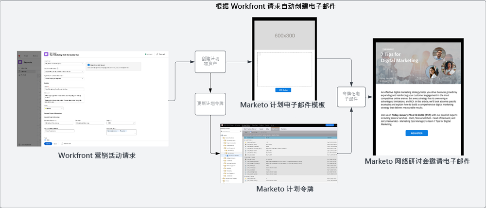
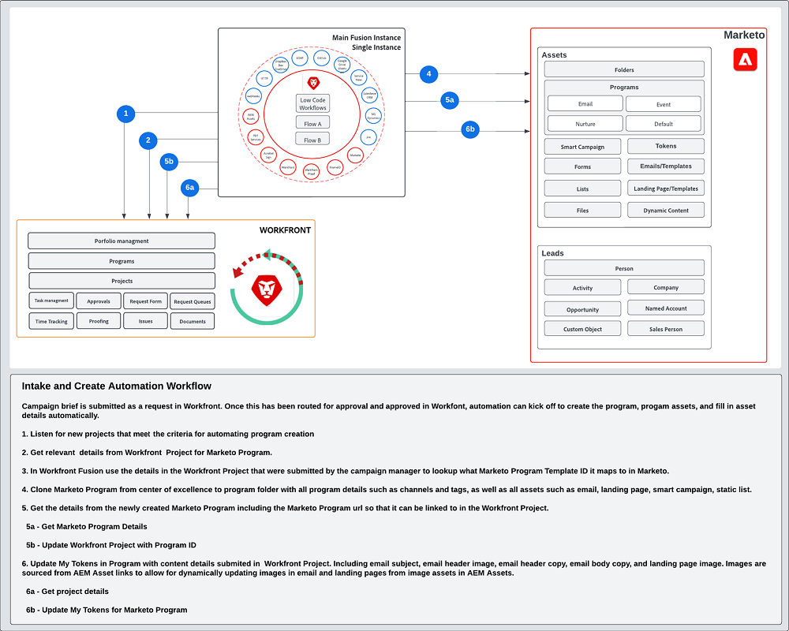

# 接收和创建 Blueprint {#intake-and-create}

传送给营销运营团队以发起新营销活动的营销请求数量可能会将一个高效运转的团队转变为重复性任务的旋转门，导致倦怠和创新停滞。

通过建立提交营销活动请求并自动创建经常请求的营销活动的流程，您可以：提高营销活动的速度、减少错误、将请求路由到处理营销操作的正确成员、平衡和提高资源利用率，以及将更多营销操作集中在更具战略性的任务上。

通过 Workfront 和 Marketo Engage，系统到系统连接允许 [Workfront 请求表单](https://experienceleague.adobe.com/docs/workfront/using/administration-and-setup/customize/custom-forms/create-or-edit-a-custom-form.html?lang=zh-Hans){target="_blank"}创建 Marketo Engage 计划，然后填写关键变量，例如主题行、电子邮件文案、图像、日期、时间、事件信息等。

要实现此集成，您需要使用 Workfront Fusion，即一个工作自动化层，允许您自动执行 Workfront 与其他系统之间的工作流。

以下工作流展示了营销活动经理使用 Workfront 请求表单发起的网络研讨会请求。然后，请求中提交的详细信息会触发在 Marketo Engage 中为网络研讨会创建程序和电子邮件。此外，系统还会从请求表单中获取详细信息以填充电子邮件的内容。

{zoomable="yes"}

>[!TIP]
>
>要详细了解 Workfront 中用于组织营销活动工作的不同类型的对象，以及它如何映射到 Marketo Engage 计划，请查看 [Marketo 和 Workfront 概述](/help/blueprints/b2b/marketo-engage-and-workfront-integration-blueprint/overview.md){target="_blank"}。

## 准备营销活动开发流程以实现自动化 {#prepare-your-campaign-development-process-for-automation}

每个出色的工作流自动化背后都有一个明确定义的流程，可确保团队和利益相关者从自动化中获得最大价值。

**您会收到哪些类型的营销请求？**

请考虑您将采用的营销策略类型，如电子邮件、客户培养、第一方网络研讨会和活动。您还会举办第 3 方网络研讨会或投放展示广告吗？应考虑其中每个请求，因为它们可能需要请求表单中的特定输入字段，并且将映射到将被克隆的 Marketo Engage 中的不同计划模板。

您还需要了解您是否在多个地区开展营销活动。如果是这种情况，您需要在 Workfront 中考虑一个项目，在 Marketo Engage 中创建多个计划，每个计划代表不同的语言支持。

务必提前了解您预计会收到的营销请求类型，以确保能够自动为请求提供便利。

**营销活动请求中应捕获哪些信息？**

请考虑您在请求表单中需要捕获的关键信息片段，以了解您运行的每种不同策略。以下是一些可在 Workfront 表单中捕获的信息示例，可帮助您自动开发营销活动。

<table> 
  <tr> 
   <td><b>营销策略</b></td>
   <td><b>要捕获的信息</b></td>
  </tr>
  <tr> 
   <td>电子邮件群发</td>
   <td>·电子邮件主题 
·计划日期 
·电子邮件文案 
·行动号召 
·图像 — 可以直接引用以在 Marketo 中使用的 AEM Assets URL 
·受众资格条件</td>
  </tr>
  <tr>
   <td>网络研讨会/事件</td>
   <td>·事件名称 
·事件日期 
·事件时间 
·事件城市 
·事件描述 
·网络研讨会记录页面 — PageURL OnDemand 
·发言人姓名 
·发言人头衔 
·发言人图像 
·所需电子邮件（邀请、确认、提醒、跟进） 
·电子邮件标题图像 
·受众资格标准</td>
  </tr>
  <tr>
   <td>客户培养</td>
   <td>·电子邮件数量 
·电子邮件文案 
·电子邮件标题 
·行动号召 
·受众资格条件</td>
  </tr>
  </tbody>
</table>

>[!NOTE]
>
>如今，通过自动化以编程方式建立受众在 Marketo Engage 中受到限制，因为智能列表不支持令牌。这意味着受众需要由用户在 Marketo Engage 中创建，或者如果您有一个持续与之交流的预定受众，您可以将配置的智能列表作为在自动化过程中克隆的计划模板的一部分。

### 建立您的卓越中心 {#establish-your-center-of-excellence}

如果要自动创建计划，您需要在 Marketo Engage 中创建一个卓越中心。卓越中心包括模板化的计划和资产，以帮助加快和标准化营销活动开发流程。例如，您可能有一个可满足不同的营销活动需求的计划模板：电子邮件、客户培养、面对面活动和网络研讨会。此外，您可能有多个电子邮件计划模板，可用于不同地区或不同类型的电子邮件公告。

在 Marketo Engage 中利用计划模板构建您的卓越中心，是采取更程序化的方法执行营销活动的第一步，并将作为自动化营销活动请求的基础。

拥有一组可重复使用的计划模板后，您就可以使用此蓝图中概述的自动化来进一步扩展您的工作范围，以加快营销活动开发的速度。

要进一步了解如何创建您自己的卓越中心，请查看 [Marketo 社区](https://nation.marketo.com/t5/product-blogs/marketo-master-class-center-of-excellence-with-chelsea-kiko/ba-p/243221){target="_blank"}以了解最佳实践。

### 使用令牌填充内容 {#use-tokens-to-populate-content}

通过 Marketo Engage，可使用令牌向营销活动资产中填充内容。例如，在从您的卓越中心克隆电子邮件模板后，Workfront Fusion 可以从 Workfront 中的营销活动请求中获取详细信息，并将其传递到 Marketo Engage 计划中的“我的令牌”。然后，可以直接将令牌值继承到电子邮件中，以构建电子邮件。

{zoomable="yes"}

### 从 AEM Assets 填充图像 {#populate-images-from-aem-assets}

您可以利用 Marketo Engage 令牌和指向 AEM Assets 中资产的链接，进一步自动化电子邮件和登录页面的开发。营销活动请求者可以在请求过程中提交来自 AEM Assets 的已发布图像链接。然后，Workfront Fusion 可以获取这些链接，并使用 Marketo Engage 令牌将其嵌入到电子邮件的 HTML 中。

请记住，您需要在 Marketo Engage 中构建计划和计划模板才能利用“我的令牌”，以便 Fusion 能够使用 Workfront 中提交的信息更新令牌值。

>[!NOTE]
>
>AEM Assets 不需要支持此工作流，但可以允许更简化的流程来管理整个营销活动开发供应链中的营销活动资产。

### 为所有计划请求类型组合查找库 {#assemble-a-lookup-library-for-all-program-request-types}

通过 Workfront 请求自动创建新的 Marketo Engage 计划时，务必在 Workfront Fusion 自动化中包含一个步骤，以便从 Workfront 请求中获取信息，并查找应在 Marketo Engage 中克隆的正确计划模板。

为此，您可以在 Workfront Fusion 中导入一个数据集，其中包含您的 Marketo Engage 卓越中心中所有不同计划模板的列表。

要包含在计划模板查找库中的一些基本信息包括：

<table> 
  <tr> 
   <td><b>列</b></td>
   <td><b>描述</b></td>
  </tr>
  <tr> 
   <td>营销活动类型</td>
   <td>这可以是电子邮件、网络研讨会、客户培养、事件、第三方网络研讨会、列表导入等。“营销活动类型”将用作所请求内容的可读描述。</td>
  </tr>
  <tr> 
   <td>Workfront 请求类型</td>
   <td>这是在 Workfront 表单中选择的请求类型，它可能与营销活动类型相同，如电子邮件、网络研讨会、客户培养或事件。用于将 Workfront 表单中选择的输入映射到 Marketo 中的计划模板。</td>
  </tr>
  <tr> 
   <td>Workfront 表单 ID</td>
   <td>Workfront 请求表单的唯一 ID，用于验证写入请求是否映射到 Marketo Engage 计划模板。</td>
  </tr>
  <tr> 
   <td>Marketo 计划 ID</td>
   <td>这是 Marketo Engage 中映射到正在发出的请求的计划模板的 ID。在 Workfront Fusion 中随时提供此信息将允许 Fusion 向 Marketo Engage 发出请求并了解要克隆的确切计划。</td>
  </tr>
  </tbody>
</table>

## 接收和创建自动化流 {#intake-and-create-automation-flow}

以下示例介绍了如何使用预生成的[Workfront](https://experienceleague.adobe.com/docs/workfront/using/adobe-workfront-fusion/fusion-apps-and-modules/workfront-modules.html?lang=zh-Hans){target="_blank"}和[Marketo Engage](https://experienceleague.adobe.com/docs/workfront/using/adobe-workfront-fusion/fusion-apps-and-modules/marketo-modules.html?lang=zh-Hans){target="_blank"}模块在Fusion中组合工作流逻辑，这些模块使您能够更快地实现自动化。

## 资源 {#resources}

* [Adobe Marketo Engage 模块](https://experienceleague.adobe.com/docs/workfront/using/adobe-workfront-fusion/fusion-apps-and-modules/marketo-modules.html?lang=zh-Hans){target="_blank"}

* [Adobe Workfront 模块](https://experienceleague.adobe.com/docs/workfront/using/adobe-workfront-fusion/fusion-apps-and-modules/workfront-modules.html?lang=zh-Hans){target="_blank"}

* [Marketo 和 Workfront 概述](/help/blueprints/b2b/marketo-engage-and-workfront-integration-blueprint/overview.md){target="_blank"}
