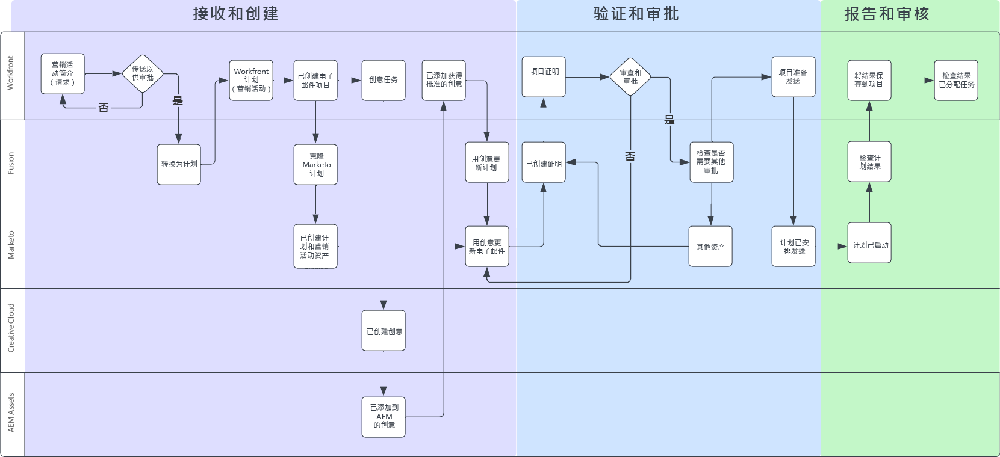
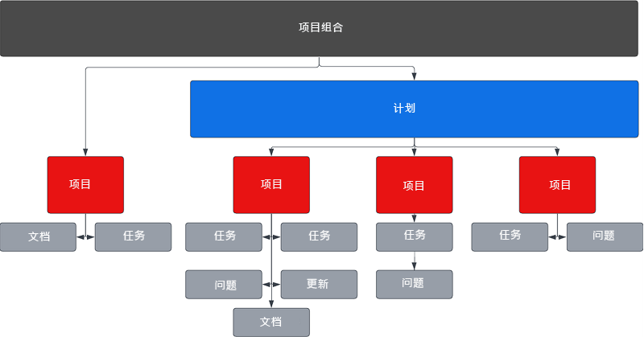
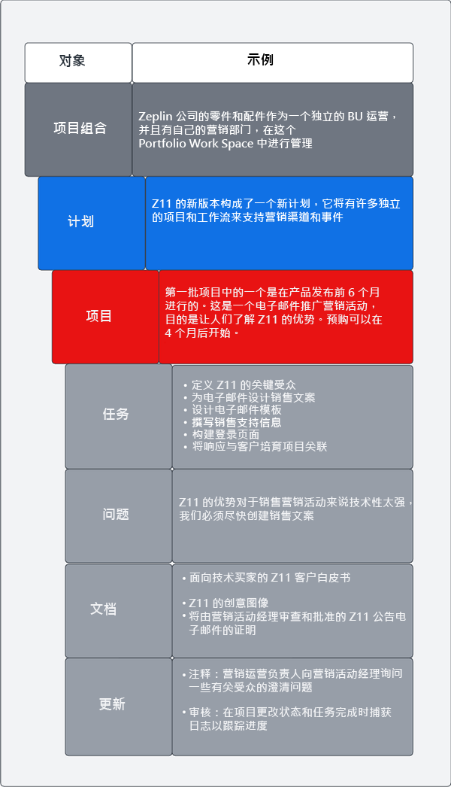
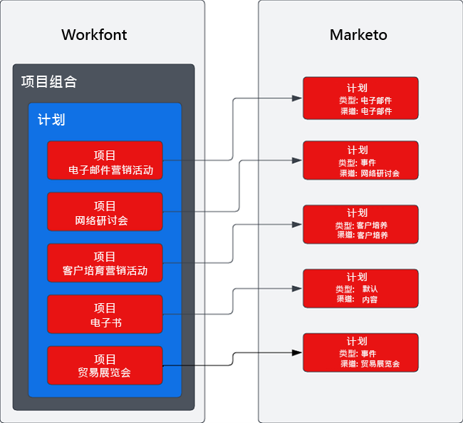

# Marketo Engage 和 Workfront 集成 Blueprint 概述 {#overview}

## 利用 Marketo Engage 和 Workfront 加快上市速度 {#achieve-faster-time-to-market-with-marketo-engage-and-workfront}

营销工作不断增加，个性化日常沟通的新渠道和方式也在不断增加。营销团队需要寻找继续加强自动化和发展的方法，以支持全球不断变化的营销需求。

**“投资回报率一直是真正的目标。能提高收益固然很好，但不能不惜任何代价 — 尤其是在今天。”- CMO，商业服务行业**

在提高收益的同时实现更高 ROI 的组织正通过简化其营销活动开发流程、优化其营销活动执行速度并改进对整个营销职能的监督来实现这一目标。

如果贵组织希望实现下面概述的类似目标，本文档将有助于您：

* 扩展营销活动运营以支持跨职能营销团队
* 通过简化营销活动请求流程快速进入市场
* 建立记录系统，以提高对营销活动利益相关者的可见性
* 审查和批准营销活动资产（图像、电子邮件文案）

营销活动运营团队需要能够让他们高效地规划和执行营销活动的系统。无论是电子邮件、网络研讨会、活动、付费媒体、客户培养还是内容整合，营销团队都需要一个中央解决方案来组织营销活动参与者、可交付成果和执行。

通过将多渠道营销激活系统 (Marketo Engage) 与营销规划和记录系统 (Workfront) 集成，您可以提高营销活动速度并改善对利益相关者的可见性。

借助 Workfront Fusion，营销运营团队可以在很大程度上消除将营销摘要转换为营销活动时涉及的手动和容易出错的步骤。Workfront Fusion 在 Workfront 和 Marketo Engage 之间提供了一个开箱即用的集成层，允许灵活、高效地在系统之间开发工作流。您可以在[此处](https://experienceleague.adobe.com/docs/workfront/using/adobe-workfront-fusion/fusion-apps-and-modules/marketo-modules.html?lang=zh-Hans){target="_blank"}详细了解如何设置集成以及可以采取哪些操作来自动化工作流。

## 营销活动规划到执行 — 自动化用例 {#campaign-planning-to-execution-automation-use-cases}

* 通过在 Workfront 中接收请求，自动在 Marketo Engage 中创建营销活动，从而为营销运营团队提供支持
* 将在 Marketo Engage 中创建的电子邮件和登录页面的草稿共享到 Workfront，以供跨职能利益相关者进行最终的审查和审批
* 将来自 Marketo Engage 的营销活动结果共享到 Workfront，以实现对营销活动指标的大众化访问

在下方，您可以看到电子邮件群发请求中营销活动开发流程的工作流程图。此外，您还可以看到 Workfront Fusion 如何在 Workfront 和 Marketo Engage 之间发挥作用，在整个营销活动开发周期中推动工作流和流程自动化。

{zoomable="yes"}

请注意营销活动开发过程中的不同阶段。

1. 接收和创建：营销活动请求以编程方式组合营销活动资产。

1. 审查和批准：组合营销活动后，利益相关者便会审查和签核电子邮件和登录页面等营销活动资产。

1. 报告和审计：将营销活动结果共享到 Workfront，以便更好地向跨职能的利益相关者展示。

>[!NOTE]
>
>在以上示例中，Workfront 在 Marketo Engage 计划的整个生命周期中管理和规划工作。也就是说，Workfront 可以灵活地管理您营销团队的所有工作。这包括基于帐户的营销、营销内容供应链、代理管理、数字和社交营销活动管理以及销售支持计划。

## 了解营销方案在 Workfront 中的呈现方式 {#understanding-how-marketing-initiatives-are-represented-in-workfront}

Adobe Workfront 使组织能够管理工作以提高执行效率。Workfront 内部有一个对象层级，它为各个团队的规划、资源管理和协作提供框架。

了解如何将业务流程映射到这些对象对于了解 Workfront 与 Marketo Engage 之间的关系非常重要。

{zoomable="yes"}

### 项目组合层次定义 {#portfolio-hierarchy-defined}

<table> 
  <tr> 
   <td><b>对象</b></td>
   <td><b>定义</b></td>
  </tr>
  <tr> 
   <td>项目组合</td>
   <td>您可以在 Workfront 中使用项目组合和计划来组织项目。通过组织项目，您可以比较类似的项目并确定资源的最佳使用位置。  
   (例如，为公司内专注于销售服务和/或产品的业务部门创建项目组合。)</td>
  </tr>
  <tr>
   <td>计划</td>
   <td>您可以使用 Workfront 计划来组织项目。通过组织项目，您可以比较类似的项目并确定资源的最佳使用位置。  
   （例如，具有高级别目标的营销策略，例如提高对新产品发布的认识并推动需求。）</td>
  </tr>
  <tr>
   <td>项目</td>
   <td>Workfront 项目是完成特定目标、可交付结果、产品等所需完成的工作项的集合。  
   (例如，营销策略，如电子邮件群发、客户培养营销活动、网络研讨会或面对面活动。单个项目也可能更加复杂，因为它包含多种策略，如电子邮件、展示广告、登录页面和可下载的白皮书，所有这些策略都旨在推动相同的结果。)</td>
  </tr>
  <tr>
   <td>任务</td>
   <td>Workfront 任务是可能属于项目或方案一部分的计划工作项。任务会分配给用户或团队完成。  
   (例如，构建受众细分或创建电子邮件草稿的任务可能是与项目关联以开发 Marketo Engage 电子邮件程序的任务。)</td>
  </tr>
  <tr>
   <td>问题</td>
   <td>问题是 Workfront 中的计划外工作项。它们可能是项目期间发生的问题，也可能是通过请求队列提交的请求。  
   （例如，由于电子邮件横幅图像的尺寸错误，因此提出了问题。）</td>
  </tr>
  <tr>
   <td>文档</td>
   <td>文档可以是传统文档，如 Word文档或演示文稿，也可以是图像文件。Workfront 允许通过文档和图像上的注释和批注对资产进行验证，从而实现团队之间的协作。  
   （例如，需要审查的电子邮件标题图像。）</td>
  </tr>
  <tr>
   <td>更新</td>
   <td>包括注释和审核日志，旨在跟踪 Workfront 的工作并促进协作。  
   （例如，新图像版本的审核日志。）</td>
  </tr>
  </tbody>
</table>

## 营销方案工作管理示例 {#marketing-initiative-work-management-example}

让我们来看看 Workfront 项目组合层级在真实世界中的表现。

Zeplin 公司将发布其一款名为 Z11 的紧凑型实用拖拉机配件的更新版本，该款配件的耐用性和定制性都优于以前的 Z10 型号。因此，他们需要规划、制定和执行其营销策略，以推动需求，并提高公司拖拉机部门对其新版本的认识。此营销战略需要包含不同的营销策略，以提高新客户和现有 Z10 客户的认识。

下面的层级显示此营销活动的战略、策略、任务和资产如何映射到 Workfront。

{zoomable="yes"}

## 将 Workfront 映射到 Marketo {#mapping-workfront-to-marketo}

在 Workfront 作为营销规划和项目组织的上游系统时，务必了解如何在 Marketo Engage 和 Workfront 之间共享信息，这一点至关重要。

为了在制定新的营销方案时使这些系统协同工作，务必了解 Workfront 中不同的记录类型如何映射以记录 Marketo Engage 中的类型。

### 将 Workfront 项目映射到 Marketo Engage 项目 {#mapping-workfront-projects-to-marketo-engage-programs}

使用 Workfront Fusion 作为集成层，可以将 Workfront 中的项目映射到 Marketo Engage 中的项目。例如，在上述案例中，Zeplin 希望提高对新 Zeplin 机型的认识。出于此目的，他们在 Workfront 中创建了一个新项目，其中包含以项目表示的多种营销策略。一种策略是，向 Z10 型号的现有客户发送一封推广电子邮件，让他们了解新的 Z11 机型。在 Workfront 中，将创建一个项目来表示此电子邮件策略，其中包含一组与其关联的任务，用于创建受众、创建电子邮件图像，以及在 Marketo Engage 中汇编电子邮件。Workfront 中的项目可以映射到 Marketo Engage 中的电子邮件计划，以便在系统之间同步信息。

在下面，您可以看到一个示例，说明一个计划如何可以包含多个项目，以及这些 Workfront 项目如何映射到 Marketo Engage 中的计划。

{zoomable="yes"}

您可能希望启动一个大型营销方案，该方案需要将多个 Workfront 项目放入 Workfront 计划中，或者您可能有一个一次性的网络研讨会或电子邮件请求，只需要创建一个 Workfront 项目。无论您有什么需求，借助 Workfront、Workfront Fusion 和 Marketo Engage，您的团队都可以灵活、无缝地集成从规划到执行的整个营销活动开发流程。

### 将 Workfront 任务映射到 Marketo Engage 资产 {#mapping-workfront-tasks-to-marketo-engage-assets}

当您开始在 Workfront 中映射营销活动开发流程时，还可以考虑要在 Marketo Engage 中完成的工作的任务映射，以及如何在 Workfront 中捕获信息，帮助在营销活动开发供应链中提高一致性、效率和准确性。

Workfront 项目可以模板化，以便能够在每次运行特定营销策略时明确定义您的流程。例如，在执行电子邮件营销活动时，需要为您的组织完成一组标准任务。这些任务可能包括与利益相关者召开启动会议、获取创意资产、批准创意、构建目标受众、构建电子邮件、电子邮件翻译、批准电子邮件以及与利益相关者共享电子邮件营销活动结果。

其中一些任务可以直接映射到要在 Marketo Engage 中完成的工作。例如，可以自定义 Workfront 中的构建电子邮件任务，以包含将信息传递到 Marketo Engage 以自动汇编电子邮件的字段。这些字段可能包括电子邮件中的主题行、文案和图像等内容。

## 后续步骤 {#next-steps}

现在，您对 Workfront 和 Marketo Engage 如何在您的营销活动开发供应链中提高效率已经有了基本的了解，请查阅以下文档和资源，了解如何使用 Workfront Fusion 在 Marketo Engage 和 Workfront 之间自动执行工作流和流程。

### Workfront Fusion、Workfront 和 Marketo Engage 集成快速入门 {#getting-started-with-workfront-fusion}

* [接收和创建](/help/blueprints/b2b/marketo-engage-and-workfront-integration-blueprint/intake-and-create.md){target="_blank"} - 使用 Marketo Engage 和 Workfront 实现营销活动开发自动化

* [审查和批准](/help/blueprints/b2b/marketo-engage-and-workfront-integration-blueprint/review-and-approve-blueprint.md){target="_blank"}

### 管理 Marketo Engage 营销活动名称及其关联 URL {#managing-marketo-engage-campaign-names}

标准化营销活动和 URL 的命名约定是在 Marketo Engage 中准确管理计划的关键基础，有助于在整个营销活动开发生命周期中推动更一致的流程。如果您要查找相关工具来帮助解决此问题，我们建议您查看 [Adobe 成功服务](https://main--marketo-campaign-tools--dr-adobe.hlx.live/){target="_blank"}中的一些免费开源工具，这些工具可让您创建一致的方法来创建和管理 Marketo Engage 营销活动及其关联 URL。

### 资源 {#resources}

* [适用于 Marketo Engage 的 Workfront Fusion](https://experienceleague.adobe.com/docs/workfront/using/adobe-workfront-fusion/fusion-apps-and-modules/marketo-modules.html?lang=zh-Hans){target="_blank"}

* [适用于 Workfront 的 Workfront Fusion](https://experienceleague.adobe.com/docs/workfront/using/adobe-workfront-fusion/fusion-apps-and-modules/workfront-modules.html?lang=zh-Hans){target="_blank"}
