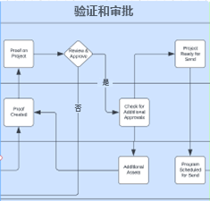
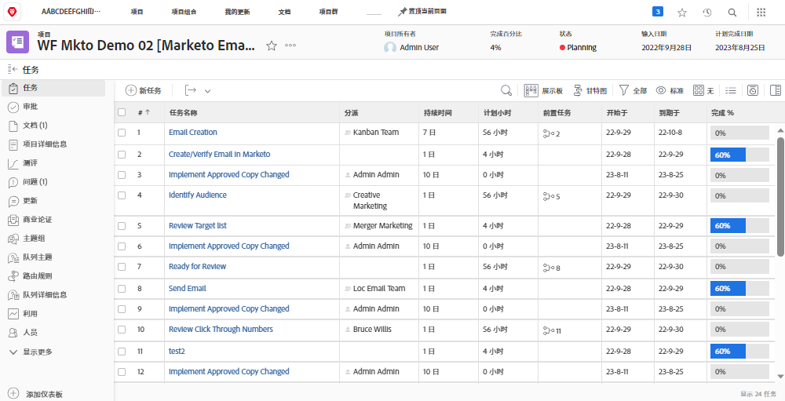
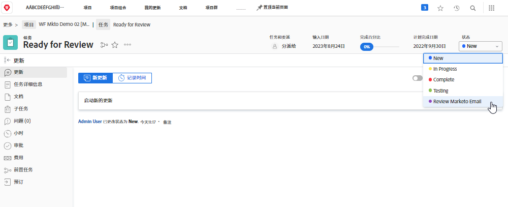
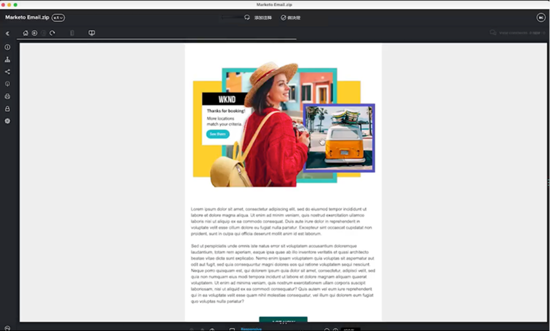

# 审阅和批准Blueprint {#review-and-approve-blueprint}

确保营销资源和营销活动满足业务的期望和标准，其范围不仅仅是为适当的受众提供适当的内容和消息。 在启动新的营销计划时，组织还要负责维护内部政策、行业法规，甚至还要遵守法律先决条件。 通过将审阅和批准步骤纳入其营销活动开发流程，营销团队可以确保内容和消息传送准确且符合其行业标准，尤其是在金融、医疗保健和制药等行业。

借助Workfront和Marketo Engage，营销团队有机会建立紧密连接的营销系统，并且消息传送准确且符合要求。

## 使用Workfront为Marketo Engage解锁验证和高级审批 {#unlock-proofing-and-advanced-approvals}

当我们考虑构建营销活动时，必须考虑多个系统支持涉及的不同步骤，包括：规划、构建、审核、反馈、批准和执行。 借助Workfront和Marketo Engage，各个团队拥有完成端到端流程所需的所有工具，进而规划和启动新的营销活动。 此外，团队可以进一步简化其审核和批准流程，以提高营销活动开发速度，同时确保准确性和合规性符合最高标准。

{zoomable=&quot;yes&quot;}

### 连接Workfront和Marketo Engage的用例 {#use-cases-for-connecting-workfront-and-marketo-engage}

* 利用Workfront对Marketo Engage资源的注释和评论功能，消除不同的反馈并增加集中式协作。

* 通过在Workfront审批工作流的Marketo Engage中触发审批来集中处理审批。

* 通过将Workfront的高级审批功能与Marketo Engage资源结合使用，支持和简化营销资源的复杂审批工作流。

* 通过以编程方式将Marketo资源引入Workfront以供多个利益相关者审查，实现营销草稿的访问大众化。

* 通过在Workfront中集中处理Marketo Engage资源的所有审阅和验证工作，跟踪更改并创建书面记录。

## 规划验证和审批工作流 {#planning-your-proof-and-approval-workflow}

在Marketo Engage和Workfront之间设置验证和审批集成之前，请考虑以下方面：

* 哪些资产需要审核和批准？
* 谁需要成为批准者？
* 营销资源上线之前，是否需要多个批准者？
* 在营销活动开发过程的哪个阶段，将组合营销资产并准备好进行审查？

回答这些问题将帮助您获得一个基准，确定审批流程的外观以及如何开始考虑配置Workfront实例。

## 在Marketo Engage和Workfront之间构建验证和审批工作流 {#building-a-proof-and-approval-workflow}

为了简化Workfront和Marketo Engage之间的验证和批准流程，您可以使用Workfront Fusion集成这两个解决方案。 Workfront Fusion提供了一个工作流界面，用于在Workfront和Marketo Engage实例之间触发操作和传递信息。

为此，请考虑将以下步骤作为集成审阅和批准体验流程的一部分。

1. 使用准备好审查任务配置您的Workfront项目。
1. 触发您的Marketo Engage电子邮件以通过状态更改同步到Workfront。
1. 将您的Marketo Engage电子邮件文件转换为Workfront中的可查看的校对。
1. 使用Workfront校对通过注释和批注进行协作。
1. 批准Workfront Proof以在Marketo Engage中触发资源批准，然后将任务标记为完成。

### 使用准备好审查任务配置Workfront项目 {#configure-a-workfront-project-with-a-ready-for-review-task}

使用 [项目模板](https://experienceleague.adobe.com/docs/workfront/using/manage-work/projects/create-and-manage-project-templates/project-template-overview.html){target="_blank"} 捕获与组织中项目关联的大多数可重复流程、信息和设置。 您可以在模板中定义任务、队列主题、创建自定义表单和附加文档。

在Workfront的项目模板中，包含用于审核营销活动中的资源的任务。 此外，您可以添加审批流程来处理单个审批或更复杂的多级别审批。

如果要启动新的电子邮件营销活动，您应该有一个项目模板，其中包括一项审查电子邮件的任务，以及一个审批流程，用于确保电子邮件在发送之前获得利益相关者的批准。

{zoomable=&quot;yes&quot;}

### 触发您的Marketo Engage电子邮件以通过任务状态更改同步到Workfront {#trigger-your-marketo-engage-email-to-sync-to-workfront}

在审查过程中，您需要能够在电子邮件准备好供营销团队审查后，将电子邮件同步到您的Workfront项目。 为此，我们建议使用设置一个准备好审查任务 [任务状态](https://experienceleague.adobe.com/docs/workfront/using/manage-work/projects/update-work-on-a-project/update-task-status.html){target="_blank"} 这表示何时可以审查电子邮件。 在我们的示例中，我们向任务添加了“审阅Marketo电子邮件”状态，可在电子邮件草稿可供利益相关者审阅时选择此状态。

在Workfront项目中确立此状态后，您可以将Workfront Fusion方案配置为监听“准备审阅”任务以更新为“审阅Marketo电子邮件”。 更新后，您的方案可以检索作为HTML文件的Marketo Engage电子邮件，将其压缩，并在Workfront项目文档中保存一个副本以供审查。

{zoomable=&quot;yes&quot;}

### 在Workfront中将Marketo Engage电子邮件转换为可查看的校对 {#convert-your-marketo-engage-email-to-reviewable-proof-in-workfront}

准备好审查任务移至“审查Marketo电子邮件”状态并将Marketo Engage电子邮件保存在Workfront中后，您可以配置Workfront Fusion方案以将电子邮件转换为Workfront Proof。

{zoomable=&quot;yes&quot;}

## Fusion场景模板 {#fusion-scenario-templates}

为了帮助您简化您自己的Workfront和Marketo Engage实例中审阅和批准工作流的开发过程，我们构建了Fusion Templates以帮助您开始集成。 您可以通过在Fusion的“公共模板”部分中搜索“Marketo”并将它们下载到实例来利用这些模板。

### 在Workfront中查看Marketo Engage电子邮件草稿的电子邮件验证 {#review-an-email-proof-of-your-marketo-engage-email-draft-in-workfront}

以下融合场景将引导您完成审阅和批准流程的上半部分，在该流程中，可以从Marketo Engage中提取电子邮件草稿并将其另存到Workfront作为验证。 在将它另存为Workfront项目文档中的验证后，营销利益相关者可以对其进行审阅、评论，并在审阅过程中添加注释。

{zoomable=&quot;yes&quot;}

### 在Workfront中批准触发审批Marketo Engage中资源的电子邮件 {#approve-an-email-in-workfront-that-triggers-approval}

以下融合场景可用于检测Workfront中的验证何时获得批准，并将该批准路由到Marketo Engage以更新电子邮件草稿，使其在Marketo Engage程序中实时并准备好使用。

{zoomable=&quot;yes&quot;}

这两种情况加在一起，可用于创建一条双向路径，以将营销资源从Marketo Engage拉入Workfront强大的审核和批准工作流程，并将批准从Workfront推送回Marketo Engage。
