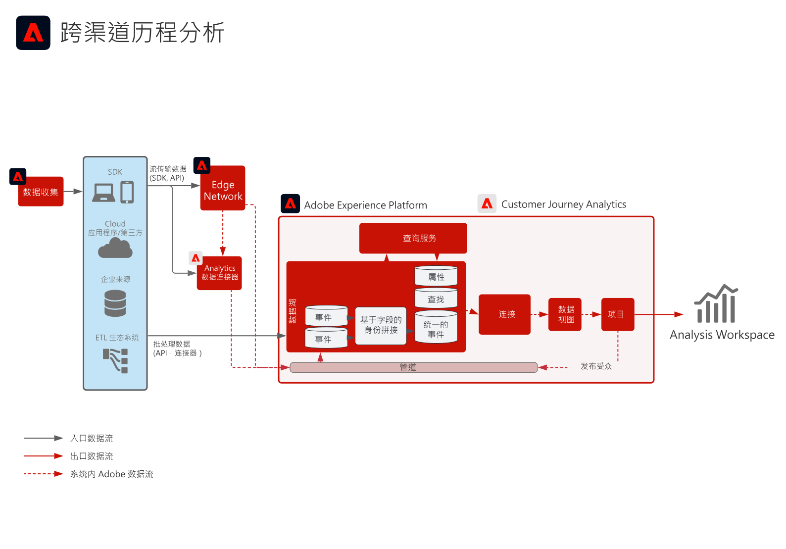

<!-- markdownlint-disable-next-line MD025 -->
# B2B Customer Journey Analytics Blueprint

Customer Journey Analytics B2B edition为B2B组织启用基于帐户的报表和分析。 与以人员为中心的B2C分析不同，此Blueprint将&#x200B;**帐户**&#x200B;放在数据模型的中心，以便您能够跨多个利益相关者、购买组和销售周期分析复杂的B2B购买历程。 使用[!DNL Customer Journey Analytics]将行为数据与B2B维度（帐户、机会、营销活动和营销列表）相结合，以实现基于历程的洞察和受众创建。

## 应用程序

* Adobe [!DNL Customer Journey Analytics] (B2B edition)
* Adobe Experience Platform（用于B2B和事件数据）

## 用例

* **优化客户营销** — 分析营销活动、渠道和内容对客户中的购买群体、管道进展和追加销售/交叉销售商机的影响。
* **增长关键帐户** — 识别关键帐户中跨购买组的高价值接触点，以告知营销和销售行动，并在帐户级别计算客户存留期值。
* **构建产品价值** — 衡量产品发布和使用情况对帐户和用户级别客户满意度的影响，以优化功能并告知开发情况。
* **基于人员的B2B分析** — 将帐户和机会上下文与个人用户行为相结合，以实现商机评分、参与度和历程分析。

## 先决条件

* [!DNL Customer Journey Analytics]个B2B edition权利。
* Adobe Experience Platform中的B2B和行为数据：[CJA连接](https://experienceleague.adobe.com/docs/analytics-platform/using/cja-connections/create-connection.html)中提供的B2B数据集（帐户、机会、人员、营销活动、营销列表、B2B活动）和事件数据（Web、移动或其他渠道）。
* CJA的[B2B命名](https://experienceleague.adobe.com/docs/analytics-platform/using/cja-dataviews/b2b.html)：为连接配置的特定于B2B的数据视图设置（帐户ID、机会ID和相关维度）。

## 架构

{zoomable="yes"}

数据通过CJA连接从Experience Platform（B2B和事件数据集）流入[!DNL Customer Journey Analytics]。 B2B维度在数据视图中公开，因此可以在客户、机会和人员级别构建分析和受众。

## 护栏

* 有关B2B edition产品限制和授权，请参阅[Customer Journey Analytics B2B产品描述](https://helpx.adobe.com/legal/product-descriptions/customer-journey-analytics-b2b.html)。
* 有关Analytics Platform和CJA的技术限制，请参阅[Analytics Platform护栏](https://experienceleague.adobe.com/en/docs/analytics-platform/using/technotes/guardrails)。
* 有关CJA数据引入和连接限制，请参阅[Customer Journey Analytics数据引入护栏](https://experienceleague.adobe.com/docs/experience-platform/sources/connectors/adobe-applications/analytics.html#what-is-the-expected-latency-for-analytics-data-on-platform%3F)。
* 如果将CJA受众发布到Real-time Customer Data Platform，请参阅[Customer Journey Analytics受众共享护栏](https://experienceleague.adobe.com/docs/analytics-platform/using/cja-components/audiences/publish.html#latency)。
* 有关端到端延迟和平台护栏，请参阅[部署护栏文档](../experience-platform/guardrails.md)。

## 实施步骤

1. **将B2B和事件数据摄取到Experience Platform** — 使用[源](https://experienceleague.adobe.com/docs/experience-platform/sources/home.html?lang=zh-Hans)（例如[!DNL Marketo Engage]、CRM或其他B2B连接器）引入帐户、机会、人员、营销活动和活动数据以及行为事件。
2. **创建CJA连接** — [将相关的Experience Platform数据集](https://experienceleague.adobe.com/docs/analytics-platform/using/cja-connections/create-connection.html)（B2B和事件）添加到Customer Journey Analytics连接。
3. **在数据视图中配置B2B** — 启用[B2B命名和密钥维度](https://experienceleague.adobe.com/docs/analytics-platform/using/cja-dataviews/b2b.html)（帐户ID、机会ID等） 在连接的数据视图中。
4. **构建基于帐户的分析和受众** — 使用[CJA B2B用例和报表](https://experienceleague.adobe.com/docs/analytics-platform/using/cja-usecases/b2b.html?lang=zh-Hans)在帐户和机会级别创建报表、划分和受众；可选[将受众发布到Real-time CDP](https://experienceleague.adobe.com/docs/analytics-platform/using/cja-components/audiences/publish.html?lang=zh-Hans)以进行激活。

## 相关文档

### Customer Journey Analytics B2B edition

* [Customer Journey Analytics B2B edition](https://experienceleague.adobe.com/docs/analytics-platform/using/cja-overview/cja-b2b/cja-b2b-edition.html)
* [B2B用例](https://experienceleague.adobe.com/docs/analytics-platform/using/cja-usecases/b2b.html?lang=zh-Hans)
* [B2B edition用例概述](https://experienceleague.adobe.com/docs/analytics-platform/using/cja-usecases/b2b/b2b-edition/use-cases-overview.html)
* [基于人员的B2B项目示例](https://experienceleague.adobe.com/docs/analytics-platform/using/cja-usecases/b2b/example.html)

### 连接和数据视图

* [创建连接](https://experienceleague.adobe.com/docs/analytics-platform/using/cja-connections/create-connection.html)
* [B2B数据视图设置](https://experienceleague.adobe.com/docs/analytics-platform/using/cja-dataviews/b2b.html)

### 受众和护栏

* [将CJA受众发布到Real-time CDP](https://experienceleague.adobe.com/docs/analytics-platform/using/cja-components/audiences/publish.html?lang=zh-Hans)
* [Experience Platform和应用程序护栏](../experience-platform/guardrails.md)
