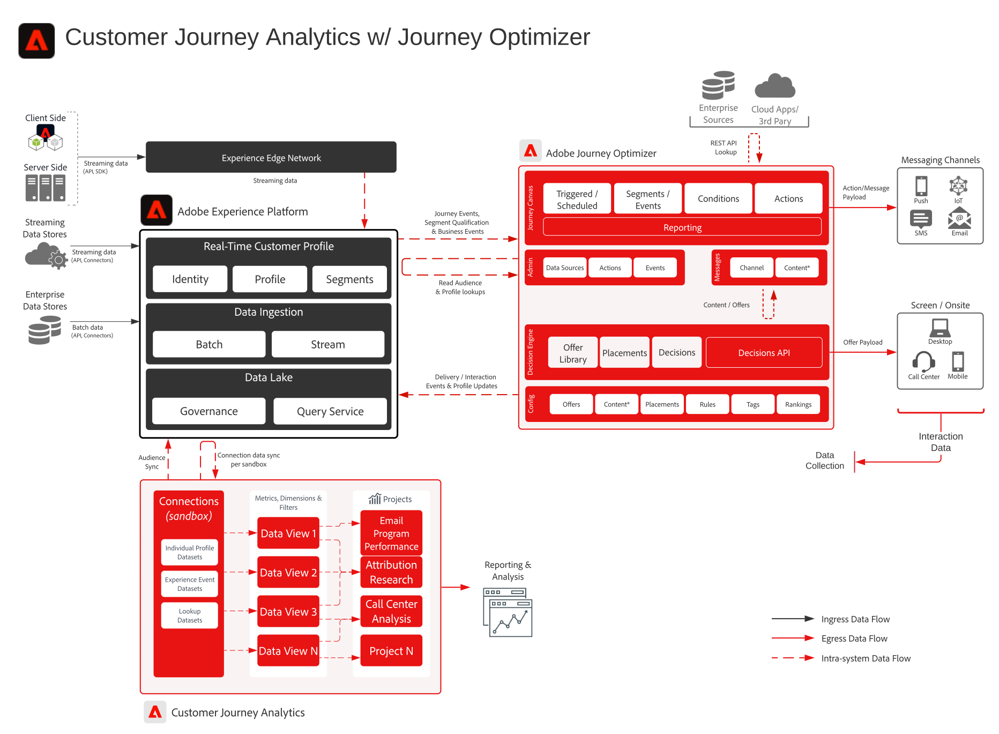

# Customer Journey Analytics 与 Journey Optimizer Blueprint

来自 Journey Optimizer 的数据将共享到 Experience Platform 的数据湖，并可在 Customer Journey Analytics 中用于摄入、分析和报告。在 Customer Journey Analytics 内可以分析和报告历程投放、互动和有效性。

此外，在 Customer Journey Analytics 中创作的受众可发布到 Experience Platform 实时客户档案，并可用于 Journey Optimizer 中的历程执行。

## 实施指南

请参阅以下文档，了解有关在 Customer Journey Analytics 中实施和配置 Journey Optimizer 数据的指导。[文档](https://experienceleague.adobe.com/docs/journey-optimizer/using/reporting/reports/sharing-overview.html?lang=zh-Hans)

## Customer Journey Analytics 与 Journey Optimizer 的架构

