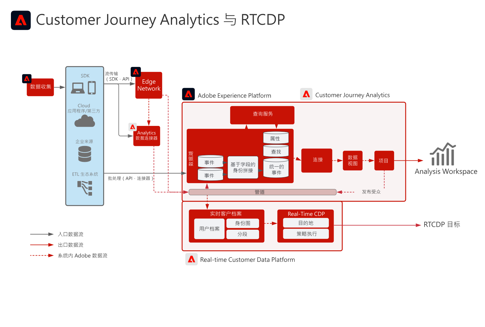

# Customer Journey AnalyticsReal-time Customer Data Platform

创建Customer Journey Analytics(CJA)中标识的受众并将其发布到Adobe Experience Platform中的实时客户资料，以便进行客户定位和个性化。 非常适用于使用历史数据创建受众，或通过Customer Journey Analytics中的精细过滤和计算字段更精细的受众。

## Customer Journey AnalyticsAudience Publishing指南

有关从Customer Journey Analytics到Real-time Customer Data Platform的受众发布的实施和配置的指导，请参阅以下文档。 [文档](https://experienceleague.adobe.com/docs/analytics-platform/using/cja-components/audiences/publish.html)

## Customer Journey Analytics 的架构 Blueprint

## Customer Journey Analytics Blueprint 护栏图

## 相关博客帖子

* [[!DNL Blueprint for Multi-Channel Orchestration in Adobe Experience Platform]](https://medium.com/adobetech/blueprint-for-multi-channel-orchestration-in-adobe-experience-platform-c68317e94184)
* [[!DNL Leveraging External Data Platforms in Adobe Experience Platform Journey Orchestration]](https://medium.com/adobetech/leveraging-external-data-platforms-in-adobe-experience-platform-journey-orchestration-54fc6134fe17)
* [[!DNL Event-Based Triggering on Adobe Experience Platform Orchestration Service using Apache Airflow]](https://medium.com/adobetech/event-based-triggering-on-adobe-experience-platform-orchestration-service-using-apache-airflow-8607b28251f1)
* [[!DNL Adobe Campaign Classic Integration with Journey Orchestration]](https://medium.com/adobetech/adobe-campaign-classic-integration-with-journey-orchestration-ae577653281)
* [[!DNL Demonstrating the Power of Adobe’s New Journey Orchestration Service to Build Personalized Omnichannel Experiences in Real-Time]](https://medium.com/adobetech/demonstrating-the-power-of-adobes-new-journey-orchestration-service-to-build-personalized-aa60d88cd34)
* [[!DNL Journey Orchestration in an Omnichannel World]](https://medium.com/adobetech/journey-orchestration-in-an-omnichannel-world-3a2d32d556d9)
