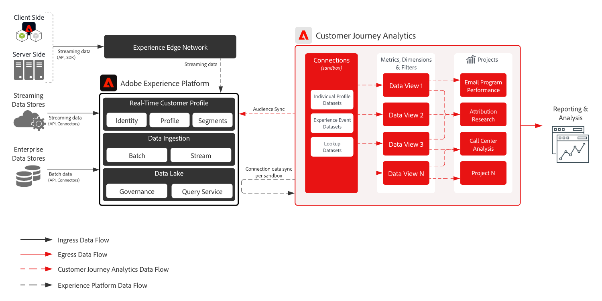

# 带有Real-time Customer Data Platform Blueprint的Customer Journey Analytics

创建在 Customer Journey Analytics (CJA) 中识别的受众并将其发布到 Adobe Experience Platform 中的实时客户档案，以用于客户定位和个性化。 非常适用于使用历史数据创建受众，或通过 Customer Journey Analytics 中的精细筛选和计算字段得出更细化的受众。

## Customer Journey Analytics 受众发布指南

请参阅以下文档，了解有关从 Customer Journey Analytics 向 Real-time Customer Data Platform 发布受众的实施和配置的指导。 [文档](https://experienceleague.adobe.com/docs/analytics-platform/using/cja-components/audiences/publish.html?lang=zh-Hans)

## Customer Journey Analytics 的架构 Blueprint

{zoomable="yes"}

## Customer Journey Analytics 护栏图 Blueprint

* 有关详细的护栏和端到端延迟，请参阅[部署护栏文档](../experience-platform/guardrails.md)