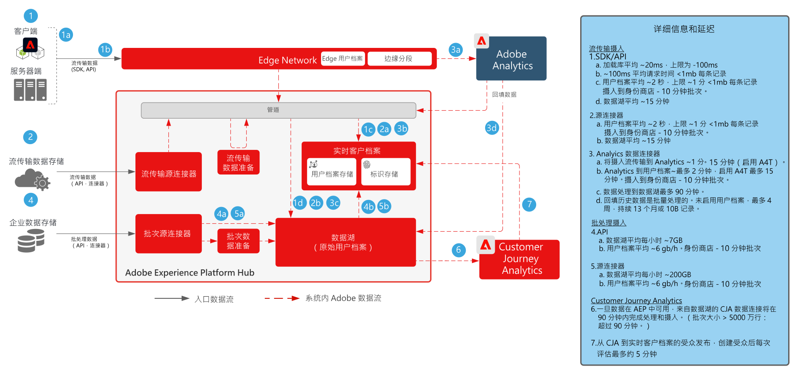

# Customer Journey AnalyticsBlueprint

Customer Journey Analytics 显示了各品牌如何统一来自各种互动渠道和来源的客户数据和行为，以创建包含所有客户互动的基于历程的视图。报告和分析可在 Customer Journey Analytics 应用程序服务中执行，以评估和了解客户互动和行为模式。

Customer Journey Analytics 用例的完整列表可在此处的客户历程分析文档中找到。

## Customer Journey Analytics 用例

[常见用例包括：](https://experienceleague.adobe.com/docs/analytics-platform/using/cja-usecases/cja-usecases.html?lang=zh-Hans)

* 创建受众并将其发布到 Real-time Customer Data Platform
* 顶部/底部转化路径
* 渠道参与度和转化率
* 查看次数最多的内容
* 首要类别和产品
* 哪些营销活动提高了转化率和参与度
* 工具使用分析，以优化自助服务体验

## Customer Journey Analytics 的架构

{zoomable=&quot;yes&quot;}

主要用例示例包括以下内容。

| Blueprint | 描述 | Experience Cloud 应用程序 |
|---|---|---|
| **[跨渠道历程分析](https://experienceleague.adobe.com/docs/analytics-platform/using/cja-usecases/cross-channel.html?lang=zh-Hans)** | <ul><li>通过统一来自各种 Web、移动和线下属性的数据，获取关于不同渠道客户行为的整合视图。</li></ul> | <ul><li>Adobe Experience Platform</li><li>Customer Journey Analytics</li><li>Adobe Analytics（可选）</li></ul> |
| **[将受众发布到Real-time Customer Data Platform](https://experienceleague.adobe.com/docs/analytics-platform/using/cja-components/audiences/publish.html?lang=zh-Hans)** | <ul><li>创建在 Customer Journey Analytics (CJA) 中识别的受众并将其发布到 Adobe Experience Platform 中的实时客户档案，以用于客户定位和个性化。非常适用于使用历史数据创建受众，或通过 Customer Journey Analytics 中的精细筛选和计算字段得出更细化的受众。</li></ul> | <ul><li>Real-time Customer Data Platform  </li><li>Customer Journey Analytics</li> |
| **[呼叫转移历程分析](https://experienceleague.adobe.com/docs/analytics-platform/using/cja-usecases/call-center.html?lang=zh-Hans)** | <ul><li>通过将呼叫中心数据与 Web、移动和其他交互数据结合在一起，确定哪些行为最能指示产生座席协助呼叫。</li><li>然后，这些洞察可用于优化客户体验，并通过优化自助服务内容和工具精简座席协助互动的路径。  </li></ul> | <ul><li>Adobe Experience Platform</li><li>Customer Journey Analytics</li> |

## Customer Journey Analytics 护栏图 Blueprint

* 有关详细的护栏和端到端延迟，请参阅[部署护栏文档](../experience-platform/deployment/guardrails.md)

{zoomable=&quot;yes&quot;}

## 相关博客帖子

* [[!DNL Blueprint for Multi-Channel Orchestration in Adobe Experience Platform]](https://medium.com/adobetech/blueprint-for-multi-channel-orchestration-in-adobe-experience-platform-c68317e94184){target="_blank"}
* [[!DNL Leveraging External Data Platforms in Adobe Experience Platform Journey Orchestration]](https://medium.com/adobetech/leveraging-external-data-platforms-in-adobe-experience-platform-journey-orchestration-54fc6134fe17){target="_blank"}
* [[!DNL Event-Based Triggering on Adobe Experience Platform Orchestration Service using Apache Airflow]](https://medium.com/adobetech/event-based-triggering-on-adobe-experience-platform-orchestration-service-using-apache-airflow-8607b28251f1){target="_blank"}
* [[!DNL Adobe Campaign Classic Integration with Journey Orchestration]](https://medium.com/adobetech/adobe-campaign-classic-integration-with-journey-orchestration-ae577653281){target="_blank"}
* [[!DNL Demonstrating the Power of Adobe's New Journey Orchestration Service to Build Personalized Omnichannel Experiences in Real-Time]](https://medium.com/adobetech/demonstrating-the-power-of-adobes-new-journey-orchestration-service-to-build-personalized-aa60d88cd34){target="_blank"}
* [[!DNL Journey Orchestration in an Omnichannel World]](https://medium.com/adobetech/journey-orchestration-in-an-omnichannel-world-3a2d32d556d9){target="_blank"}
