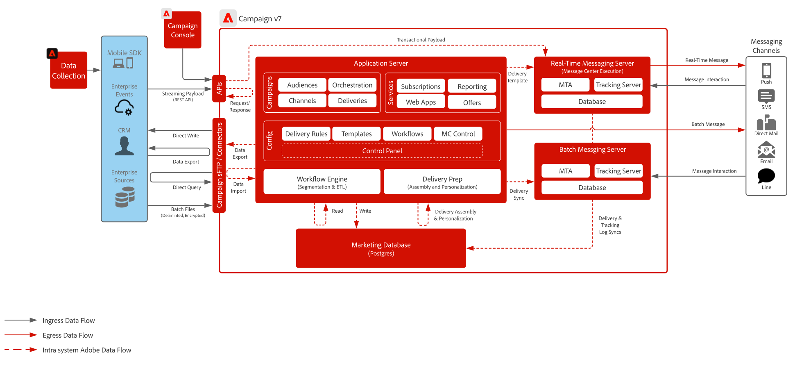

# Campaign v7 Blueprint

>[!IMPORTANT]
>
> 此Adobe Campaign v7 Blueprint已被弃用，不再受支持。 有关最新指南、架构和最佳实践，请参阅Adobe Campaign v8的蓝图。
> 
> 👉查看[Adobe [!DNL Campaign] v8 Blueprint](../campaign-v8/campaign-v8-overview.md)

 

## 架构

 

## 相关文档

* [Campaign v7文档](https://experienceleague.adobe.com/docs/campaign-classic.html?lang=zh-Hans)
* [Campaign v7产品描述](https://helpx.adobe.com/cn/legal/product-descriptions/adobe-campaign-managed-cloud-services.html)
* [Experience Platform标记文档](https://experienceleague.adobe.com/docs/launch.html?lang=zh-Hans)
* [Experience Platform Mobile SDK文档](https://experienceleague.adobe.com/docs/mobile.html?lang=zh-Hans)
