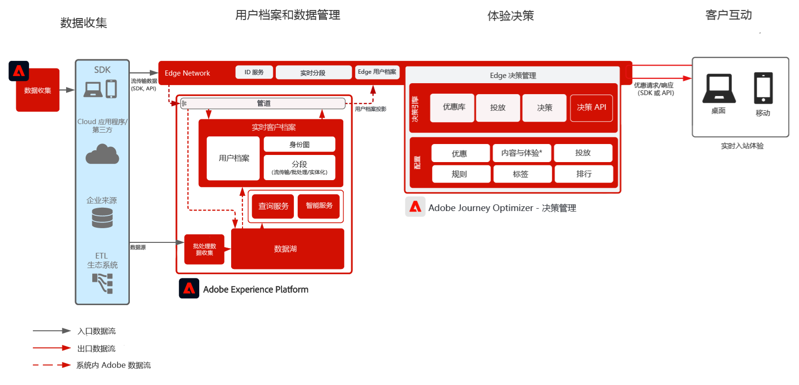

# Journey Optimizer — 边缘决策管理

要了解有关决策管理的更多信息，请参阅产品文档 [此处](https://experienceleague.adobe.com/docs/journey-optimizer/using/offer-decisioniong/get-started-decision/starting-offer-decisioning.html?lang=zh-Hans) 和决策管理概述 [此处](https://experienceleague.adobe.com/docs/blueprints-learn/architecture/customer-journeys/journey-optimizer/offer-decisioning/decision-management-overview.html)

Adobe 决策管理是作为 Adobe Journey Optimizer 的一部分提供的服务。此蓝图概述了应用程序的用例和技术功能，并深入介绍了构成决策管理的各种体系结构组件和注意事项。

决策管理可以通过两种方式进行部署。第一种是通过 Adobe Experience Platform 中心，即采用单个数据中心架构。对于“中心”方法，执行、个性化和投放优惠的延迟为一秒左右。因此，中心架构最适合不需要亚秒级延迟的客户体验，例如，为自助终端、呼叫中心中的座席协助体验或者个人交互提供的优惠决策。

第二种方法是通过 Experience Edge 网络，它是分布在全球各地的基础架构，可提供快速的亚秒级和毫秒级体验。由最靠近消费者地理位置的边缘基础架构执行最终消费者体验，可最大程度地减少延迟。边缘决策管理旨在提供实时的消费者体验。这些体验包括 Web 或移动入站个性化请求等体验。

此 Blueprint 将介绍边缘决策管理的具体细节。

要了解有关中心决策管理的更多信息，请参阅[中心决策管理](https://experienceleague.adobe.com/docs/blueprints-learn/architecture/customer-journeys/journey-optimizer/offer-decisioning/decision-management-hub.html) Blueprint。

## 边缘决策管理用例

* 通过Web或移动设备入站体验进行在线个性化。
* 跨渠道历程执行 - 通过 Adobe Journey Optimizer 提供跨 Web、移动设备、电子邮件和其他交互渠道的一致性。

 

## 架构

 

## 集成模式

| 集成 | 描述 |
| :-- | :--- |
| [使用Adobe Target进行决策管理](https://experienceleague.adobe.com/docs/target/using/integrate/ajo/offer-decision.html?lang=zh-Hans) | 决策管理可以与Adobe Target集成，以便能够测试选件并将其作为Target体验进行交付。 |

## 先决条件

Adobe Experience Platform

* 必须在系统中配置架构和数据集，然后才能配置 Journey Optimizer 数据源
* 对于基于体验事件类的架构，当您希望触发的事件不是基于规则的事件时，请添加“编排事件 ID 字段组”
* 对于基于个人用户档案类的架构，添加“用户档案测试详细信息”字段组，以便能够加载测试用户档案以与 Journey Optimizer 一起使用

 

## 护栏

* 有关 Journey Optimizer 护栏，请参阅以下 [Journey Optimizer 护栏](https://experienceleague.adobe.com/docs/journey-optimizer/using/get-started/limitations.html?lang=zh-Hans)。
* 有关决策管理护栏，请参阅以下内容 [决策管理产品说明](https://helpx.adobe.com/cn/legal/product-descriptions/offer-decisioning-app-service.html).
* 每秒请求数= 5000。
* 响应的延迟少于250毫秒。
* 访问边缘实时配置文件。 配置文件中只有边缘预测受众和配置文件属性可用。
* 如果首次体验中需要个性化，则中心将是理想的选择，因为完整的用户档案可用。 边缘配置文件必须首次从集线器同步到边缘体验。 因此，从边缘网站获得的首个体验将不包含以前上传到中心的配置文件数据。

### 数据摄入护栏

 

### 激活护栏

 

## 实施模式

* 使用Web或移动SDK在网站和移动应用程序上进行部署，以在部署SDK的位置实施决策管理。
   * [Web/Mobile SDK Blueprint](https://experienceleague.adobe.com/docs/blueprints-learn/architecture/data-ingestion/websdk.html?lang=zh-Hans)
   * [WebSDK](https://experienceleague.adobe.com/docs/experience-platform/edge/personalization/offer-decisioning/offer-decisioning-overview.html?lang=zh-Hans)
   * [MobileSDK](https://aep-sdks.gitbook.io/docs/)

或

* 对于基于API服务器到服务器的实施，使用边缘网络服务API将决策管理的服务器直接实施到服务器。
   * [Edge 网络服务器 API](https://experienceleague.adobe.com/docs/journey-optimizer/using/offer-decisioniong/api-reference/offer-delivery/deliver-offers.html?lang=zh-Hans)

 

## 实施步骤

### Adobe Experience Platform

#### 模式/数据集

1. 根据客户提供的数据在 Experience Platform 中[配置单个用户档案、体验事件和多实体模式。](https://experienceleague.adobe.com/?recommended=ExperiencePlatform-D-1-2021.1.xdm)
1. 为要摄入的数据在 Experience Platform 中[创建数据集](https://experienceleague.adobe.com/docs/platform-learn/tutorials/data-ingestion/create-datasets-and-ingest-data.html?lang=zh-Hans)。
1. 在 Experience Platform 中为数据集[添加数据使用标签](https://experienceleague.adobe.com/docs/platform-learn/tutorials/data-governance/classify-data-using-governance-labels.html?lang=zh-Hans)以便进行治理。
1. [创建对目标实施治理的策略](https://experienceleague.adobe.com/docs/platform-learn/tutorials/data-governance/create-data-usage-policies.html?lang=zh-Hans)。

#### 用户档案/身份

1. [创建任何客户特定的命名空间](https://experienceleague.adobe.com/docs/platform-learn/tutorials/identities/label-ingest-and-verify-identity-data.html?lang=zh-Hans)。
1. [向模式添加身份](https://experienceleague.adobe.com/docs/platform-learn/tutorials/identities/label-ingest-and-verify-identity-data.html)。
1. [为用户档案启用架构和数据集](https://experienceleague.adobe.com/docs/platform-learn/tutorials/profiles/bring-data-into-the-real-time-customer-profile.html?lang=zh-Hans)。
1. 为[!UICONTROL 实时客户档案]的不同视图[设置合并策略](https://experienceleague.adobe.com/docs/platform-learn/tutorials/profiles/create-merge-policies.html?lang=zh-Hans)（可选）。
1. 创建区段以用于 Journey。

#### 源/目标

1. 使用流传输 API 和源连接器[将数据摄入 Experience Platform。](https://experienceleague.adobe.com/?recommended=ExperiencePlatform-D-1-2020.1.dataingestion&amp;lang=zh-Hans)

## 相关文档

* [Adobe Experience Platform](https://experienceleague.adobe.com/docs/experience-platform.html?lang=zh-Hans)
* [Adobe Journey Optimizer](https://experienceleague.adobe.com/docs/journey-optimizer.html?lang=zh-Hans)
* [Adobe Journey Optimizer 决策管理](https://experienceleague.adobe.com/docs/journey-optimizer/using/offer-decisioniong/get-started-decision/starting-offer-decisioning.html)
* [Adobe Journey Optimizer 产品描述](https://helpx.adobe.com/cn/legal/product-descriptions/adobe-journey-optimizer.html)
* [Adobe决策管理产品说明](https://helpx.adobe.com/legal/product-descriptions/offer-decisioning-app-service.html)
