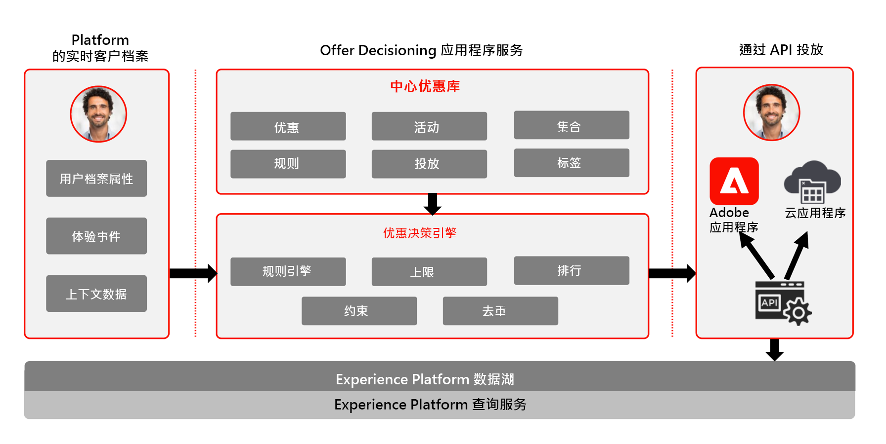

# Journey Optimizer - 决策管理概述

要了解有关决策管理的更多信息，请参阅[此处](https://experienceleague.adobe.com/docs/journey-optimizer/using/offer-decisioniong/get-started-decision/starting-offer-decisioning.html?lang=zh-Hans)的产品文档

Adobe 决策管理是作为 Adobe Journey Optimizer 的一部分提供的服务。此 Blueprint 概述了该应用程序的用例和技术功能，并深入介绍了构成决策管理的各种架构组件和注意事项。

Journey Optimizer 用于跨所有接触点在适当的时间为客户提供最佳优惠和体验。决策管理通过集中的营销优惠库和决策引擎轻松实现个性化，该引擎可将规则和约束应用于 Adobe Experience Platform 创建的丰富实时用户档案，以帮助您在适当的时间向客户发送适当的优惠。

决策管理功能包含两个主要组件：

* 集中式优惠库，可在该界面中创建和管理构成优惠的不同元素，并定义其规则和约束。
* 优惠决策引擎可利用 Adobe Experience Platform 数据和实时客户档案以及优惠库，选择出投放优惠的适当时间、客户和渠道。

决策管理可通过以下两种方式部署：在边缘或中心。每种方法都有一系列用于操作服务的特定接口和协议，如下面引用的相应 Blueprint 中所述。[此处](https://experienceleague.adobe.com/docs/journey-optimizer/using/offer-decisioniong/api-reference/offer-delivery-api/decisioning-vs-edge-apis.html?lang=zh-Hans)的决策管理文档中还提供了其他详细信息。

## 中心决策管理

第一种是通过 Adobe Experience Platform 中心，即采用中央数据中心架构。对于“中心”方法，执行、个性化和投放优惠的延迟在 500 毫秒以上。因此，中心架构最适合不需要亚秒级延迟的客户体验，例如，为自助终端、呼叫中心中的座席协助体验或者个人交互提供的优惠决策。插入到电子邮件、短信、推送通知和其他推拨营销活动中的优惠同样由中心方法提供支持。要了解有关中心决策管理的更多信息，请参阅[中心决策管理](https://experienceleague.adobe.com/docs/blueprints-learn/architecture/customer-journeys/journey-optimizer/decision-management/decision-management-hub.html?lang=zh-Hans) Blueprint。

* 优惠资格可以针对完整的实时客户档案进行操作，包括所有属性和体验事件

### 中心决策管理用例

* 自助终端和店内体验中的个性化优惠。
* 通过座席辅助体验提供的个性化优惠，例如用于呼叫中心或销售互动。
* 电子邮件、短信或其他推拨交互中包含的优惠。
* 跨渠道历程执行 - 通过 Adobe Journey Optimizer 提供跨 Web、移动设备、电子邮件和其他交互渠道的一致性。

### 关于中心技术考虑事项的决策管理

* 每秒请求数= 2000。
* 响应延迟小于 500 ms。
* 访问完整的实时客户档案，包括受众会员资格、属性和体验事件。

## 边缘决策管理

第二种方法是通过 Experience Edge 网络，它是分布在全球各地的基础架构，可提供快速的亚秒级和毫秒级体验。由最靠近消费者地理位置的边缘基础架构执行最终消费者体验，可最大程度地减少延迟。边缘决策管理旨在提供实时客户体验，例如 Web 或移动集客个性化请求。要了解有关边缘决策管理的更多信息，请参阅[边缘决策管理](https://experienceleague.adobe.com/docs/blueprints-learn/architecture/customer-journeys/journey-optimizer/decision-management/decision-management-edge.html?lang=zh-Hans) Blueprint。

### 边缘决策管理用例

* 通过 Web 或移动设备集客体验进行在线个性化。
* 跨渠道历程执行 - 通过 Adobe Journey Optimizer 提供跨 Web、移动设备、电子邮件和其他交互渠道的一致性。

### 关于边缘技术考虑事项的决策管理

* 每秒请求数= 5000。
* 响应延迟小于 250 ms。
* 访问边缘实时用户档案。用户档案中只有边缘预测受众和用户档案属性可用。
* 如果首次体验中需要个性化，则中心将是理想的选择，因为可以使用完整的用户档案。对于首次边缘体验，必须从中心同步边缘用户档案。因此，从边缘网站获得的首个体验将不包含以前上传到中心的用户档案数据。

## 相关文档

* [Adobe Experience Platform](https://experienceleague.adobe.com/docs/experience-platform.html?lang=zh-Hans)
* [Adobe Journey Optimizer](https://experienceleague.adobe.com/docs/journey-optimizer.html?lang=zh-Hans)
* [Adobe Journey Optimizer 决策管理](https://experienceleague.adobe.com/docs/journey-optimizer/using/offer-decisioniong/get-started-decision/starting-offer-decisioning.html?lang=zh-Hans)
* [Adobe Journey Optimizer 产品描述](https://helpx.adobe.com/cn/legal/product-descriptions/adobe-journey-optimizer.html)
* [Adobe 决策管理产品描述](https://helpx.adobe.com/cn/legal/product-descriptions/offer-decisioning-app-service.html)
