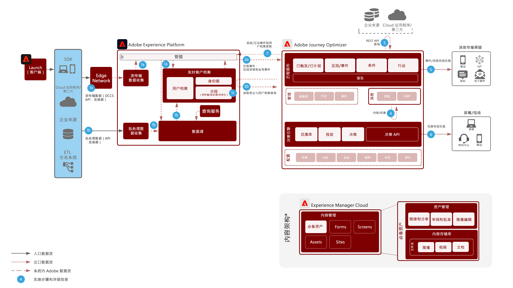

# Journey Optimizer

Adobe Journey Optimizer是营销团队专门构建的系统，可实时响应客户行为并在其所在位置满足他们。 数据管理功能已移至Adobe Experience Platform，使营销团队能够专注于他们最擅长的工作：它创建了世界一流的客户历程和个性化的对话。  此蓝图概述了应用程序的技术功能，并深入介绍了构成Adobe Journey Optimizer的各种体系结构组件。

## 用例

* 触发式消息
* 注册确认
* 放弃购物车和应用程序表单
* 位置触发式消息

## 架构

## 集成模式

* Adobe Experience Platform—>Journey Optimizer

## 先决条件

1. 必须使用有效的IMS组织为Experience Cloud配置客户
1. 移动推送

* 客户必须拥有移动开发人员才能构建应用程序
* Adobe Experience Platform Mobile SDK
* Adobe启动
   * 移动资产
      * 扩展：
         * Adobe Journey Optimizer扩展
         * Adobe Experience Platform边缘网络
         * 身份
         * 移动核心
         * 用户档案
   * 应用程序配置
   * 数据流
      * 启用Experience Platform
      * 事件数据集 — 用于收集常规移动设备行为
      * 配置文件数据集 — AJO推送配置文件数据集（不能不同）

## 护栏

* 请参阅有关限制的更多详情链接
* 批处理客户细分 — 需要确保您了解符合条件的用户的每日流量，并确保目标系统能够处理每个历程和所有历程的突发吞吐量
* 流区段 — 需要确保能够处理配置文件资格条件的初始突发，以及每个历程和所有历程的每日流资格条件数量
* 用户档案更新活动 — 实时客户用户档案可以从历程中以本地方式更新。  在将更新处理到用户档案存储时，最多有1分钟的延迟
* 业务事件 — 可以触发基于读取区段的历程，以便根据对JO系统的外部调用开始
* 本机仅支持消息中的Offer decisioning。 将来通过本机操作提供支持
* 支持的渠道：
   * 电子邮件
   * 推送(FCM / APNS)
   * Rest API端点
* 每秒处理5k个事件，并进行水平缩放（Wallet受限）
* A/B测试通过使用两个投放并使用QS或CJA确定结果来完成
* Litmus集成 — 必须拥有Litmus帐户才能利用集成

## 实施步骤

### Adobe Experience Platform

#### 架构/数据集

1. 根据客户提供的数据在 Experience Platform 中[配置单个用户档案、体验事件和多实体架构。](https://experienceleague.adobe.com/docs/platform-learn/tutorials/schemas/create-a-schema.html?lang=zh-Hans)
1. 为 broadLog、trackingLog、无法投放的地址和用户档案首选项创建 Adobe Campaign 架构（可选）。
1. 为要摄入的数据在 Experience Platform 中[创建数据集](https://experienceleague.adobe.com/docs/platform-learn/tutorials/data-ingestion/create-datasets-and-ingest-data.html?lang=zh-Hans)。
1. 在 Experience Platform 中为数据集[添加数据使用标签](https://experienceleague.adobe.com/docs/platform-learn/tutorials/data-governance/classify-data-using-governance-labels.html?lang=zh-Hans)以便进行治理。
1. [创建对目的地实施治理的策略。](https://experienceleague.adobe.com/docs/platform-learn/tutorials/data-governance/create-data-usage-policies.html?lang=zh-Hans)

#### 用户档案/身份

1. [创建任何客户特定的命名空间](https://experienceleague.adobe.com/docs/platform-learn/tutorials/identities/label-ingest-and-verify-identity-data.html?lang=zh-Hans)。
1. [向架构添加身份](https://experienceleague.adobe.com/docs/platform-learn/tutorials/identities/label-ingest-and-verify-identity-data.html)。
1. [为用户档案启用架构和数据集](https://experienceleague.adobe.com/docs/platform-learn/tutorials/profiles/bring-data-into-the-real-time-customer-profile.html?lang=zh-Hans)。
1. 为[!UICONTROL 实时客户档案]的不同视图[设置合并策略](https://experienceleague.adobe.com/docs/platform-learn/tutorials/profiles/create-merge-policies.html?lang=zh-Hans)（可选）。
1. 为 Adobe Campaign 使用创建区段。

#### 源/目的地

1. 使用流 API 和源连接器[将数据摄入到 Experience Platform 中](https://experienceleague.adobe.com/?recommended=ExperiencePlatform-D-1-2020.1.dataingestion&amp;lang=zh-Hans)。1. 配置[!DNL Azure] Blob 存储目的地以便与 Adobe Campaign 一起使用。

#### 移动应用程序部署

1. 为 Adobe Campaign Classic 实施 Adobe Campaign SDK 或为 Adobe Campaign Standard 实施 Experience Platform SDK。如果存在 Experience Platform Launch，建议将 Adobe Campaign Classic 或 Adobe Campaign Standard 扩展与 Experience Platform SDK 一起使用。

### Journey Orchestration

1. 必须先在Journey Optimizer中配置用于启动客户历程的流数据，才能获取编排ID。 然后，此编排 ID 将被提供给开发人员以在摄入时使用。
1. 配置外部数据源。
1. 配置自定义操作。

## 相关文档

* [Adobe Experience Platform 文档](https://experienceleague.adobe.com/docs/experience-platform.html?lang=zh-Hans)
* [Journey Optimizer文档](https://experienceleague.adobe.com/docs/journey-orchestration.html?lang=zh-Hans)
* [Experience Platform Launch 文档](https://experienceleague.adobe.com/docs/launch.html?lang=zh-Hans)
* [Experience Platform Mobile SDK 文档](https://experienceleague.adobe.com/docs/mobile.html?lang=zh-Hans)
