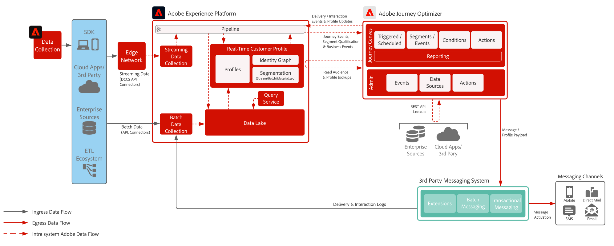

# 第三方消息传递 blueprint

>[!TIP]
>此Blueprint还作为[用例模式](/help/blueprints/use-case-patterns/campaign-management-orchestration/third-party-messaging.md)在Campaign Management &amp; Orchestration下提供。

演示如何将Adobe Journey Optimizer与第三方消息传递系统结合使用，以发送个性化通信。

 

## 架构

 

## 先决条件

**Adobe Experience Platform**

* 必须在系统中配置架构和数据集，然后才能配置 Journey Optimizer 数据源
* 对于基于体验事件类的架构，当您希望触发的事件不是基于规则的事件时，请添加“Orchestration eventID”字段组
* 对于基于个人资料类的架构，请添加“个人资料测试详细信息”字段组，以便能够加载测试个人资料以用于Journey Optimizer

**第三方消息传递应用程序**

* 必须支持 REST API 调用以发送事务负载

 

## 护栏

[Journey Optimizer护栏产品链接](https://experienceleague.adobe.com/docs/journeys/using/starting-with-journeys/limitations.html?lang=zh-Hans)

[护栏和端到端延迟指导](https://experienceleague.adobe.com/docs/blueprints-learn/architecture/architecture-overview/guardrails.html?lang=zh-Hans)

 

## 实施步骤

### Adobe Experience Platform

#### 架构/数据集

1. 根据客户提供的数据，在Experience Platform中[配置架构](https://experienceleague.adobe.com/?recommended=ExperiencePlatform-D-1-2021.1.xdm&lang=zh-Hans)。
1. 为要摄入的数据在 Experience Platform 中[创建数据集](https://experienceleague.adobe.com/docs/platform-learn/tutorials/data-ingestion/create-datasets-and-ingest-data.html?lang=zh-Hans)。
1. 在 Experience Platform 中为数据集[添加数据使用标签](https://experienceleague.adobe.com/docs/platform-learn/tutorials/data-governance/classify-data-using-governance-labels.html?lang=zh-Hans)以便进行治理。
1. [创建对目标实施治理的策略](https://experienceleague.adobe.com/docs/platform-learn/tutorials/data-governance/create-data-usage-policies.html?lang=zh-Hans)。

#### 用户档案/身份

1. [创建任何客户特定的命名空间](https://experienceleague.adobe.com/docs/platform-learn/tutorials/identities/label-ingest-and-verify-identity-data.html?lang=zh-Hans)。
1. [向模式添加身份](https://experienceleague.adobe.com/docs/platform-learn/tutorials/identities/label-ingest-and-verify-identity-data.html?lang=zh-Hans)。
1. [为用户档案启用架构和数据集](https://experienceleague.adobe.com/zh-hans/docs/platform-learn/tutorials/profiles/bring-data-into-the-real-time-customer-profile)。
1. 为[!UICONTROL 实时客户档案]的不同视图[设置合并策略](https://experienceleague.adobe.com/docs/platform-learn/tutorials/profiles/create-merge-policies.html?lang=zh-Hans)（可选）。
1. 创建区段以用于 Journey。

#### 源/目标

1. 使用流传输 API 和源连接器[将数据摄入 Experience Platform。](https://experienceleague.adobe.com/?recommended=ExperiencePlatform-D-1-2020.1.dataingestion&lang=zh-Hans)

### Journey Optimizer

1. 配置您的Experience Platform数据源，并确定应在历程中缓存哪些字段
1. 必须先配置用于启动客户历程的流数据才能获取编排ID。 然后，将此编排ID提供给开发人员在摄取期间使用
1. 配置外部数据源
1. 为第三方应用程序配置自定义操作

### 移动推送配置（可选，因为第三方可能会收集令牌）

1. 实施 Experience Platform Mobile SDK 以收集推送令牌和登录信息，从而关联回已知的客户用户档案
1. 利用 Adobe 标记并创建具有以下扩展的移动资产：
   * Adobe Journey Optimizer
   * Adobe Experience Platform Edge 网络
   * [!DNL Edge Network]的身份
   * 移动核心
1. 确保您拥有专用数据流，用于移动应用程序部署与 Web 部署
1. 有关更多信息，请参阅 [Adobe Journey Optimizer 移动指南](https://developer.adobe.com/client-sdks/documentation/adobe-journey-optimizer/)

 

## 相关文档

* [Experience Platform文档](https://experienceleague.adobe.com/docs/experience-platform.html?lang=zh-Hans)
* [Experience Platform标记文档](https://experienceleague.adobe.com/docs/experience-platform/tags/home.html?lang=zh-Hans)
* [Experience Platform Mobile SDK文档](https://experienceleague.adobe.com/docs/mobile.html?lang=zh-Hans)
* [Journey Optimizer文档](https://experienceleague.adobe.com/docs/journey-optimizer/using/ajo-home.html?lang=zh-Hans)
* [Journey Optimizer产品描述](https://helpx.adobe.com/cn/legal/product-descriptions/adobe-journey-optimizer.html)
