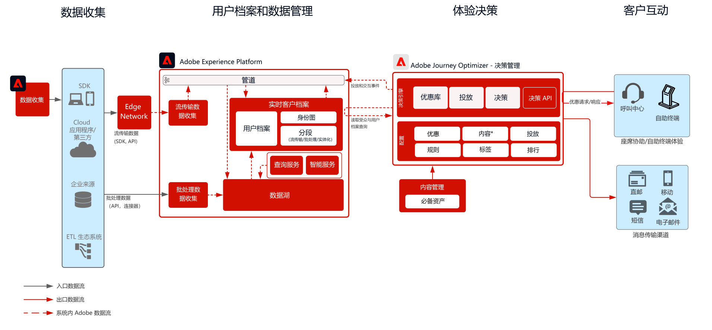

# Journey Optimizer - 中心 Offer Decisioning

要了解有关决策管理的更多信息，请参阅产品文档 [此处](https://experienceleague.adobe.com/docs/journey-optimizer/using/offer-decisioniong/get-started-decision/starting-offer-decisioning.html?lang=zh-Hans) 和Offer decisioning概述 [此处](https://experienceleague.adobe.com/docs/blueprints-learn/architecture/customer-journeys/journey-optimizer/offer-decisioning/offers-overview.html)

Adobe 决策管理是作为 Adobe Journey Optimizer 的一部分提供的服务。此 Blueprint 概述了该应用程序的用例和技术功能，并深入介绍了构成 Offer Decisioning 的各种架构组件和注意事项。

Journey Optimizer用于在适当的时间跨所有接触点为客户提供最佳选件和体验。 offer decisioning通过集中的营销选件库和决策引擎(该引擎可将规则和约束应用于Adobe Experience Platform创建的丰富实时用户档案，以帮助您在适当的时间向客户发送正确的选件)，从而轻松实现个性化。

决策管理可以通过两种方式进行部署。第一种是通过 Adobe Experience Platform 中心，即采用中央数据中心架构。对于“中心”方法，执行、个性化和投放优惠的延迟在 500 毫秒以上。因此，中心架构最适合不需要亚秒级延迟的客户体验，例如，为自助终端、呼叫中心中的座席协助体验或者个人交互提供的优惠决策。插入到电子邮件和推拨营销活动中的优惠同样由中心方法提供支持。

第二种方法是通过 Experience Edge 网络，它是分布在全球各地的基础架构，可提供快速的亚秒级和毫秒级体验。由最靠近消费者地理位置的边缘基础架构执行最终消费者体验，可最大程度地减少延迟。边缘决策管理旨在提供实时客户体验，例如 Web或移动集客个性化请求。

此 Blueprint 将介绍中心决策管理的具体细节。

要了解有关边缘决策管理的更多信息，请参阅[边缘决策管理](https://experienceleague.adobe.com/docs/blueprints-learn/architecture/customer-journeys/journey-optimizer/offer-decisioning/offers-edge.html) Blueprint。

## 中心上的决策管理用例

* 自助终端和店内体验中的个性化优惠。
* 通过座席辅助体验提供的个性化优惠，例如用于呼叫中心或销售互动。
* 电子邮件、短信、移动推送通知或其他出站交互中包含的选件。
* 向外部ESP和报文传送系统提供优惠以供交付。
* 跨渠道历程执行 - 通过 Adobe Journey Optimizer 提供跨 Web、移动设备、电子邮件和其他交互渠道的一致性。

 

## 架构

 

## 先决条件

Adobe Experience Platform

* 必须在系统中配置架构和数据集，然后才能配置 Journey Optimizer 数据源
* 对于基于体验事件类的架构，当您希望触发的事件不是基于规则的事件时，请添加“编排事件 ID 字段组”
* 对于基于个人用户档案类的架构，添加“用户档案测试详细信息”字段组，以便能够加载测试用户档案以与 Journey Optimizer 一起使用

 

## 护栏

* 有关 Journey Optimizer 护栏，请参阅以下 [Journey Optimizer 护栏](https://experienceleague.adobe.com/docs/journey-optimizer/using/get-started/limitations.html?lang=zh-Hans)。
* 有关 Offer Decisioning 护栏，请参阅以下 [Offer Decisioning 产品描述](https://helpx.adobe.com/cn/legal/product-descriptions/offer-decisioning-app-service.html)。

### 数据摄入护栏

 

### 激活护栏

 

## 实施模式

* 通过直接与 [Adobe Journey Optimizer](https://experienceleague.adobe.com/docs/journey-optimizer/using/offer-decisioniong/get-started-decision/offers-e2e.html?lang=zh-Hans) 集成，在电子邮件、短信和推拨渠道中实施。
* 对于基于服务器 API 的 Offer Decisioning 实施，请利用[决策 API](https://experienceleague.adobe.com/docs/journey-optimizer/using/offer-decisioniong/api-reference/offer-delivery/decisioning-vs-edge-apis.html?lang=zh-Hans)。
* 要实施基于批次的决策，以便将优惠批量投放到消息投放应用程序，请使用[批量决策 API](https://experienceleague.adobe.com/docs/journey-optimizer/using/offer-decisioniong/api-reference/offer-delivery/batch-decisioning-api.html?lang=zh-Hans)。
* 对于基于边缘的实时体验，请按照[边缘 Offer Decisioning Blueprint](https://experienceleague.adobe.com/docs/blueprints-learn/architecture/customer-journeys/journey-optimizer/offer-decisioning/offers-edge.html) 中的说明使用 Web/Mobile SDK 或 Edge Decisioning API。
 

## 实施步骤

### Adobe Experience Platform

#### 模式/数据集

1. 根据客户提供的数据在 Experience Platform 中[配置单个用户档案、体验事件和多实体模式。](https://experienceleague.adobe.com/?recommended=ExperiencePlatform-D-1-2021.1.xdm)
1. 为要摄入的数据在 Experience Platform 中[创建数据集](https://experienceleague.adobe.com/docs/platform-learn/tutorials/data-ingestion/create-datasets-and-ingest-data.html?lang=zh-Hans)。
1. 在 Experience Platform 中为数据集[添加数据使用标签](https://experienceleague.adobe.com/docs/platform-learn/tutorials/data-governance/classify-data-using-governance-labels.html?lang=zh-Hans)以便进行治理。
1. [创建对目标实施治理的策略](https://experienceleague.adobe.com/docs/platform-learn/tutorials/data-governance/create-data-usage-policies.html?lang=zh-Hans)。

#### 用户档案/身份

1. [创建任何客户特定的命名空间](https://experienceleague.adobe.com/docs/platform-learn/tutorials/identities/label-ingest-and-verify-identity-data.html?lang=zh-Hans)。
1. [向模式添加身份](https://experienceleague.adobe.com/docs/platform-learn/tutorials/identities/label-ingest-and-verify-identity-data.html)。
1. [为用户档案启用架构和数据集](https://experienceleague.adobe.com/docs/platform-learn/tutorials/profiles/bring-data-into-the-real-time-customer-profile.html?lang=zh-Hans)。
1. 为[!UICONTROL 实时客户档案]的不同视图[设置合并策略](https://experienceleague.adobe.com/docs/platform-learn/tutorials/profiles/create-merge-policies.html?lang=zh-Hans)（可选）。
1. 创建区段以用于 Journey。

#### 源/目标

1. 使用流传输 API 和源连接器[将数据摄入 Experience Platform。](https://experienceleague.adobe.com/?recommended=ExperiencePlatform-D-1-2020.1.dataingestion&amp;lang=zh-Hans)

## 相关文档

* [Adobe Experience Platform](https://experienceleague.adobe.com/docs/experience-platform.html?lang=zh-Hans)
* [Adobe Journey Optimizer](https://experienceleague.adobe.com/docs/journey-optimizer.html?lang=zh-Hans)
* [Adobe Journey Optimizer 决策管理](https://experienceleague.adobe.com/docs/journey-optimizer/using/offer-decisioniong/get-started-decision/starting-offer-decisioning.html)
* [Adobe Journey Optimizer 产品描述](https://helpx.adobe.com/cn/legal/product-descriptions/adobe-journey-optimizer.html)
* [Adobe Offer Decisioning 产品描述](https://helpx.adobe.com/legal/product-descriptions/offer-decisioning-app-service.html)
