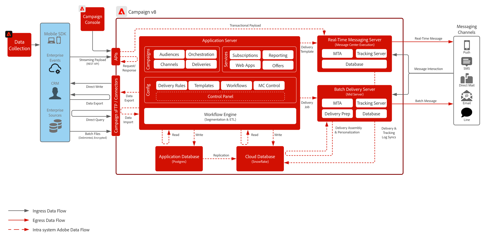

# 客户历程 Blueprint

现代营销团队需要同时支持反应参与（响应单个客户行为）和主动外联（启动引导受众进入转化漏斗的营销活动）的平台。 这些用例涵盖了电子邮件、短信、推送等渠道，并且越来越多地涵盖Web和应用程序内体验。

Adobe Journey Optimizer和Adobe Campaign v8都支持客户参与的两个基本模型：

- 客户触发的历程：基于个人行为和信号的事件驱动、实时编排。
- 品牌启动的促销活动：根据细分或业务逻辑将受众引入参与漏斗的策略性定时推送。

这两种解决方案都支持跨传统和数字渠道的出站通信。 此外，AJO还支持通过受众状态共享和决策服务与入站渠道（如Web和移动应用程序）集成，从而实现统一的跨渠道个性化。

这些工具之间的选择取决于体系结构考虑因素，如延迟容忍、通道要求、数据集成策略和可扩展性。

 

| Blueprint | 描述 | 架构 |
|---|---|:---:|
| **[Adobe Journey Optimizer](journey-optimizer/journey-optimizer-overview.md)** | 将事件驱动的1:1配置文件编排与跨多个渠道（如电子邮件、短信、Web、推送、应用程序内消息传送、桌面等）的基于受众的品牌通信整合在一起。 |  |
| **[Adobe [!DNL Campaign] v8](campaign-v8/campaign-v8-overview.md)** | 侧重于基于批次的多渠道营销活动管理，非常适合于电子邮件、短信和直邮等传统营销渠道。 |  |

 

## 已弃用的Blueprint

| Blueprint | 架构 |
|---|:---:|
| **[Adobe [!DNL Campaign] v7](campaign-v7/campaign-v7-overview.md)** |  |