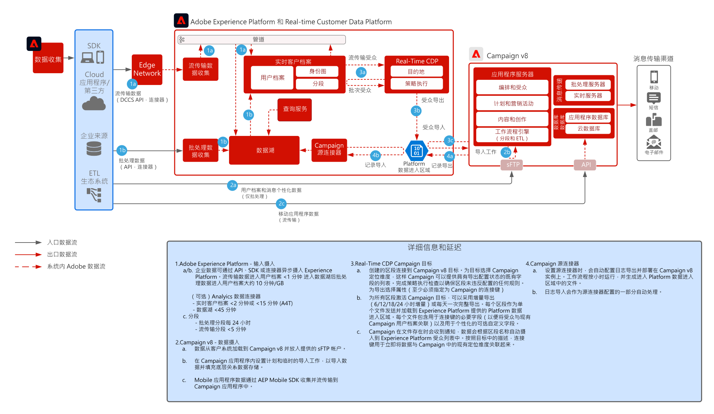

# Real-Time CDP与Adobe Campaign v8集成模式

显示如何将 Adobe Experience Platform 及其实时客户档案和集中化分段工具与 Adobe Campaign 结合使用来提供个性化对话。

 

## 应用程序

* Adobe Experience Platform Real-Time CDP
* Adobe Campaign v8

 

## 架构

 

## 先决条件

* 对于 Experience Cloud，必须为客户配置有效的 IMS 组织
* 建议在同一 IMS 组织中配置 Adobe Experience Platform 和 Campaign，以便只有一个登录 URL
* 必须为客户配置 V8 Campaign 实例
* 客户必须符合条件并有权访问 RTCDP、源、目标。
* 必须存在 Adobe Campaign 产品上下文

 

## 实施步骤

请参阅以下文档，了解如何配置到Adobe Experience Platform的Campaign v8源连接器和到Campaign v8的Real-time Customer Data Platform目标连接器。
[Campaign 和 AEP 连接器](https://experienceleague.adobe.com/docs/campaign/campaign-v8/connect/ac-aep.html?lang=zh-Hans)

## 护栏

### Adobe Campaign

* 请参阅 Campaign 源连接器文档 - [Campaign 源连接器](https://experienceleague.adobe.com/docs/experience-platform/sources/ui-tutorials/create/adobe-applications/campaign.html?lang=zh-Hans)
* 仅支持 Adobe Campaign 单个组织单位部署
* Adobe Campaign 是所有主要用户档案的真相来源，这意味着用户档案必须存在于 Adobe Campaign 中，而新用户档案不应基于 Experience Platform 区段创建。

### Experience PlatformReal-time Customer Data Platform区段共享

* 请参阅 RTCDP Campaign 目标连接器 - [RTCDP Campaign 连接](https://experienceleague.adobe.com/docs/experience-platform/destinations/catalog/email-marketing/adobe-campaign-managed-services.html?lang=zh-Hans)
* 建议 50 区段限额
* 请注意，对于批处理（每天 1 次）和流传输（约 5 分钟），AEP 中的区段成员身份实现都有延迟，且基于区段评估计划。
* 激活延迟为最少 3 小时
* 仅合并可用于激活的架构属性（不支持阵列/映射/体验事件）
* 建议每个区段不超过 20 个属性
* 所有具有“已实现”区段成员资格的配置文件的每个区段都有一个文件，或者如果将区段成员资格作为属性添加到文件中，则同时作为“已实现”和“已退出”配置文件
* 支持增量和完整的区段导出
* 不支持文件加密
* 请参阅 AEP 的用户档案和数据摄入护栏 - [链接](https://experienceleague.adobe.com/docs/experience-platform/profile/guardrails.html?lang=zh-Hans)
