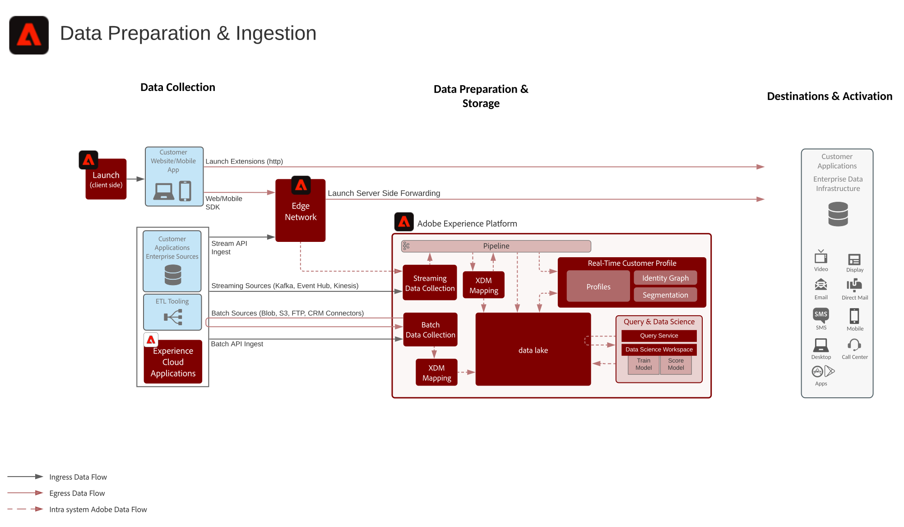

# 数据准备和摄入 Blueprint

数据准备和摄入 Blueprint 包含准备数据并将其摄入到 Adobe Experience Platform 的所有方法。

数据准备包括将源数据映射到体验数据模型(XDM)模式。 它还包括对数据执行转换，包括日期格式、字段拆分/串联/转化，以及对记录进行连接/合并/重新设置键。数据准备有助于统一客户数据以提供汇总/筛选的分析，包括报告或准备数据以用于客户用户档案汇编/数据科学/激活。

## 架构

## 数据摄入方法

| 摄入方法 | 描述 |
|------------------------------|-----------------------------------------------------------------------------------------------------------------------------------------------------------------------------------------------------------------------------------------------------------------------------------------------------------------------------------------------------------------------------------------------------------------------------------------|
| Web/Mobile SDK | 延迟：<ul><li>实时 — 到 Edge Network 的同一页面集合</li><li>流传输摄入到用户档案 ~ 1分钟</li><li>流传输摄入到数据湖（微批量~ 15 分钟）</ul>文档： <ul><li>[Web SDK](https://experienceleague.corp.adobe.com/docs/web-sdk.html)</li><li>[Mobile SDK](https://experienceleague.adobe.com/docs/mobile.html?lang=zh-Hans)</li></ul> |
| 流传输源 | 延迟：<ul><li>实时 — 到 Edge Network 的同一页面集合</li><li>流传输摄入到用户档案 ~ 1分钟</li><li>流传输摄入到数据湖（微批量~ 15 分钟）</li></ul>[文档](https://experienceleague.adobe.com/docs/experience-platform/sources/home.html?lang=zh-Hans#connectors) |
| 流传输 API | 延迟：<ul><li>实时 — 到 Edge Network 的同一页面集合</li><li>流传输摄入到用户档案 ~ 1分钟</li><li>流传输摄入到数据湖（微批量~ 15 分钟）</li><li>7 GB/小时</li></ul>[文档](https://experienceleague.adobe.com/docs/experience-platform/ingestion/streaming/overview.html?lang=zh-Hans#what-can-you-do-with-streaming-ingestion%3F) |
| ETL 工具 | 使用 ETL 工具在将企业数据摄入到 Experience Platform 之前对其进行修改和转换。  延迟：<ul><li>根据外部 ETL 工具的调度进行定时，然后根据摄入方法应用标准摄入护栏。</li></ul> |
| 批次源 | 计划从源获取 延迟：~ 200 GB/小时文档视频  [文档](https://experienceleague.adobe.com/docs/experience-platform/sources/home.html?lang=en#connectors) [视频教程](https://experienceleague.adobe.com/docs/platform-learn/tutorials/sources/overview.html?lang=zh-Hans) |
| 批处理 API | 延迟：<ul><li>根据大小和流量负载，批量摄入到用户档案需要约 45 分钟</li><li>根据大小和流量负载，批量摄入到数据湖</li></ul>[文档](https://experienceleague.adobe.com/docs/experience-platform/ingestion/batch/overview.html?lang=zh-Hans#batch) |
| Adobe 应用程序连接器 | 自动摄入来自 Adobe Experience Cloud 应用程序的数据<ul><li>Adobe Analytics：[文档](https://experienceleague.adobe.com/docs/experience-platform/sources/connectors/adobe-applications/analytics.html?lang=zh-Hans#connectors)和[视频教程](https://experienceleague.adobe.com/docs/platform-learn/tutorials/sources/ingest-data-from-adobe-analytics.html?lang=zh-Hans)</li><li>Audience Manager：[文档](https://experienceleague.adobe.com/docs/experience-platform/sources/connectors/adobe-applications/audience-manager.html?lang=zh-Hans#connectors)和[视频教程](https://experienceleague.adobe.com/docs/platform-learn/tutorials/sources/ingest-data-from-aam.html?lang=zh-Hans)</li></ul> |

## 数据准备方法

| 数据准备方法 | 描述 |
|------------------------------------------------------------|------------------------------------------------------------------------------------------------------------------------------------------------------------------------------------------------------------------------------------------------------------------------------------------------|
| [!UICONTROL 数据科学工作区]  — 数据准备 | 模型驱动的转换，脚本转换。 [文档](https://experienceleague.adobe.com/docs/experience-platform/data-science-workspace/home.html?lang=zh-Hans) |
| 外部ETL工具（[!DNL Snaplogic]、[!DNL Mulesoft]、[!DNL Informatica]等） | 在ETL工具中执行复杂的转换，并使用标准Experience Platform[!UICONTROL 流服务] API或源连接器收集生成数据。 |
| [!UICONTROL 查询服务]  — 数据准备 | 将数据联接、拆分、合并、转换、查询和筛选到新数据集。 使用创建表作为选择(CTAS) [文档](https://experienceleague.adobe.com/docs/experience-platform/query/home.html?lang=zh-Hans#sql) |
| XDM映射器和数据准备功能（流和批处理） | 在Experience Platform获取过程中，将CSV或JSON格式的源属性映射到XDM属性。 在摄入数据时计算有关数据的函数；即数据格式化、拆分、串联等。 [文档](https://experienceleague.adobe.com/docs/experience-platform/data-prep/home.html?lang=zh-Hans) |

## 相关博客帖子

* [[!DNL Leveraging External Data Platforms in Adobe Experience Platform Journey Orchestration]](https://medium.com/adobetech/leveraging-external-data-platforms-in-adobe-experience-platform-journey-orchestration-54fc6134fe17?source=your_stories_page-------------------------------------)
* [[!DNL High Throughput Ingestion with Iceberg]](https://medium.com/adobetech/high-throughput-ingestion-with-iceberg-ccf7877a413f?source=your_stories_page-------------------------------------)
* [[!DNL Query Service Tricks in Adobe Experience Platform (Writing Queries and Storing Derived Datasets)]](https://medium.com/adobetech/query-service-tricks-in-adobe-experience-platform-writing-queries-and-storing-derived-datasets-eaee0d6d683e?source=your_stories_page-------------------------------------)
* [[!DNL Digging into Adobe Experience Platform’s Experience Data Model to More Fully Understand the Power of Real-time Customer Profile]](https://medium.com/adobetech/digging-into-adobe-experience-platforms-experience-data-model-to-more-fully-understand-the-power-3e109271e04f?source=your_stories_page-------------------------------------)
* [[!DNL An Introductory Look at Exploratory Data Analysis on Adobe Experience Platform]](https://medium.com/adobetech/an-introductory-look-at-exploratory-data-analysis-on-adobe-experience-platform-1bfce7501d9a?source=your_stories_page-------------------------------------)
* [[!DNL Modeling XDM Data for Data Science at Scale on Adobe Experience Platform]](https://medium.com/adobetech/modeling-xdm-data-for-data-science-at-scale-on-adobe-experience-platform-222bb2a6dbf7?source=your_stories_page-------------------------------------)
