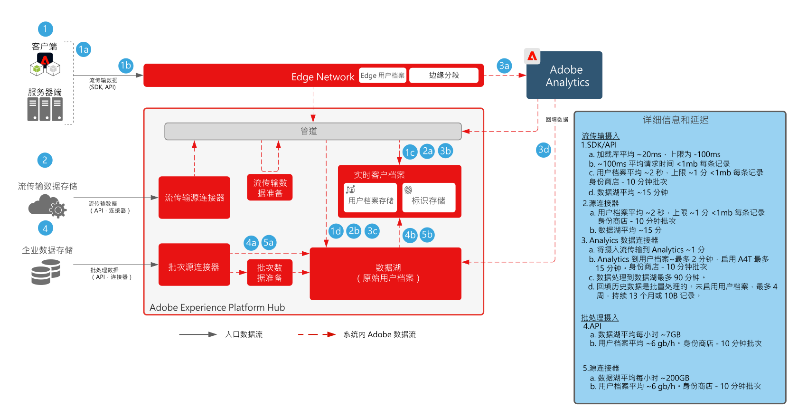

# 数据准备和引入Blueprint

数据准备和引入Blueprint包含可用于准备数据并将其引入Adobe[!DNL Experience Platform]的所有方法。

数据准备包括将源数据映射到体验数据模型 (XDM) 架构。它还包括对数据执行转换，包括日期格式、字段拆分/串联/转化，以及对记录进行连接/合并/重新设置键。数据准备有助于统一客户数据以提供汇总/筛选的分析，包括报告或准备数据以用于客户档案汇编/数据科学/激活。

## 架构

## 数据摄入护栏

下图说明了将数据摄取到Adobe[!DNL Experience Platform]中的平均性能护栏和延迟。

## 数据摄入方法

<table cellspacing="0" class="Table" style="border-collapse:collapse; width:1123px">
<tbody>
<tr>
<td colspan="4" style="background-color:#308fff; border-bottom:4px solid white; border-left:1px solid white; border-right:1px solid white; border-top:1px solid white; height:31px; vertical-align:top; width:1123px">

<strong>流传输源</strong>

</td>
</tr>
<tr>
<td style="background-color:#969696; border-bottom:1px solid white; border-left:1px solid white; border-right:1px solid white; border-top:none; height:20px; vertical-align:top; width:222px">

方法

</td>
<td style="background-color:#969696; border-bottom:1px solid white; border-left:none; border-right:1px solid white; border-top:none; height:20px; vertical-align:top; width:401px">

常见用例

</td>
<td style="background-color:#969696; border-bottom:1px solid white; border-left:none; border-right:1px solid white; border-top:none; height:20px; vertical-align:top; width:218px">

协议

</td>
<td style="background-color:#969696; border-bottom:1px solid white; border-left:none; border-right:1px solid white; border-top:none; height:20px; vertical-align:top; width:282px">

注意事项

</td>
</tr>
<tr>
<td style="background-color:#e8eeff; border-bottom:1px solid white; border-left:1px solid white; border-right:1px solid white; border-top:none; height:39px; vertical-align:top; width:222px">

<a href="https://experienceleague.adobe.com/docs/experience-platform/edge/home.html?lang=zh-Hans" style="color:#0563c1; text-decoration:underline">Adobe Web/Mobile SDK</a>

</td>
<td style="background-color:#e8eeff; border-bottom:1px solid white; border-left:none; border-right:1px solid white; border-top:none; height:39px; vertical-align:top; width:401px">
<ul style="list-style-type:square">
<li>从网站和移动设备应用程序中收集数据。</li>
<li>客户端收集的首选方法。</li>
</ul>
</td>
<td style="background-color:#e8eeff; border-bottom:1px solid white; border-left:none; border-right:1px solid white; border-top:none; height:39px; vertical-align:top; width:218px">

推送、HTTP、JSON

</td>
<td style="background-color:#e8eeff; border-bottom:1px solid white; border-left:none; border-right:1px solid white; border-top:none; height:39px; vertical-align:top; width:282px">
<ul>
<li>利用单 SDK 实施多个 Adobe 应用程序。</li>
</ul>
</td>
</tr>
<tr>
<td style="background-color:#cddbff; border-bottom:1px solid white; border-left:1px solid white; border-right:1px solid white; border-top:none; height:39px; vertical-align:top; width:222px">

<a href="https://experienceleague.adobe.com/docs/experience-platform/sources/ui-tutorials/create/streaming/http.html?lang=zh-Hans" style="color:#0563c1; text-decoration:underline">HTTP API 连接器</a>

</td>
<td style="background-color:#cddbff; border-bottom:1px solid white; border-left:none; border-right:1px solid white; border-top:none; height:39px; vertical-align:top; width:401px">
<ul style="list-style-type:square">
<li>从流传输源、交易、相关客户事件和信号收集</li>
</ul>
</td>
<td style="background-color:#cddbff; border-bottom:1px solid white; border-left:none; border-right:1px solid white; border-top:none; height:39px; vertical-align:top; width:218px">

推送、REST API、JSON

</td>
<td style="background-color:#cddbff; border-bottom:1px solid white; border-left:none; border-right:1px solid white; border-top:none; height:39px; vertical-align:top; width:282px">
<ul>
<li>数据会直接流式传输到中心，因此无需实时边缘分段或事件转发。</li>
</ul>
</td>
</tr>
<tr>
<td style="background-color:#e8eeff; border-bottom:1px solid white; border-left:1px solid white; border-right:1px solid white; border-top:none; height:39px; vertical-align:top; width:222px">

<a href="https://experienceleague.adobe.com/docs/experience-platform/edge-network-server-api/data-collection/interactive-data-collection.html?lang=zh-Hans" style="color:#0563c1; text-decoration:underline">[!DNL Edge Network] API</a>

</td>
<td style="background-color:#e8eeff; border-bottom:1px solid white; border-left:none; border-right:1px solid white; border-top:none; height:39px; vertical-align:top; width:401px">
<ul style="list-style-type:square">
<li>从流源、交易、相关客户事件和来自全球分发的信号的收集 [!DNL Edge Network]</li>
</ul>
</td>
<td style="background-color:#e8eeff; border-bottom:1px solid white; border-left:none; border-right:1px solid white; border-top:none; height:39px; vertical-align:top; width:218px">

推送、REST API、JSON

</td>
<td style="background-color:#e8eeff; border-bottom:1px solid white; border-left:none; border-right:1px solid white; border-top:none; height:39px; vertical-align:top; width:282px">
<ul>
<li>数据通过[!DNL Edge Network]流式传输。 支持边缘实时分段。 </li>
</ul>
</td>
</tr>
<tr>
<td style="background-color:#cddbff; border-bottom:1px solid white; border-left:1px solid white; border-right:1px solid white; border-top:none; height:39px; vertical-align:top; width:222px">

<a href="https://experienceleague.adobe.com/docs/experience-platform/sources/connectors/adobe-applications/analytics.html?lang=zh-Hans" style="color:#0563c1; text-decoration:underline">Adobe 应用程序</a>

</td>
<td style="background-color:#cddbff; border-bottom:1px solid white; border-left:none; border-right:1px solid white; border-top:none; height:39px; vertical-align:top; width:401px">
<ul style="list-style-type:square">
<li>在实施 Adobe Analytics、Marketo、Campaign、Target、AAM 之前</li>
</ul>
</td>
<td style="background-color:#cddbff; border-bottom:1px solid white; border-left:none; border-right:1px solid white; border-top:none; height:39px; vertical-align:top; width:218px">

推送、源连接器和 API

</td>
<td style="background-color:#cddbff; border-bottom:1px solid white; border-left:none; border-right:1px solid white; border-top:none; height:39px; vertical-align:top; width:282px">
<ul>
<li>推荐的方法是从传统的应用程序 SDK 迁移到 Web/Mobile SDK。</li>
</ul>
</td>
</tr>
<tr>
<td style="background-color:#e8eeff; border-bottom:1px solid white; border-left:1px solid white; border-right:1px solid white; border-top:none; height:39px; vertical-align:top; width:222px">

<a href="https://experienceleague.adobe.com/docs/experience-platform/ingestion/streaming/overview.html?lang=zh-Hans" style="color:#0563c1; text-decoration:underline">流传输源连接器</a>

</td>
<td style="background-color:#e8eeff; border-bottom:1px solid white; border-left:none; border-right:1px solid white; border-top:none; height:39px; vertical-align:top; width:401px">
<ul style="list-style-type:square">
<li>企业事件流的摄入，通常用于将企业数据共享到多个下游应用程序。 </li>
</ul>
</td>
<td style="background-color:#e8eeff; border-bottom:1px solid white; border-left:none; border-right:1px solid white; border-top:none; height:39px; vertical-align:top; width:218px">

推送、REST API、JSON

</td>
<td style="background-color:#e8eeff; border-bottom:1px solid white; border-left:none; border-right:1px solid white; border-top:none; height:39px; vertical-align:top; width:282px">
<ul>
<li>必须以 XDM 格式进行流传输。</li>
</ul>
</td>
</tr>
<tr>
<td style="background-color:#cddbff; border-bottom:1px solid white; border-left:1px solid white; border-right:1px solid white; border-top:none; height:39px; vertical-align:top; width:222px">

流传输源 SDK

</td>
<td style="background-color:#cddbff; border-bottom:1px solid white; border-left:none; border-right:1px solid white; border-top:none; height:39px; vertical-align:top; width:401px">
<ul style="list-style-type:square">
<li>与 HTTP API 连接器类似，支持外部数据流的自助配置信息卡。</li>
</ul>
</td>
<td style="background-color:#cddbff; border-bottom:1px solid white; border-left:none; border-right:1px solid white; border-top:none; height:39px; vertical-align:top; width:218px">

推送、HTTP API、JSON

</td>
<td style="background-color:#cddbff; border-bottom:1px solid white; border-left:none; border-right:1px solid white; border-top:none; height:39px; vertical-align:top; width:282px">
<ul>
<li>[!DNL Edge Network]</li>
</ul>
</td>
</tr>
</tbody>
</table>

<table cellspacing="0" class="Table" style="border-collapse:collapse; width:1105px">
<tbody>
<tr>
<td colspan="4" style="background-color:#308fff; border-bottom:4px solid white; border-left:1px solid white; border-right:1px solid white; border-top:1px solid white; height:37px; vertical-align:top; width:1105px">

<strong>批次源</strong>

</td>
</tr>
<tr>
<td style="background-color:#969696; border-bottom:1px solid white; border-left:1px solid white; border-right:1px solid white; border-top:none; height:34px; vertical-align:top; width:217px">

方法

</td>
<td style="background-color:#969696; border-bottom:1px solid white; border-left:none; border-right:1px solid white; border-top:none; height:34px; vertical-align:top; width:397px">

常见用例

</td>
<td style="background-color:#969696; border-bottom:1px solid white; border-left:none; border-right:1px solid white; border-top:none; height:34px; vertical-align:top; width:215px">

协议

</td>
<td style="background-color:#969696; border-bottom:1px solid white; border-left:none; border-right:1px solid white; border-top:none; height:34px; vertical-align:top; width:277px">

注意事项

</td>
</tr>
<tr>
<td style="background-color:#e8eeff; border-bottom:1px solid white; border-left:1px solid white; border-right:1px solid white; border-top:none; height:62px; vertical-align:top; width:217px">

<a href="https://experienceleague.adobe.com/docs/experience-platform/ingestion/batch/getting-started.html?lang=zh-Hans" style="color:#0563c1; text-decoration:underline">批次摄入 API</a>

</td>
<td style="background-color:#e8eeff; border-bottom:1px solid white; border-left:none; border-right:1px solid white; border-top:none; height:62px; vertical-align:top; width:397px">
<ul style="list-style-type:square">
<li>从企业管理的队列摄入。在摄入之前对数据进行清理和转换。</li>
</ul>
</td>
<td style="background-color:#e8eeff; border-bottom:1px solid white; border-left:none; border-right:1px solid white; border-top:none; height:62px; vertical-align:top; width:215px">

推送、JSON 或拼接

</td>
<td style="background-color:#e8eeff; border-bottom:1px solid white; border-left:none; border-right:1px solid white; border-top:none; height:62px; vertical-align:top; width:277px">
<ul>
<li>必须管理摄入的批次和文件</li>
</ul>
</td>
</tr>
<tr>
<td style="background-color:#cddbff; border-bottom:1px solid white; border-left:1px solid white; border-right:1px solid white; border-top:none; height:62px; vertical-align:top; width:217px">

<a href="https://experienceleague.adobe.com/docs/experience-platform/sources/connectors/cloud-storage/blob-s3.html?lang=zh-Hans" style="color:#0563c1; text-decoration:underline">批次源连接器</a>

</td>
<td style="background-color:#cddbff; border-bottom:1px solid white; border-left:none; border-right:1px solid white; border-top:none; height:62px; vertical-align:top; width:397px">
<ul style="list-style-type:square">
<li>从云存储位置摄入文件的常见方法。</li>
<li>常见 CRM 和营销应用程序的连接器。</li>
<li>非常适合摄入大量历史数据。</li>
</ul>
</td>
<td style="background-color:#cddbff; border-bottom:1px solid white; border-left:none; border-right:1px solid white; border-top:none; height:62px; vertical-align:top; width:215px">

提取、CSV、JSON、拼接

</td>
<td style="background-color:#cddbff; border-bottom:1px solid white; border-left:none; border-right:1px solid white; border-top:none; height:62px; vertical-align:top; width:277px">
<ul>
<li>不始终开启，即时摄入。 </li>
</ul>
</td>
</tr>
<tr>
<td style="background-color:#e8eeff; border-bottom:1px solid white; border-left:1px solid white; border-right:1px solid white; border-top:none; height:62px; vertical-align:top; width:217px">

<a href="https://experienceleague.adobe.com/docs/experience-platform/sources/connectors/cloud-storage/data-landing-zone.html?lang=zh-Hans" style="color:#0563c1; text-decoration:underline">数据进入区域</a>

</td>
<td style="background-color:#e8eeff; border-bottom:1px solid white; border-left:none; border-right:1px solid white; border-top:none; height:62px; vertical-align:top; width:397px">
<ul style="list-style-type:square">
<li>Adobe 配置的文件存储位置，以推送文件用于摄入。</li>
</ul>
</td>
<td style="background-color:#e8eeff; border-bottom:1px solid white; border-left:none; border-right:1px solid white; border-top:none; height:62px; vertical-align:top; width:215px">

推送、CSV、JSON、拼接

</td>
<td style="background-color:#e8eeff; border-bottom:1px solid white; border-left:none; border-right:1px solid white; border-top:none; height:62px; vertical-align:top; width:277px">
</td>
</tr>
<tr>
<td style="background-color:#cddbff; border-bottom:1px solid white; border-left:1px solid white; border-right:1px solid white; border-top:none; height:62px; vertical-align:top; width:217px">

<a href="https://experienceleague.adobe.com/docs/experience-platform/sources/sdk/overview.html?lang=zh-Hans" style="color:#0563c1; text-decoration:underline">批次源 SDK</a>

</td>
<td style="background-color:#cddbff; border-bottom:1px solid white; border-left:none; border-right:1px solid white; border-top:none; height:62px; vertical-align:top; width:397px">
<ul style="list-style-type:square">
<li>支持外部数据源的自助配置信息卡。</li>
<li>非常适合合作伙伴连接器，或为设置企业连接器而量身定制的工作流体验。</li>
</ul>
</td>
<td style="background-color:#cddbff; border-bottom:1px solid white; border-left:none; border-right:1px solid white; border-top:none; height:62px; vertical-align:top; width:215px">

提取、REST API、CSV 或 JSON 文件

</td>
<td style="background-color:#cddbff; border-bottom:1px solid white; border-left:none; border-right:1px solid white; border-top:none; height:62px; vertical-align:top; width:277px">
<ul>
<li>示例：MailChimp、One Trust、Zendesk</li>
</ul>

 

</td>
</tr>
</tbody>
</table>