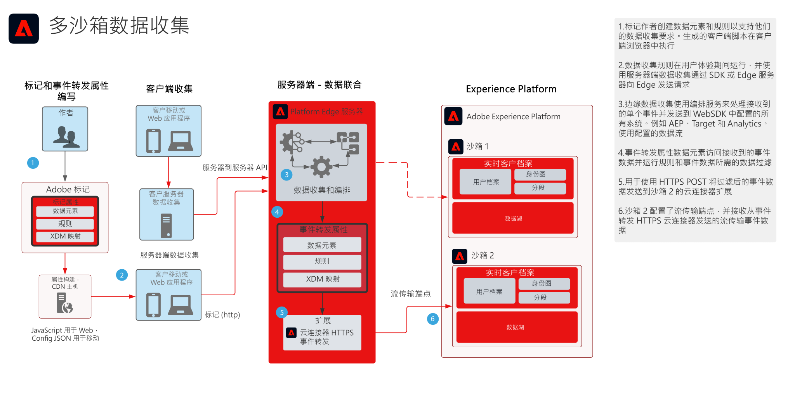

# 多沙盒事件转发数据收集Blueprint

多沙盒事件转发数据收集Blueprint显示如何配置通过Adobe Experience Platform Web和Mobile SDK收集的数据，以收集单个事件并转发到多个AEP沙箱。 此Blueprint是一个使用“Adobe标记”的事件转发功能的特定用例。

除了使用事件转发功能复制事件之外，您还可以添加、过滤或处理原始收集的数据，以满足其他沙箱的要求。 例如，沙盒A需要接收所有事件数据元素，而沙盒B只应接收非PII数据。

事件转发使用单独的标记属性，该属性包含满足您的数据要求所必需的数据元素、规则和扩展。 对于传入的事件，您的事件转发属性可以在转发之前收集数据并根据需要进行管理。

您的目标sadnbox需要配置HTTP流端点，以供事件转发HTTPS扩展使用。

## 用例

* 全局数据报告 — 使用多个沙箱来隔离操作环境，以及需要将数据收集整合到一个沙箱中以用于跨沙盒报告。 事件转发到报表沙盒允许每个沙盒操作环境在收集数据时将数据实时发送到报表沙盒
* 根据每个沙盒操作环境的不同数据规则，跨沙盒管理数据收集。 需要过滤敏感数据（如医疗保健和金融服务）的此类操作环境

## 应用程序

* Adobe Experience Platform 收藏集

## 架构

1. 标记作者既定义了标记属性，又定义了事件转发属性。 在此，作者将定义用于管理数据收集的数据元素、规则和操作。 请记住，标记属性代码在客户端上运行，并由CDN主机分发。 事件转发属性代码在Adobe Edge服务器上运行。

1. 在客户端上收集的数据会发送到边缘服务器。 客户还可以选择首先将数据作为服务器端收集的一种方法发送到自己的服务器。
WebSDK可以提供服务器到服务器的收集功能。 但是，这确实需要不同的编程模型来实施。 请参阅此文档 **边缘网络服务器API概述** 下面

1. Platform Edge Server接收数据收集负载并协调数据流到所需的系统，如Target和Analytics。

1. 事件转发属性数据元素用于访问到达有效负载的事件数据。 在转发之前，还可以根据需要使用规则来处理事件数据。 例如，将数据格式化为流式数据摄取所需的XDM

1. 事件转发提供了HTTPS扩展，该扩展允许将事件数据转发到HTTPS端点。

1. 沙盒2配置了接收转发事件的流端点。

## 相关文档

* [事件转发文档](https://experienceleague.adobe.com/docs/experience-platform/tags/event-forwarding/overview.html?lang=zh-Hans)
* [事件转发视频](https://experienceleague.adobe.com/docs/launch-learn/tutorials/server-side/overview.html?lang=zh-Hans)
* Web SDK 教程的[事件转发课程](https://experienceleague.adobe.com/docs/platform-learn/implement-web-sdk/event-forwarding/setup-event-forwarding.html?lang=zh-Hans)
* [Experience PlatformWebSDK概述](https://experienceleague.adobe.com/docs/experience-platform/edge/home.html?lang=zh-Hans)
* [边缘网络服务器API概述](https://experienceleague.adobe.com/docs/experience-platform/edge-network-server-api/overview.html?lang=zh-Hans)

## 相关博客帖子

* [[!DNL Boosting Website Performance with Adobe Experience Platform Web SDK and Edge Network]](https://medium.com/adobetech/boosting-website-performance-with-adobe-experience-platform-web-sdk-and-edge-network-329fcf70fdf9)
* [[!DNL Solving Implementation Pain Points with Adobe Experience Platform Web SDK and Edge Network]](https://medium.com/adobetech/solving-implementation-pain-points-with-adobe-experience-platform-web-sdk-and-edge-network-880b635e6819)
* [[!DNL Adobe Experience Platform Web SDK for Audience Management]](https://medium.com/adobetech/adobe-experience-platform-web-sdk-for-audience-management-751fa6d063bc)
* [[!DNL Adobe Experience Platform Web SDK — Adobe Target]](https://medium.com/adobetech/adobe-experience-platform-web-sdk-adobe-target-9b9f621d271)
* [[!DNL Adobe Experience Platform Web SDK Migration Scenarios for Adobe Analytics]](https://medium.com/adobetech/adobe-experience-platform-web-sdk-migration-scenarios-for-adobe-analytics-91c255ec82b0)
* [[!DNL Unify Your Adobe Experience Platform Services with Adobe Experience Platform Web SDK]](https://medium.com/adobetech/unify-your-adobe-experience-platform-services-with-adobe-experience-platform-web-sdk-75cf6851a9fc)
* [[!DNL Accelerate Your Mobile Application Development with Adobe Experience Platform Mobile SDK and Launch]](https://medium.com/adobetech/accelerate-your-mobile-application-development-with-adobe-experience-platform-mobile-sdk-and-launch-ed023536d611)
* [[!DNL Simplifying Customer Workflows with Adobe Experience Platform Web SDK]](https://medium.com/adobetech/simplifying-customer-workflows-with-adobe-experience-platform-web-sdk-4e54fe134f4a)
