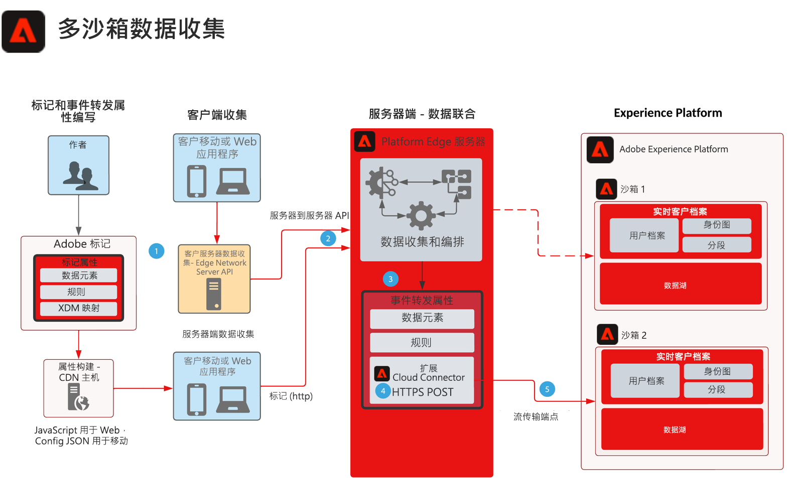

# 多沙盒事件转发数据收集 Blueprint

此Blueprint显示如何将使用Experience PlatformWeb和移动SDK收集的数据配置为收集单个事件并转发到多个AEP沙盒。 此Blueprint是用于多沙盒数据收集的特定用例，使用事件转发来实现此目标。

除了使用事件转发功能复制事件之外，您还可以添加、筛选或处理收集的原始数据，这些数据符合其他沙盒的要求。

事件转发使用单独的属性，该属性包含数据要求所必需的数据元素、规则和扩展。 对于传入事件，您的事件转发属性可以收集数据并在转发之前根据需要进行管理。

您的目标沙盒需要配置由Adobe云连接器扩展使用的HTTP流端点。

## 用例

* 全局数据报告 - 使用多个沙箱来隔离操作环境，以及需要将数据收集整合到一个沙箱中时，用于跨沙盒报告。通过事件转发将Experience Edge事件路由到报告沙盒，可让每个沙盒操作环境将数据实时收集到时发送到报告沙盒
* 根据每个沙盒操作环境的不同数据规则，跨沙盒管理数据收集。

## 应用程序

* Adobe Experience Platform 数据收集
* 事件转发
* AEP扩展
* 云连接器扩展

## 注意事项

使用事件转发将数据发送到多个沙盒的方法，在解决方案架构中必须考虑一些注意事项。

### 无HIPAA数据

事件转发不被认为是HIPAA就绪，不应在收集HIPAA数据的任何HIPAA用例中使用。 但是，用于事件转发的基础架构被视为HIPAA就绪，完全由客户自行决定。 当事件转发标记属性驻留在事件转发系统中时，收集的整个数据有效负载都会发送到事件转发系统以供处理。 正是这个过程使事件转发涉及HIPAA用例。 在将整个有效负载发送到事件转发系统后，这将包括任何HIPAA值。 即使事件转发规则会在将该数据发送到其目标之前对其进行过滤，该HIPAA数据仍会发送到不符合HIPAA要求的基础架构。 但是，有效负载数据永远不会存储，只是传递数据。

### 不同的数据流和流端点

当数据流从Platform Edge Network流经数据流时，使用事件转发到另一个AEP沙盒时，一个HARD要求是“绝不”使用与生成原始收集的数据流相同的数据流或流端点。 这可能会对AEP实例造成不利影响，并可能触发DoS情况。

### 预计的流量

每个用例都需要查看流量。 这一点很重要，因为高流量可能会导致限制情况，如果发生这种情况，客户将收到通知。

## 架构

1. 要使用“事件转发”，需要收集事件数据并将其发送到Platform Edge Network。 客户可以使用Adobe标记进行客户端收集，也可以使用Platform Edge Network Server API进行服务器到服务器数据收集。 Platform Edge Network API可提供服务器到服务器的收集功能。 但是，这确实需要不同的编程模型来实施。请参阅 [Edge Network服务器API概述](https://experienceleague.adobe.com/docs/experience-platform/edge-network-server-api/overview.html?lang=en)

1. 收集的有效负载从标记实施发送到Platform Edge Network到事件转发服务，由其自己的数据元素、规则和操作进行处理。 您可以详细了解以下各项的差异： [标记和事件转发](https://experienceleague.adobe.com/docs/experience-platform/tags/event-forwarding/overview.html?lang=en#differences-from-tags).

1. 从Platform Edge Network接收收集的事件数据还需要事件转发属性。 事件数据是由部署的标记实施还是服务器到服务器收集发送到Platform Edge Network。 作者定义在转发到第二个沙盒之前用于扩充事件数据的数据元素、规则和操作。 考虑使用自定义代码JavaScript数据元素，以帮助构建用于沙盒摄取的数据。 与AEP数据准备功能结合使用时，您有多个选项可用于管理数据结构。

1. 目前，需要在Adobe转发属性中使用Event Cloud Connector扩展。 在Rules处理或扩充事件数据后，可在为将有效负载发送到第二个沙盒的POST配置的获取调用中使用Cloud Connector

1. 第二个沙盒需要数据摄取的流端点。 您还可以考虑AEP中的数据准备功能，以帮助摄取和映射事件转发有效负载到XDM。 请参阅AEP文档创建 [使用UI的HTTP API流连接](https://experienceleague.adobe.com/docs/experience-platform/sources/ui-tutorials/create/streaming/http.html?lang=zh-Hans)
