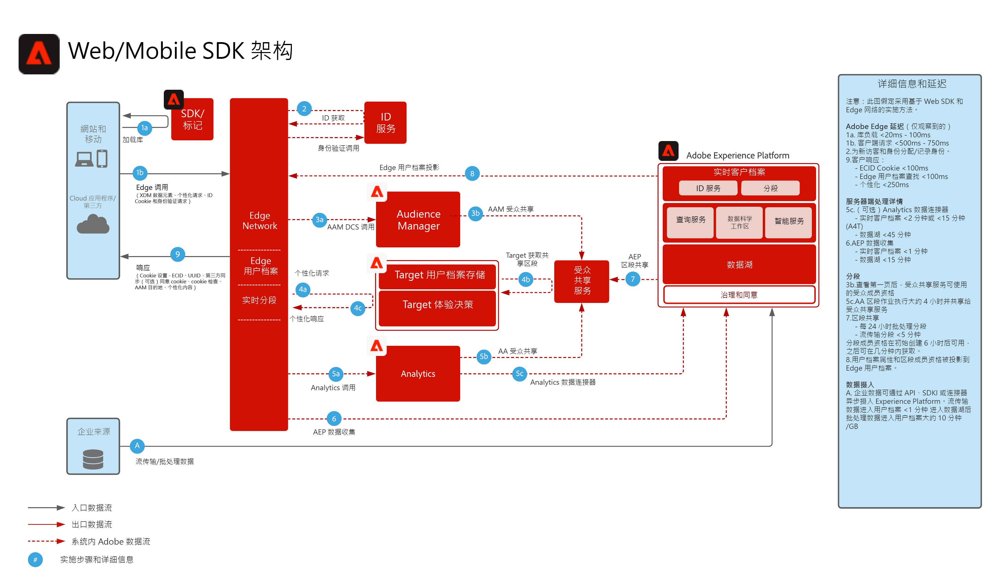

# Experience Platform Web/Mobile SDK 数据收集

以下架构图说明了利用 Experience Platform Web SDK 的集成路径和数据收集。

## 参考文档

* [Experience Platform Web/Mobile SDK 概述](https://experienceleague.adobe.com/docs/experience-platform/edge/home.html?lang=zh-Hans)
* [使用Web SDK实施Adobe Experience Cloud教程](https://experienceleague.adobe.com/docs/blueprints-learn/architecture/data-ingestion/websdk.html)
