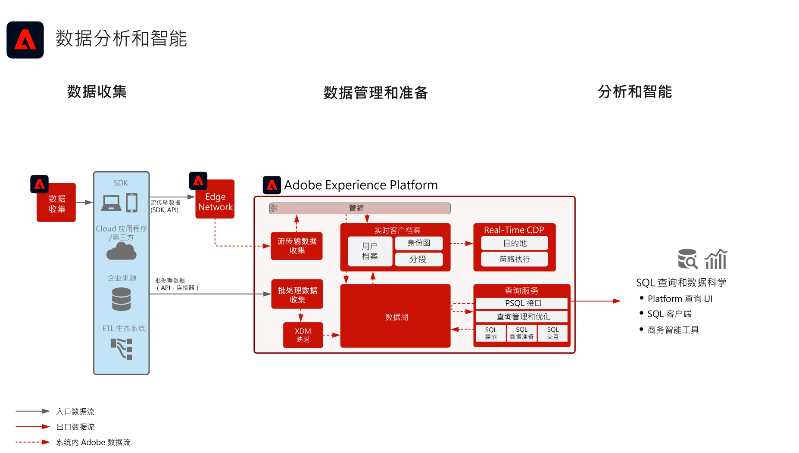

# 数据分析和智能Blueprint

数据分析和智能包括在[!DNL Experience Platform]内对存在于数据湖中的数据执行探索性查询和分析的能力。

[!DNL Experience Platform]的[!UICONTROL 查询服务]允许对数据执行SQL查询。

[!DNL Experience Platform]允许与第三方SQL客户端、接口和Business Intelligence (BI)工具的连接使用[!DNL Experience Platform]协议直接连接到、访问和查询[!DNL PostgreSQL]中的数据。

## 用例

* 交互式查询和数据聚合
* 对所摄入数据的行和列访问，以便进行探索和验证
* 通过 Business Intelligence 工具实现数据仪表板化和可视化

[查询服务用例](https://experienceleague.adobe.com/docs/experience-platform/query/use-cases/abandoned-browse.html?lang=zh-Hans)这里概述了查询服务的其他常见用例

## 应用程序

* Adobe [!DNL Experience Platform]

## 架构

## 护栏

有关最佳实践和护栏的详细信息，请参阅查询服务产品文档。
[查询服务指南](https://experienceleague.adobe.com/docs/experience-platform/query/guardrails.html?lang=zh-Hans)

## 相关文档

* [Adobe [!DNL Experience Platform] Intelligence产品说明](https://helpx.adobe.com/cn/legal/product-descriptions/adobe-experience-platform-intelligence---product-description.html)
* [[!UICONTROL 查询服务]文档](https://experienceleague.adobe.com/docs/experience-platform/query/home.html?lang=zh-Hans)
