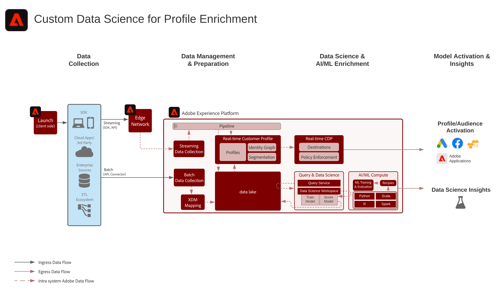

# 用户档案扩充蓝图的自定义数据科学

针对用户档案扩充的自定义数据科学Blueprint说明了如何在[!UICONTROL 数据科学工作区]中使用Adobe Experience Platform中的数据来培训、部署和得分模型以提供机器学习洞察。 这些模型可以直接输出到启用[!UICONTROL 实时客户用户档案]的数据集，以进一步丰富客户用户档案。 然后，可以对这些洞察进行个性化配置。 机器学习洞察的示例包括终身价值评分、产品和类别关联、转化倾向或客户流失倾向。

## 用例

* 从Experience Platform中的客户数据中提取洞察并发现模式。 根据这些数据对模型进行培训和评分。
* 利用模型驱动的洞察和属性丰富[!UICONTROL 实时客户用户档案]，以实现更精细的个性化和优化旅程。
* 培训和评分模型以确定客户洞察，如客户终身价值、转化或参与倾向、产品和内容关联，以及互动分数。

## 架构

## 实施步骤

1. 创建模式和数据集。
1. 将数据引入Experience Platform。
1. 创建DSW笔记本。
1. 选择语言。 支持Python和PySpark。
1. 在笔记本中创作模型。
1. 训练模型。
1. 对模型进行评分，以使用目标数据生成预测。
1. 如果将模型结果推送到[!UICONTROL 实时客户用户档案]，则启用模型结果数据集以进行用户档案。

## 相关文档

* [Adobe Experience Platform Intelligence产品说明](https://helpx.adobe.com/legal/product-descriptions/adobe-experience-platform-intelligence---product-description.html)
* [[!UICONTROL 数据科学工作] 空间文档](https://experienceleague.adobe.com/docs/experience-platform/data-science-workspace/home.html?lang=en)
* [[!UICONTROL 数据科学工作] 空间教程](https://experienceleague.adobe.com/docs/platform-learn/tutorials/data-science-workspace/understanding-data-science-workspace.html)

## 相关博客帖子

* [[!DNL Simplifying the Data Science Lifecycle with Adobe Platform Experience]](https://medium.com/adobetech/simplifying-the-data-science-lifecycle-with-adobe-platform-experience-8ea4f056d82f)
* [[!DNL Content and Commerce AI: Personalizing Your Interactions with Customers Through Content Intelligence]](https://medium.com/adobetech/content-and-commerce-ai-personalizing-your-interactions-with-customers-through-content-intelligence-dc182601deab)
* [[!DNL Gaining a Deeper Understanding of Churn Using Data Science Workspace]](https://medium.com/adobetech/gaining-a-deeper-understanding-of-churn-using-data-science-workspace-18a2190e0cf3)
* [[!DNL Understanding Data Science In Adobe Experience Platform]](https://medium.com/adobetech/understanding-data-science-in-adobe-experience-platform-5bce5a17b42)
* [[!DNL An Introductory Look at Exploratory Data Analysis on Adobe Experience Platform]](https://medium.com/adobetech/an-introductory-look-at-exploratory-data-analysis-on-adobe-experience-platform-1bfce7501d9a)
* [[!DNL Cutting Across Adobe Experience Products with Machine Learning to Elevated User Experience]](https://medium.com/adobetech/cutting-across-adobe-experience-products-with-machine-learning-to-elevated-user-experience-7c85000510d1)
* [[!DNL Modeling XDM Data for Data Science at Scale on Adobe Experience Platform]](https://medium.com/adobetech/modeling-xdm-data-for-data-science-at-scale-on-adobe-experience-platform-222bb2a6dbf7)
* [[!DNL Segmentation.AI: Automated Audience-Clustering-as-a-Service in Adobe Experience Platform]](https://medium.com/adobetech/segmentation-ai-automated-audience-clustering-as-a-service-in-adobe-experience-platform-261f4099462c)
* [[!DNL Reimagining Jupyter Notebooks for Enterprise Scale]](https://medium.com/adobetech/reimagining-jupyter-notebooks-for-enterprise-scale-8bc6340d504a)
* [[!DNL Accelerate Intelligent Insights with Adobe Experience Platform Data Science Workspace]](https://medium.com/adobetech/accelerate-intelligent-insights-with-adobe-experience-platform-data-science-workspace-89538bacbbea)
* [[!DNL A Preview of Time Series Forecasting with Adobe Experience Platform]](https://medium.com/adobetech/preview-of-time-series-forecasting-with-adobe-experience-platform-38a2fc778e89)
* [[!DNL Cutting Across Adobe Experience Products with Machine Learning to Elevated User Experience]](https://medium.com/adobetech/cutting-across-adobe-experience-products-with-machine-learning-to-elevated-user-experience-7c85000510d1)
