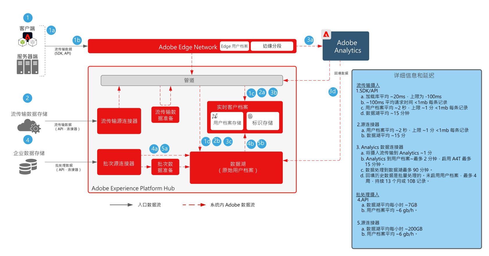
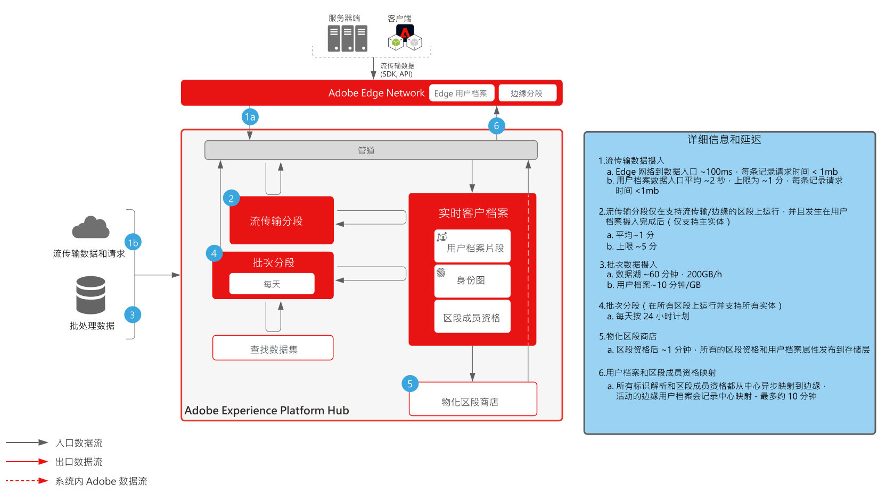
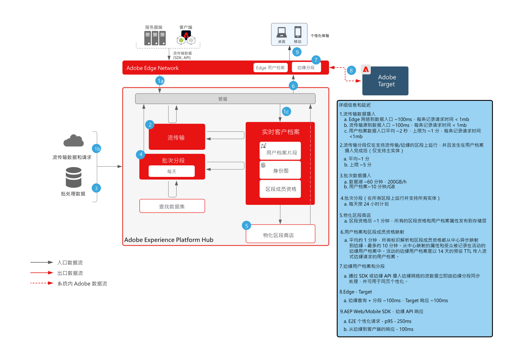
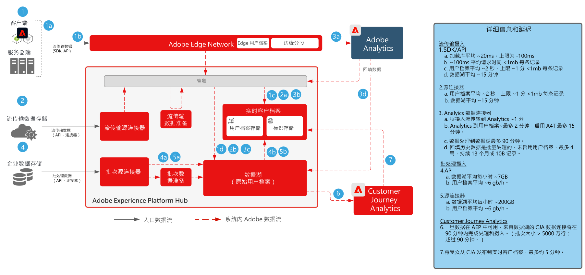
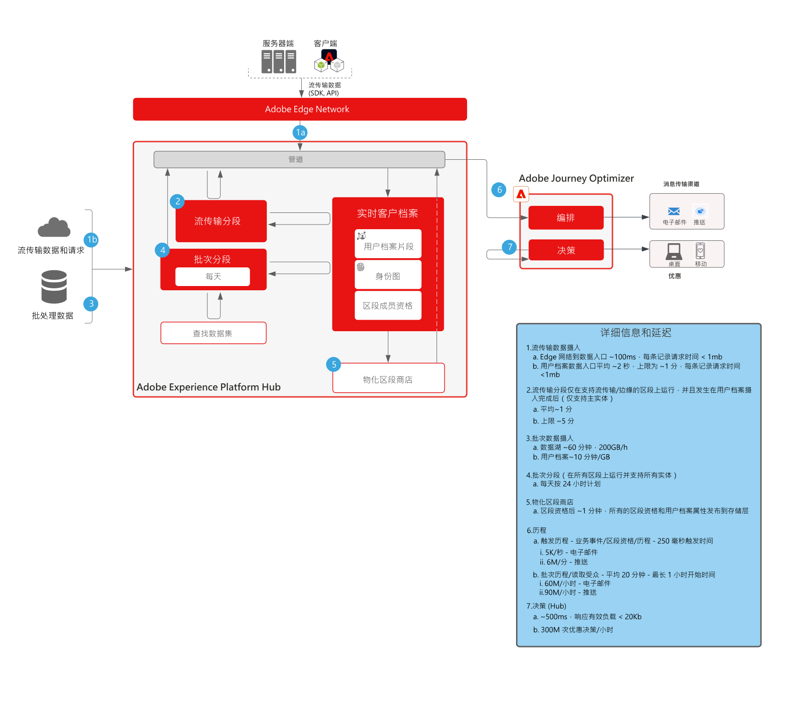

# 护栏

护栏是建议的阈值，用于就数据和系统使用、优化性能提供指导，并避免在 Adobe Experience Platform 和应用程序中出现错误或意外结果。护栏旨在反映系统约束和性能预期，以促进客户架构和使用案例性能优化。护栏不是服务级别协议，有关产品特定的服务级别协议的信息，请参阅下面链接的产品描述文档。

## Adobe Experience Platform 和应用程序的护栏

[数据摄入护栏](https://experienceleague.adobe.com/docs/experience-platform/ingestion/guardrails.html?lang=zh-Hans)

[边缘网络 API 护栏](https://experienceleague.adobe.com/docs/experience-platform/edge-network-server-api/guardrails.html?lang=zh-Hans)

[实时客户档案护栏](https://experienceleague.adobe.com/docs/experience-platform/profile/guardrails.html?lang=zh-Hans)

[身份护栏](https://experienceleague.adobe.com/docs/experience-platform/identity/guardrails.html?lang=zh-Hans)

[查询服务护栏](https://experienceleague.adobe.com/docs/experience-platform/query/guardrails.html?lang=zh-Hans)

[目标激活护栏](https://experienceleague.adobe.com/docs/experience-platform/destinations/guardrails.html?lang=zh-Hans)

[Journey Optimizer 护栏](https://experienceleague.adobe.com/docs/journey-optimizer/using/get-started/guardrails.html?lang=zh-Hans)

 

## 端到端延迟图

### 数据摄入

 

### 分段

 

### Real-time Customer Data Platform 和 Adobe Target

 

### Customer Journey Analytics

 

### Journey Optimizer

 

## 产品描述

[Experience Platform Collection Enterprise](https://helpx.adobe.com/cn/legal/product-descriptions/adobe-experience-platform-collection-enterprise.html)

[Real-time Customer Data Platform](https://helpx.adobe.com/cn/legal/product-descriptions/real-time-customer-data-platform.html)

[B2B 客户数据平台](https://helpx.adobe.com/cn/legal/product-descriptions/adobe-experience-platform-b2b.html)

[Experience Platform Activation](https://helpx.adobe.com/cn/legal/product-descriptions/adobe-experience-platform0.html)

[Experience Platform 智能](https://helpx.adobe.com/cn/legal/product-descriptions/adobe-experience-platform-intelligence---product-description.html)

[智能服务](https://helpx.adobe.com/cn/legal/product-descriptions/intelligent-services.html)

[Data Distiller](https://helpx.adobe.com/cn/legal/product-descriptions/data-distiller.html)

[Customer Journey Analytics](https://helpx.adobe.com/cn/legal/product-descriptions/customer-journey-analytics.html)

[Journey Optimizer](https://helpx.adobe.com/cn/legal/product-descriptions/adobe-journey-optimizer.html)

[Journey Orchestration](https://helpx.adobe.com/cn/legal/product-descriptions/journey-orchestration.html)

[Offer Decisioning](https://helpx.adobe.com/cn/legal/product-descriptions/offer-decisioning-app-service.html)
