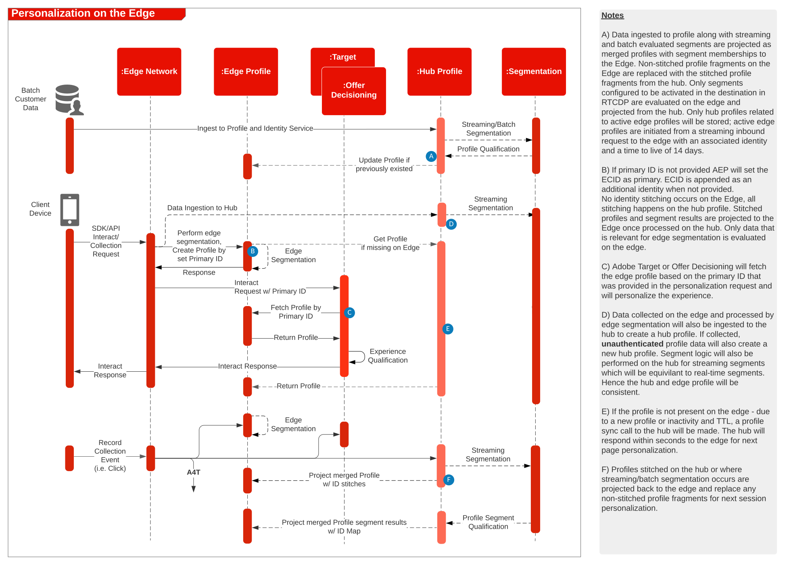

# Experience Platform Web SDK和[!DNL Edge Network]架构图

有关Web和Mobile SDK以及[!DNL Edge Network]服务器API的概述和详细信息，请参阅以下内容。

* [Web SDK 概述](https://experienceleague.adobe.com/zh-hans/docs/blueprints-learn/architecture/architecture-overview/deployment/websdk)
* [Mobile SDK 概述](https://developer.adobe.com/client-sdks/documentation/)
* [[!DNL Edge Network] 服务器API](https://experienceleague.adobe.com/docs/experience-platform/edge-network-server-api/overview.html?lang=zh-Hans)

有关 WebSDK 支持哪些应用程序功能的详细概述，请参阅以下文档。

* [Web SDK 应用程序功能支持](https://github.com/orgs/adobe/projects/18/views/1)

有关从特定于应用程序的 SDK 迁移到 Web SDK 和 Mobile SDK 的详细信息，请参阅以下文档。

* [身份服务](https://experienceleague.adobe.com/docs/experience-platform/edge/identity/overview.html?lang=zh-Hans)
* [Analytics](https://experienceleague.adobe.com/docs/experience-platform/edge/data-collection/adobe-analytics/analytics-overview.html?lang=zh-Hans)
* [Target](https://experienceleague.adobe.com/docs/experience-platform/edge/personalization/adobe-target/target-overview.html?lang=zh-Hans)
* [Analytics for Target](https://experienceleague.adobe.com/docs/experience-platform/edge/personalization/adobe-target/a4t/overview.html?lang=zh-Hans)

## Experience Platform Web/Mobile SDK或[!DNL Edge Network]服务器API部署

以下架构图说明了利用 Experience Platform Web SDK 的部署和数据收集。

Experience Edge、Experience Platform 服务和应用程序的序列图

## 参考文档

* [使用 Web SDK 实施 Adobe Experience Cloud 教程](https://experienceleague.adobe.com/docs/platform-learn/implement-web-sdk/overview.html?lang=zh-Hans)
* [在移动设备应用程序中实施 Adobe Experience Cloud 教程](https://experienceleague.adobe.com/docs/platform-learn/implement-mobile-sdk/overview.html?lang=zh-Hans)
