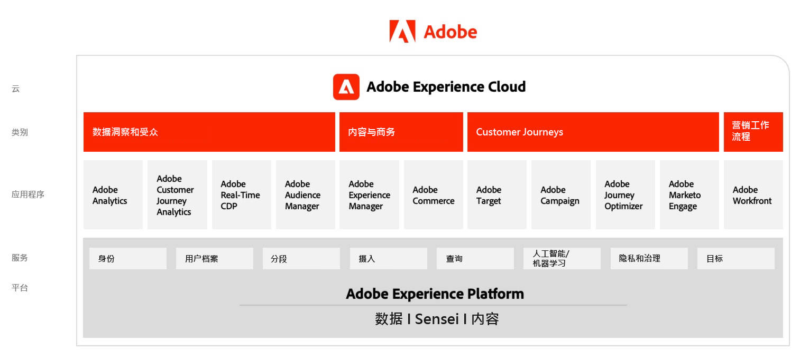

# Adobe Experience Cloud架构图

## AdobeExperience Cloud架构

下图展示了Adobe Experience Cloud中基于Adobe Experience Platform构建和集成的跨数据分析与受众、内容与商务、客户历程、营销工作流的各个组件。

 

## 数据与分析、内容与商务和体验交付的集成架构

以下架构图说明了Adobe Experience Cloud各个组件如何进行连接和集成，以便在数据、内容和体验交付中实现大规模个性化。

 

## Adobe Experience Cloud在企业景观中

以下架构图说明了Adobe Experience Cloud应用程序和Adobe Experience Platform如何整合到数据、分析、编排和参与这四个类别的企业客户体验架构中。

